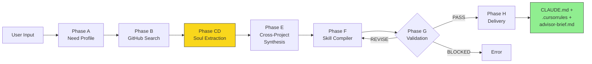
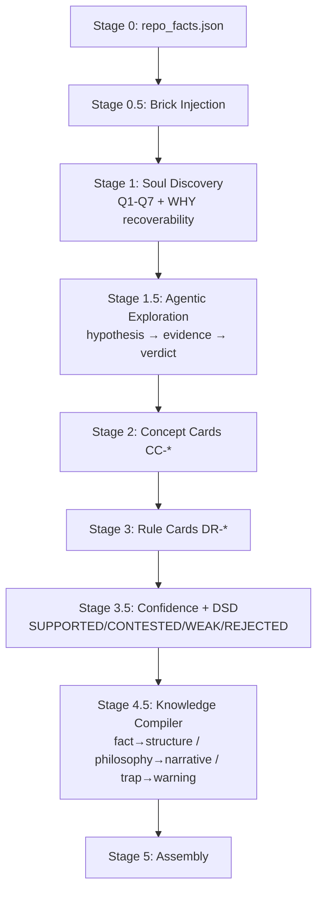

# Doramagic

[](https://github.com/tangweigang-jpg/Doramagic/actions/workflows/ci.yml)

> **不教用户做事，给他工具。** — Doramagic 的产品设计之魂

Doramagic 是运行在 OpenClaw 上的哆啦A梦——用户说出模糊烦恼，Doramagic 从开源世界找最好作业，提取智慧，锻造开袋即食的 AI 道具。

## What It Does

Doramagic extracts the **soul** of open-source projects — not just what the code does (WHAT/HOW), but *why* it was designed that way (WHY) and the hard-won community wisdom that never appears in documentation (UNSAID).

The extracted knowledge is compiled into injectable advisor packs (CLAUDE.md / .cursorrules) that make AI assistants deeply understand a project's design philosophy, mental models, and community pitfalls.

## Architecture

```
Doramagic Terminal (System A)
├── Stage 0:   Deterministic extraction (repo_facts.json)
├── Stage 0.5: Brick injection (framework baseline knowledge)
├── Stage 1:   Soul discovery (Q1-Q7 + WHY recoverability)
├── Stage 1.5: Agentic exploration (hypothesis-driven deep dive)
├── Stage 2:   Concept extraction (CC-* cards)
├── Stage 3:   Rule extraction (DR-* cards)
├── Stage 3.5: Validation + Confidence tagging + DSD
├── Stage 4.5: Knowledge Compiler (type-routed formatting)
└── Stage 5:   Assembly (CLAUDE.md + .cursorrules + advisor-brief)

Pre-extraction API (System B, optional)
├── Domain knowledge snapshots
├── Cross-project intelligence
└── Building blocks (bricks)
```

### Pipeline Flow



#### Inside Phase CD (Soul Extraction)


## Model-Agnostic Design

Doramagic works with **any LLM**. No vendor lock-in.

```json
// models.json — declare what you have
{
  "available_models": [
    {"model_id": "claude-sonnet-4-6", "provider": "anthropic", "capabilities": ["deep_reasoning", "tool_calling"]},
    {"model_id": "gemini-2.5-pro", "provider": "google", "capabilities": ["deep_reasoning", "structured_extraction"]},
    {"model_id": "gpt-4.1", "provider": "openai", "capabilities": ["deep_reasoning", "tool_calling"]}
  ],
  "routing_preference": "lowest_sufficient"
}
```

The pipeline binds to **capability requirements** (deep_reasoning, structured_extraction, tool_calling), not model names. The capability router picks the cheapest model that satisfies the requirement.

## Project Structure

```
packages/
├── contracts/          # Pydantic schemas (the foundation)
├── extraction/         # Stage 0-5 extraction pipeline
│   ├── stage15_agentic.py       # Agentic exploration loop
│   ├── knowledge_compiler.py    # Type-routed knowledge compilation
│   ├── confidence_system.py     # Evidence-chain tagging + verdict
│   ├── deceptive_source_detection.py  # 8-check DSD system
│   └── brick_injection.py       # Framework brick loading
├── orchestration/      # Phase Runner (pipeline orchestration)
├── shared_utils/       # LLMAdapter + CapabilityRouter
├── cross_project/      # Compare + synthesis + discovery
├── skill_compiler/     # OpenClaw skill compilation
└── platform_openclaw/  # Platform validation

bricks/                 # 278 knowledge bricks across 34 frameworks/domains
skills/soul-extractor/  # OpenClaw skill definition (SKILL.md + stages)
```

## Implementation Highlights

**Evidence-chain confidence tagging** — every extracted claim carries a verdict:

```python
# From packages/extraction/doramagic_extraction/confidence_system.py
def assign_verdict(claim: KnowledgeClaim) -> ConfidenceVerdict:
    """
    SUPPORTED  = CODE evidence + DOC corroboration  → inject confidently
    CONTESTED  = COMMUNITY-only evidence            → annotate source
    WEAK       = INFERENCE + some corroboration      → mark speculative
    REJECTED   = INFERENCE-only, no corroboration    → quarantine
    """
```

**Brick injection filters framework noise** — 278 pre-built knowledge bricks across 34 domains:

```python
# From packages/extraction/doramagic_extraction/brick_injection.py
injection_prompt = """
You already know this baseline knowledge (from Doramagic bricks):
[Django] MTV pattern, not MVC. Fat models, thin views.
[React] Hooks rules: no conditional calls, cleanup prevents leaks.

Your task: find what THIS project does DIFFERENTLY from the baseline.
Do NOT repeat the above knowledge.
"""
```

**Deceptive Source Detection** — 8 automated checks catch misleading knowledge:

```python
# From packages/extraction/doramagic_extraction/deceptive_source_detection.py
DSD_CHECKS = [
    "support_desk_share > 70%",      # Project is mostly "how do I?" questions
    "exception_dominance_ratio > 60%", # Mostly edge cases, sparse core knowledge
    "maintainer_boundary_statements",  # Won't-fix = design philosophy gold
    # ... 5 more checks
]
```

## Quick Start

```bash
# Clone
git clone https://github.com/user/doramagic.git
cd doramagic

# Install dependencies
pip install pydantic

# Configure your models
cp models.json.example models.json
# Edit models.json with your API keys

# Run the soul extractor on a project
python3 packages/orchestration/doramagic_orchestration/phase_runner.py \
  --repo-path /path/to/target/repo \
  --output-dir ./output
```

## Key Concepts

### Knowledge Types
- **WHAT/HOW/IF** — extractable from code (deterministic)
- **WHY** — design philosophy, mental models (requires deep reasoning)
- **UNSAID** — community wisdom that never appears in docs (highest value)

### Confidence System
Every extracted knowledge claim carries an evidence-chain verdict:
- **SUPPORTED** (CODE+DOC) → core truth, inject confidently
- **CONTESTED** (COMMUNITY only) → unsaid knowledge, annotate source
- **WEAK** (INFERENCE+corroboration) → speculative, mark as [推测]
- **REJECTED** (INFERENCE only) → quarantined, excluded from output

### Building Blocks (Bricks)
Framework-level baseline knowledge that reduces extraction noise:
- L1 bricks: framework philosophy (Django MTV, React hooks rules)
- L2 bricks: domain-specific patterns (finance multi-currency, HA automation rules)

## Product Philosophy

Inspired by Doraemon: provide tools, don't prescribe methods.

- **Code states facts, AI tells stories** — deterministic extraction as skeleton, LLM only interprets
- **Capability upgrade, essence unchanged** — new abilities stack, don't replace
- **Bias toward under-reporting** — in all uncertain scenarios
- **Conflicts are high-value knowledge** — annotate, don't resolve

## Example Output

When you run `/dora https://github.com/TandoorRecipes/recipes`, Doramagic produces:

<details>
<summary><b>advisor-brief.md</b> — Executive summary for AI assistants</summary>

```markdown
# TandoorRecipes — Advisor Brief

## Design Philosophy
TandoorRecipes follows a "recipe-centric" data model where the Recipe object
is the central entity. All features (meal planning, shopping lists, nutrition)
are designed as extensions of the recipe, not standalone modules.

## Key Mental Models
- **Ingredient ≠ Food**: Ingredients are recipe-specific references to Foods.
  Foods are the canonical nutritional entities. This separation enables
  shopping list aggregation across recipes.
- **Space isolation**: Multi-tenant by design. Every query is space-scoped.
  Forgetting the space filter is the #1 source of data leaks in contributions.

## Community Pitfalls (UNSAID)
- PostgreSQL full-text search is hardcoded — SQLite works for dev but
  search quality degrades silently in production.
- The import/export system uses a custom JSON schema, NOT standard formats.
  Don't assume compatibility with other recipe apps.
```
</details>

Each extraction also produces `CLAUDE.md` (injectable AI context), `.cursorrules`, and `PROVENANCE.md` (evidence trail for every claim).

## License

MIT
