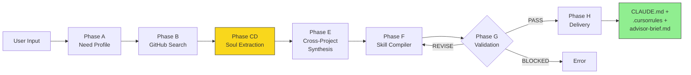
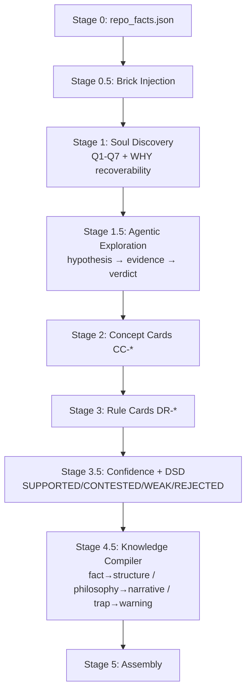

# Doramagic

[](https://github.com/tangweigang-jpg/Doramagic/actions/workflows/ci.yml)

> **不教用户做事，给他工具。** — Doramagic 的产品设计之魂

Doramagic 是运行在 OpenClaw 上的哆啦A梦——用户说出模糊烦恼，Doramagic 从开源世界找最好作业，提取智慧，锻造开袋即食的 AI 道具。

## What It Does

Doramagic extracts the **soul** of open-source projects — not just what the code does (WHAT/HOW), but *why* it was designed that way (WHY) and the hard-won community wisdom that never appears in documentation (UNSAID).

The extracted knowledge is compiled into injectable advisor packs (CLAUDE.md / .cursorrules) that make AI assistants deeply understand a project's design philosophy, mental models, and community pitfalls.

## Architecture

```
Doramagic Terminal (System A)
├── Stage 0:   Deterministic extraction (repo_facts.json)
├── Stage 0.5: Brick injection (framework baseline knowledge)
├── Stage 1:   Soul discovery (Q1-Q7 + WHY recoverability)
├── Stage 1.5: Agentic exploration (hypothesis-driven deep dive)
├── Stage 2:   Concept extraction (CC-* cards)
├── Stage 3:   Rule extraction (DR-* cards)
├── Stage 3.5: Validation + Confidence tagging + DSD
├── Stage 4.5: Knowledge Compiler (type-routed formatting)
└── Stage 5:   Assembly (CLAUDE.md + .cursorrules + advisor-brief)

Pre-extraction API (System B, optional)
├── Domain knowledge snapshots
├── Cross-project intelligence
└── Building blocks (bricks)
```

### Pipeline Flow



#### Inside Phase CD (Soul Extraction)


## Model-Agnostic Design

Doramagic works with **any LLM**. No vendor lock-in.

```json
// models.json — declare what you have
{
  "available_models": [
    {"model_id": "claude-sonnet-4-6", "provider": "anthropic", "capabilities": ["deep_reasoning", "tool_calling"]},
    {"model_id": "gemini-2.5-pro", "provider": "google", "capabilities": ["deep_reasoning", "structured_extraction"]},
    {"model_id": "gpt-4.1", "provider": "openai", "capabilities": ["deep_reasoning", "tool_calling"]}
  ],
  "routing_preference": "lowest_sufficient"
}
```

The pipeline binds to **capability requirements** (deep_reasoning, structured_extraction, tool_calling), not model names. The capability router picks the cheapest model that satisfies the requirement.

## Project Structure

```
packages/
├── contracts/          # Pydantic schemas (the foundation)
├── extraction/         # Stage 0-5 extraction pipeline
│   ├── stage15_agentic.py       # Agentic exploration loop
│   ├── knowledge_compiler.py    # Type-routed knowledge compilation
│   ├── confidence_system.py     # Evidence-chain tagging + verdict
│   ├── deceptive_source_detection.py  # 8-check DSD system
│   └── brick_injection.py       # Framework brick loading
├── orchestration/      # Phase Runner (pipeline orchestration)
├── shared_utils/       # LLMAdapter + CapabilityRouter
├── cross_project/      # Compare + synthesis + discovery
├── skill_compiler/     # OpenClaw skill compilation
└── platform_openclaw/  # Platform validation

bricks/                 # 278 knowledge bricks across 34 frameworks/domains
skills/soul-extractor/  # OpenClaw skill definition (SKILL.md + stages)
```

## Implementation Highlights

**Evidence-chain confidence tagging** — every extracted claim carries a verdict:

```python
# From packages/extraction/doramagic_extraction/confidence_system.py
def compute_verdict(tags: list[EvidenceTag]) -> tuple[Verdict, PolicyAction]:
    """
    Deterministic Boolean-algebra verdict from evidence tags:

    CODE + DOC                → SUPPORTED / ALLOW_CORE
    CODE + COMMUNITY          → SUPPORTED / ALLOW_CORE
    COMMUNITY only (no CODE)  → CONTESTED / ALLOW_STORY
    INFERENCE + corroboration → WEAK / ALLOW_STORY
    INFERENCE only            → REJECTED / QUARANTINE
    """
```

**Brick injection filters framework noise** — 278 pre-built knowledge bricks across 34 domains:

```python
# From packages/extraction/doramagic_extraction/brick_injection.py
def _generate_injection_text(bricks, frameworks_matched):
    # Output format:
    # 你已经知道以下框架基线知识（来自 Doramagic 积木库）：
    # [Django] MTV pattern, not MVC. Fat models, thin views.
    # [React] Hooks rules: no conditional calls, cleanup prevents leaks.
    # 你的任务是发现这个具体项目在基线之上的独特做法。不要重复以上知识。
```

**Deceptive Source Detection** — 8 automated checks catch misleading knowledge:

```python
# From packages/extraction/doramagic_extraction/deceptive_source_detection.py
def run_dsd_checks(cards, repo_facts, community_signals) -> DSDReport:
    """Run all 8 DSD checks: rationale_support_ratio, temporal_conflict,
    exception_dominance, support_desk_share, public_context_completeness,
    persona_divergence, dependency_dominance, narrative_evidence_tension.

    Result: CLEAN (0 triggered) / WARNING (1-3) / SUSPICIOUS (4+)"""
```

## Quick Start

Doramagic v10.0.0 is a **skill-forging skill**: you describe the expert you want, Doramagic runs its 8-phase pipeline from **A→H**, searches GitHub for the best open-source references, extracts design philosophy and community UNSAID knowledge, and forges a **Skill bundle** you can install.

The first output is **not** an app, a one-off Markdown report, or a pile of notes. The first output is a **Skill**: `SKILL.md` plus its knowledge pack, so that after installation your AI assistant behaves like a domain expert.

### Experience First

```text
User
/dora 我想做一个管理家庭菜谱和每周菜单的 Skill。Please learn from https://github.com/TandoorRecipes/recipes and https://github.com/mealie-recipes/mealie . 中文优先，适合家庭使用。

Doramagic
收到。我会进入 8-Phase 锻造流程：需求理解 → GitHub 搜索 → 多项目提取 → 跨项目综合 → Skill 编译 → 门控验证 → 交付。

Doramagic
需要一个关键澄清：你更在意“家庭协作”还是“菜谱导入/导出”？

User
家庭协作优先，手机对话体验优先。

Doramagic
锻造完成。交付物是一个 Skill bundle，而不是普通文件：
- SKILL.md
- README.md
- PROVENANCE.md
- LIMITATIONS.md

下一步：把这个 bundle 安装进你的 OpenClaw / Claude Code skill 目录。
安装后，你的 AI 助手会变成这个领域的专家级顾问。
```

安装生成的 Skill 之后，你会继续这样用它：

```text
/family-menu-coach 我冰箱里有鸡腿、土豆和番茄，给我安排 3 天晚餐，并解释为什么这么搭配。
```

### 1. OpenClaw

Keep the full repo checkout in a stable path, then link the Doramagic skill into your OpenClaw skills directory:

```bash
git clone https://github.com/tangweigang-jpg/Doramagic.git ~/Doramagic
mkdir -p ~/.openclaw/skills
cp -r ~/Doramagic/skills/doramagic ~/.openclaw/skills/dora
```

Then invoke Doramagic in OpenClaw:

```text
/dora 我想做一个帮助团队审查 API 设计的 Skill。Please benchmark https://github.com/fastapi/fastapi and https://github.com/encode/django-rest-framework . 输出给中文团队使用。
```

Typical flow:

```text
User
/dora 我想做一个帮助团队审查 API 设计的 Skill。Please benchmark https://github.com/fastapi/fastapi and https://github.com/encode/django-rest-framework . 输出给中文团队使用。

Doramagic
我会先锁定 API style、schema discipline、error contract、community pitfalls 这几个方向。

Doramagic
请确认重点：你更想要“设计审查顾问”还是“直接生成接口代码的助手”？

User
设计审查顾问。

Doramagic
完成。已锻造 Skill bundle。把 delivery 目录安装到你的 skill 目录后，AI 会变成 API review specialist。
```

### 2. Claude Code

Use the same repo checkout, and link the Doramagic skill into Claude Code manually:

```bash
git clone https://github.com/tangweigang-jpg/Doramagic.git ~/Doramagic
mkdir -p ~/.claude/skills
cp -r ~/Doramagic/skills/doramagic ~/.claude/skills/dora
```

Restart Claude Code, then invoke:

```text
/dora 我想做一个管理个人知识库和阅读摘要的 Skill。Please learn from https://github.com/obsidianmd/obsidian-releases and https://github.com/logseq/logseq . 中文优先，强调知识组织而不是笔记堆积。
```

Typical flow:

```text
User
/dora 我想做一个管理个人知识库和阅读摘要的 Skill。Please learn from https://github.com/obsidianmd/obsidian-releases and https://github.com/logseq/logseq . 中文优先，强调知识组织而不是笔记堆积。

Doramagic
我会重点提取：链接结构、知识演化、社区常见踩坑、从“记录”到“复用”的转变。

Doramagic
你更希望这个 Skill 面向“重度研究者”还是“日常工作知识管理”？

User
日常工作知识管理。

Doramagic
锻造完成。产出物是 Skill bundle，不是单个文档。安装后，你可以直接把 AI 当成 PKM advisor 使用。
```

### 3. Python CLI / Local Forge Mode

If you want to run Doramagic directly from source for local testing:

```bash
git clone https://github.com/tangweigang-jpg/Doramagic.git ~/Doramagic
cd ~/Doramagic
python3 -m venv .venv
source .venv/bin/activate
pip install -e .
pip install anthropic openai google-genai
python3 skills/doramagic/scripts/doramagic_singleshot.py \
  --run-dir ~/clawd/doramagic/runs \
  --input "我想做一个健身与饮食指导 Skill。Please learn from https://github.com/wger-project/wger and https://github.com/TandoorRecipes/recipes . 中文优先，强调长期习惯而不是短期打卡。"
```

This source mode runs the same forge pipeline and produces the same **Skill bundle**. If you want the slash-command experience, link the same checkout into OpenClaw or Claude Code and then use `/dora`:

```text
/dora 我想做一个健身与饮食指导 Skill。Please learn from https://github.com/wger-project/wger and https://github.com/TandoorRecipes/recipes . 中文优先，强调长期习惯而不是短期打卡。
```

Typical flow:

```text
User
/dora 我想做一个健身与饮食指导 Skill。Please learn from https://github.com/wger-project/wger and https://github.com/TandoorRecipes/recipes . 中文优先，强调长期习惯而不是短期打卡。

Doramagic
我会综合训练记录、营养管理、用户坚持成本、社区常见失败模式。

Doramagic
请确认：你更关注“记录准确性”还是“用户可坚持性”？

User
用户可坚持性。

Doramagic
完成。已生成 Skill bundle。安装这个 Skill 后，你的 AI 助手会从通用聊天机器人变成 habit-oriented fitness advisor。
```

### What You Get

Doramagic ships with **278 knowledge bricks across 34 frameworks/domains** and compiles the final output into an installable Skill bundle. In practice, the workflow is always:

1. Use `/dora` to describe the expert you want.
2. Let Doramagic forge the Skill.
3. Install the generated Skill bundle manually.
4. Use the generated Skill so your AI assistant becomes an expert advisor in that domain.


## Key Concepts

### Knowledge Types
- **WHAT/HOW/IF** — extractable from code (deterministic)
- **WHY** — design philosophy, mental models (requires deep reasoning)
- **UNSAID** — community wisdom that never appears in docs (highest value)

### Confidence System
Every extracted knowledge claim carries an evidence-chain verdict:
- **SUPPORTED** (CODE+DOC) → core truth, inject confidently
- **CONTESTED** (COMMUNITY only) → unsaid knowledge, annotate source
- **WEAK** (INFERENCE+corroboration) → speculative, mark as [推测]
- **REJECTED** (INFERENCE only) → quarantined, excluded from output

### Building Blocks (Bricks)
Framework-level baseline knowledge that reduces extraction noise:
- L1 bricks: framework philosophy (Django MTV, React hooks rules)
- L2 bricks: domain-specific patterns (finance multi-currency, HA automation rules)

## Product Philosophy

Inspired by Doraemon: provide tools, don't prescribe methods.

- **Code states facts, AI tells stories** — deterministic extraction as skeleton, LLM only interprets
- **Capability upgrade, essence unchanged** — new abilities stack, don't replace
- **Bias toward under-reporting** — in all uncertain scenarios
- **Conflicts are high-value knowledge** — annotate, don't resolve

## Example Output

When you run `/dora https://github.com/TandoorRecipes/recipes`, Doramagic produces:

<details>
<summary><b>advisor-brief.md</b> — Executive summary for AI assistants</summary>

```markdown
# TandoorRecipes — Advisor Brief

## Design Philosophy
TandoorRecipes follows a "recipe-centric" data model where the Recipe object
is the central entity. All features (meal planning, shopping lists, nutrition)
are designed as extensions of the recipe, not standalone modules.

## Key Mental Models
- **Ingredient ≠ Food**: Ingredients are recipe-specific references to Foods.
  Foods are the canonical nutritional entities. This separation enables
  shopping list aggregation across recipes.
- **Space isolation**: Multi-tenant by design. Every query is space-scoped.
  Forgetting the space filter is the #1 source of data leaks in contributions.

## Community Pitfalls (UNSAID)
- PostgreSQL full-text search is hardcoded — SQLite works for dev but
  search quality degrades silently in production.
- The import/export system uses a custom JSON schema, NOT standard formats.
  Don't assume compatibility with other recipe apps.
```
</details>

Each extraction also produces `CLAUDE.md` (injectable AI context), `.cursorrules`, and `PROVENANCE.md` (evidence trail for every claim).

## License

MIT
