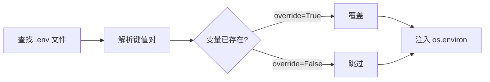

# 开源知识获取：完整可执行方案

**日期**：2026-03-09
**定位**：AllInOne 最核心子项目
**版本**：v3（整合全部调研 + 所有决策 + 可执行细节）
**输入材料**：50+ 份项目文档、三方复盘、OpenClaw 用户调研、UNSAID 采集调研、UNSAID 竞争壁垒调研、12 套优化后 Prompt

---

## 第一性原理

AllInOne = 以开源知识为燃料、以 AI 为引擎的个人数字化操作系统。

**如果知识提取无效 → 一切为零。如果有效 → 一切有了燃料。**

本方案只解决一个问题：**如何从开源项目中提取出能让 AI 变强的结构化知识？**

---

## 一、提取什么：六类知识 + 业务逻辑图

### 1.1 六类知识

| 类型 | 含义 | 来源 | 提取阶段 |
|------|------|------|----------|
| **WHAT** | 核心概念、对象、边界 | 代码 + 文档 | L1 深潜 |
| **HOW** | 流程、调用链、状态变化 | 代码 + 测试 | L2 深潜 |
| **IF** | 规则、校验、分支逻辑 | 代码 + 测试 | L3 深潜 |
| **STRUCTURE** | 模块关系、数据流、依赖 | 代码 | 鹰眼阶段 |
| **WHY** | 设计决策、trade-off、演进意图 | Issue/PR/Discussion | 社区管线 |
| **UNSAID** | 未文档化的惯例、坑、常识 | 社区讨论/长尾 Issue | 社区管线 |

### 1.2 知识载体：卡片（给 AI 看的结构化知识单元）

卡片不是帮助文档、不是 PRD。**卡片是注入 AI system prompt 的知识注射剂**，让 AI 从"什么都知道一点"变成"对这个项目有专家级理解"。

**exp01 聚焦三种核心卡片 + 一种社区卡片**：

| 卡片类型 | 承载知识 | 提取阶段 |
|----------|---------|----------|
| **concept_card** | WHAT — 概念、边界、定义 | L1 深潜 |
| **workflow_card** | HOW — 流程、步骤、状态变化 + **Mermaid 业务逻辑图** | L2 深潜 |
| **decision_rule_card** | IF + WHY/UNSAID — 规则、条件、坑、设计理由 | L3 深潜 + 社区管线 |

### 1.3 业务逻辑图（workflow_card 的必备组件）

每个 workflow_card 必须包含 Mermaid 格式的可视化流程图，用于：
- 用户理解项目核心流程
- 未来排错时定位问题环节
- AI 在生成方案时引用具体步骤



### 1.4 decision_rule_card 标准 Schema

```yaml
---
card_type: decision_rule_card
card_id: DR-001
repo: python-dotenv
type: UNSAID_GOTCHA  # UNSAID_GOTCHA | UNSAID_BEST_PRACTICE | UNSAID_COMPATIBILITY | UNSAID_PERFORMANCE | DESIGN_DECISION
title: "Docker 容器中 .env 文件路径解析与本地开发不同"
rule: |
  在 Docker 容器中使用 python-dotenv 时，load_dotenv() 的默认路径查找
  会因容器工作目录不同而失败。必须显式指定 .env 文件的绝对路径。
context: |
  本地开发时 load_dotenv() 从当前工作目录向上搜索，
  但 Docker 中工作目录通常是 /app。
do:
  - "使用 load_dotenv(dotenv_path='/app/.env') 显式指定路径"
  - "在 Dockerfile 中确保 COPY .env /app/.env"
dont:
  - "不要依赖 load_dotenv() 的默认路径搜索行为"
  - "不要在 Docker 中同时使用 docker-compose .env 语法和 python-dotenv"
applies_to_versions: ">=0.19.0"
confidence: 0.85
evidence_level: E3  # 多个独立 Issue 报告
sources:
  - "https://github.com/theskumar/python-dotenv/issues/92"
  - "https://github.com/theskumar/python-dotenv/issues/283"
extracted_at: "2026-03-09"
last_verified: "2026-03-09"
status: draft
---
```

---

## 二、怎么提取：完整管线

### 2.1 总流程

```
Phase 1: 代码半魂提取
  Repo Input
    → Repo Profile（画像）
    → Repomix --compress（鹰眼用）
    → Repomix full（深潜用）
    → Eagle Eye 1: 身份 + 核心概念（5-10）
    → Eagle Eye 2: 模块 + 关系（4-8）
    → Eagle Eye 3: Soul Locus 评分 → Deep Dive Queue
    → L1 Deep Dive: concept_card
    → L2 Deep Dive: workflow_card + Mermaid 业务逻辑图
    → L3 Deep Dive: decision_rule_card（代码层面）

Phase 2: 社区半魂提取（过渡方案：LLM 内置搜索）
  LLM 种子知识（列出已知的坑）
    → LLM 搜索验证 + 补充
    → 分类（UNSAID vs NOISE）
    → 提取 decision_rule_card（社区层面）
    → 与代码 decision_rule_card 合并去重

Phase 3: 验证
  Merge & Validate → Judge（LLM 为主导）→ Gap Queue
    → Final Soul Cards
```

### 2.2 关键技术决策（已确认）

| 决策 | 选择 | 状态 |
|------|------|------|
| 代码打包 | Repomix（压缩版用于鹰眼，完整版用于深潜） | 已确认 |
| 知识格式 | Markdown + YAML frontmatter | 已确认 |
| 提取方法 | LLM-First（Claude 全程） | 已确认 |
| Prompt 模板 | 12 套已优化版（XML tags + few-shot + 防幻觉） | 已完成 |
| 鹰眼步骤 | 完整三步（即使小项目也完整走） | 已确认 |
| 评估方式 | LLM-as-Judge 为主导 + 人工抽检 | 已确认 |
| 社区半魂 Phase 2 | LLM 内置搜索作为过渡 → 伦敦/新加坡服务器就绪后切换 | 已确认 |
| 模型 | 全程 Claude（提取+评估用同一模型） | 已确认 |
| 索引存储 | SQLite（v1） | 已确认 |

### 2.3 v1 明确不做

| 不做 | 原因 |
|------|------|
| Neo4j / 图数据库 | v1 卡片数量不需要图查询 |
| Qdrant / 向量数据库 | v1 不需要语义检索 |
| DeepWiki 深度集成 | 仅大仓库降级时考虑 |
| 多模态视频提取 | v2 方向 |
| DSPy prompt 优化 | v2 方向 |
| 全网 UGC 爬虫 | v1 用 LLM 搜索过渡 |
| 采集服务器部署 | 等伦敦/新加坡就绪 |

---

## 三、12 套优化后 Prompt 概览

优化后的完整 Prompt 位于 `docs/research/20260309_optimized_extraction_prompts.md`。

### 3.1 全局优化项

| 优化 | 具体做法 |
|------|---------|
| **XML tags 强约束** | 用 `<output>`, `<card>`, `<evidence>`, `<scratchpad>` 包裹关键输出 |
| **Few-shot 示例** | 每套 Prompt 加 1 个具体示例 |
| **Token 预算** | 每个字段加明确长度约束（如"max 2 sentences"） |
| **错误处理** | 三种降级场景：证据不足/输入差/大项目 |
| **CoT 分化** | 分类任务禁止 CoT；复杂推理允许 `<scratchpad>` |
| **防幻觉** | 禁止编造文件名；证据引用要求 `file.py:L42-L58` |
| **评分校准** | Soul Locus 要求 30% loci 低于 70 分，防止分数膨胀 |

### 3.2 12 套 Prompt 列表

| # | Prompt | 输入 | 输出 | 模型 |
|---|--------|------|------|------|
| P01 | Repo Profile | 仓库元信息 | repo_profile.yaml | Claude |
| P02 | Eagle Eye / Identity | repo_profile + repomix_compressed | 身份 + 5-10 概念 | Claude |
| P03 | Eagle Eye / Module Map | 上一步 + repomix_compressed | 4-8 模块 + 关系 | Claude |
| P04 | Eagle Eye / Soul Locus | 前两步 + repomix_compressed | 8-15 loci 评分（允许 scratchpad） | Claude |
| P05 | L1 Deep Dive / Concept | locus 完整代码 + 鹰眼产物 | concept_card | Claude |
| P06 | L2 Deep Dive / Workflow | locus 代码 + L1 卡片 | workflow_card + Mermaid 图 | Claude |
| P07 | L3 Deep Dive / Decision | locus 代码 + L1/L2 | decision_rule_card | Claude |
| P08 | Community Tier 1 | Issues 原始数据 | 预过滤候选（禁止 CoT） | Haiku |
| P09 | Community Tier 2 | Tier 1 候选 | 分类评分（禁止 CoT） | Haiku |
| P10 | Community Tier 3 | Tier 2 高分线程 | decision_rule_card（社区） | Claude |
| P11 | Merge & Validate | 所有卡片 | 去重 + 质量门控 | Claude |
| P12 | Judge | 卡片 + A/B 回答 | judge_report（6 项验证 checklist） | Claude |

---

## 四、UNSAID 采集：过渡方案 + 正式方案

### 4.1 过渡方案（立即可用：LLM 内置搜索）

```
Step 1: LLM 种子（成本 $0）
  让 Claude 列出它已知的 python-dotenv 常见陷阱
  → 产出 10-20 条候选 UNSAID

Step 2: LLM 搜索验证（成本 ~$0.5）
  用 Claude/Gemini 搜索功能验证每条候选
  搜索 "python-dotenv gotcha"、"python-dotenv docker"、"python-dotenv production"
  → 确认/否定/补充

Step 3: 结构化提取（成本 ~$0.5）
  将验证后的 UNSAID 用 P10 Prompt 提取为 decision_rule_card
  → 产出 15-25 条结构化规则

Step 4: 质量评分
  多源确认（2+ 来源）→ confidence ≥ 0.8
  单源确认 → confidence 0.5-0.7
  LLM 种子未验证 → confidence ≤ 0.5，标记为 unverified
```

**总成本**：~$1 + 1 小时人工
**优势**：立即可用，流程完整，无需采集服务器
**劣势**：搜不到长尾 Issue 和 wontfix 讨论

### 4.2 正式方案（伦敦/新加坡服务器就绪后）

```
Stage 1: GitHub API 采集（免费）
  GraphQL 批量获取 Issues + PR Comments + Discussions
  按 comments 数 + reactions 排序

Stage 2: 预过滤（免费）
  去 bot、去噪音、标签过滤、评论数 ≥ 2
  ~400 Issues → ~120 候选

Stage 3: LLM 分类（~$0.06，用 Haiku）
  分类：UNSAID_GOTCHA | BEST_PRACTICE | COMPATIBILITY | PERFORMANCE | NOISE
  ~120 → ~30 UNSAID 候选

Stage 4: LLM 提取（~$0.36，用 Claude）
  提取为 decision_rule_card
  ~30 → 20-30 高质量规则

Stage 5: 验证与去重
  版本绑定 + 矛盾检测 + 置信度计算 + 去重

Stage 6: 输出
  decision_rule_cards（YAML）
```

**80/20 策略**：LLM 种子 + 热门 Issues（Top 20%）+ 关键词捕获（"workaround"/"gotcha"/"unexpected"），减少 70-80% 工作量，保留 85-90% 价值。

**成本**：小项目 ~$1.17 + 1-2h 人工 | 中型项目 ~$4.90 + 6-10h 人工

### 4.3 过渡 → 正式的切换

```
当前：LLM 搜索过渡方案
  ↓ 伦敦/新加坡服务器就绪
替换 Stage 1 的数据源（LLM 搜索 → GitHub API）
  ↓ 下游 Prompt 不变
正式方案上线，数据质量提升
```

切换成本极低，因为 Stage 3-6 完全一样，只有数据输入层不同。

---

## 五、竞争壁垒策略

### 5.1 蓝海确认

当前没有产品在做 decision_rule_card 级别的 UNSAID 提取：
- DeepWiki → 代码理解（WHAT/HOW/STRUCTURE）
- Greptile → 代码图
- SO AI Assist → 问答总结
- **AllInOne → UNSAID 结构化提取（蓝海）**

### 5.2 五条差异化策略

| # | 策略 | 具体做法 | 竞争优势 |
|---|------|---------|----------|
| 1 | **条件化知识** | 不是"别这样做"，而是"在 X 条件下做，Y 条件下不做" | 比绝对规则更实用，减少误导 |
| 2 | **证据链透明** | 每条 UNSAID 附可点击原始链接 + 投票数 | 用户信任的关键（因为这是"没人写过的知识"） |
| 3 | **版本敏感** | 绑定版本范围 + 新版发布自动检测过时 | 知识不过时 |
| 4 | **多源交叉验证** | GitHub + SO + HN 融合计算可信度 | 比单源更可靠 |
| 5 | **跨项目知识迁移** | requests 的坑 → 自动推理 httpx 的坑 | **终极壁垒**，竞品无法复制 |

### 5.3 规模化路径

```
Phase 1（现在）: 1-10 个项目 — 验证管线，手动+半自动
Phase 2（1-2月后）: 10-100 个项目 — 自动化管线，采集服务器
Phase 3（3-6月后）: 100-1000 个项目 — 知识网络效应
Phase 4（6月+）: 1000+ 个项目 — 壁垒建立，先发优势不可逆
```

---

## 六、验证体系

### 6.1 A/B 实验设计

| 对照组 | 实验组 | 目的 |
|--------|--------|------|
| **A**：无灵魂基线 | **B**：加载代码半魂 | 验证 H1（灵魂是否有用） |
| **B**：仅代码半魂 | **C**：代码 + 社区半魂 | 验证社区半魂增量 |

### 6.2 问题集设计

10-15 题，覆盖 5 类知识：

| 类别 | 考察点 | 对应卡片 |
|------|--------|----------|
| 领域概念 | 概念定义/边界 | concept_card |
| 工作流 | 流程顺序/依赖 | workflow_card |
| 规则/条件 | 条件/限制/异常 | decision_rule_card |
| 风险/踩坑 | 常见误区/UNSAID | decision_rule_card（社区） |
| 方案建议 | 迁移/排查 | 综合 |

**必须包含**：至少 2 个容易诱发幻觉的问题 + 2 个需要结构化理解的问题

### 6.3 评估方式：LLM-as-Judge 为主导

**主评**：Claude 按 Judge Rubric 5 维度逐题打分

| 维度 | 考察什么 |
|------|----------|
| Groundedness | 回答是否基于项目证据 |
| Specificity | 是否具体到模块/规则 |
| Usefulness | 是否可直接行动 |
| Risk | 是否存在误导 |
| Uncertainty Handling | 是否诚实处理不确定 |

**复核**：人工抽检 3-5 题，验证 LLM 评分合理性

**P12 Judge Prompt 增强**：6 项自动验证 checklist + REVISE 必须给具体修改指令

### 6.4 置信度计算公式

```
confidence = base(0.3)
  + source_bonus(源数量 × 0.15, max 0.45)
  + author_weight(贡献者权重 × 0.1)
  + community_signal(投票数 ÷ 20, max 0.15)
  + recency(时间衰减 × 0.1)
```

- 2+ 独立来源 → high confidence
- 1 来源 → medium confidence
- 仅 LLM 种子未验证 → low confidence

---

## 七、风险与回退

### 7.1 核心风险

| 风险 | 级别 | 应对 |
|------|------|------|
| 灵魂提取没有显著价值 | 最高 | exp01 验证 → 失败则回退分析 |
| "Almost Right"调试陷阱 | 高 | 证据链透明 + 置信度标注 + 条件化规则 |
| Prompt 模板实测效果差 | 中 | 边跑边调，记录每次修改 |
| UNSAID 提取不准确 | 中 | 多层验证 + 人工抽检 |
| python-dotenv 过于简单 | 低 | 备选 pyjwt / itsdangerous |

### 7.2 五级回退路径

1. 换更小范围 — 只对核心解析模块做提取
2. 减卡片类型 — 只做 concept_card
3. 简化鹰眼 — 三步合一
4. 减评估题 — 5 题而非 15 题
5. 最小底线 — `repo_profile + concept_cards + 3 题 A/B`

---

## 八、执行计划

### Phase 0：环境准备（0.5 天）

| 任务 | 产出 | 检查点 |
|------|------|--------|
| 确认 Node.js / Repomix 可用 | 安装确认 | `repomix --version` |
| 克隆 python-dotenv | 本地仓库 | `git clone` |
| 跑 `repomix --compress --style xml` | packed_compressed.xml | 确认 token 规模 |
| 跑 `repomix --style xml`（完整版） | packed_full.xml | 确认深潜可用 |
| 快速审读优化后的 P01-P04 Prompt | 标注需微调的点 | 理解输入/输出 |

### Phase 1：鹰眼提取（1 天）

| 步骤 | 使用 Prompt | 输入 | 产出 | 记录 |
|------|------------|------|------|------|
| 1.1 生成 Repo Profile | P01 | 仓库元信息 | repo_profile.yaml | token / 耗时 |
| 1.2 项目身份 + 核心概念 | P02 | profile + compressed | eagle_eye_identity.md | token / 质量 |
| 1.3 核心模块 + 关系 | P03 | 上一步 + compressed | eagle_eye_module_map.md | token / 质量 |
| 1.4 Soul Locus 评分 | P04 | 前两步 + compressed | eagle_eye_soul_locus.md + deep_dive_queue | token / 评分分布 |
| 1.5 合格检查 | 六条硬规则 | 全部鹰眼产物 | 通过/不通过 | 不通过则回退 |

### Phase 2：深潜提取（1-2 天）

| 步骤 | 使用 Prompt | 输入 | 产出 | 记录 |
|------|------------|------|------|------|
| 2.1 L1 概念提取（top 2-3 loci） | P05 | locus 完整代码 + 鹰眼产物 | concept_cards | token / 质量 / 修正次数 |
| 2.2 L2 流程提取 | P06 | locus 代码 + L1 卡片 | workflow_cards + Mermaid 图 | token / 图准确性 |
| 2.3 L3 规则提取 | P07 | locus 代码 + L1/L2 卡片 | decision_rule_cards（代码层） | token / 规则实用性 |
| 2.4 整理为 soul/ 目录 | 手工 | 所有卡片 | 结构化目录 | 卡片总数 / 类型分布 |

### Phase 3：社区半魂（过渡方案）（0.5-1 天）

| 步骤 | 方法 | 产出 | 记录 |
|------|------|------|------|
| 3.1 LLM 种子 | 让 Claude 列出 python-dotenv 已知的坑 | 10-20 条候选 | 种子质量 |
| 3.2 搜索验证 | Claude 搜索验证每条候选 | 确认/否定/补充 | 验证率 |
| 3.3 结构化提取 | P10 Prompt | decision_rule_cards（社区层） | 规则数量 |
| 3.4 合并去重 | P11 Prompt | 最终 decision_rule_cards | 去重率 / 冲突数 |

### Phase 4：A/B 验证（1 天）

| 步骤 | 方法 | 产出 |
|------|------|------|
| 4.1 设计问题集 | 10-15 题，覆盖 5 类知识 | question_set_v1.md |
| 4.2 A 组回答 | 无灵魂基线（Claude 直接回答） | a_group_answers.md |
| 4.3 B 组回答 | system prompt 加载代码半魂卡片 | b_group_answers.md |
| 4.4 C 组回答 | system prompt 加载代码+社区卡片 | c_group_answers.md |
| 4.5 Judge 评分 | P12 Prompt（LLM 主导） | judge_report.md |
| 4.6 人工抽检 | 抽 3-5 题验证 LLM 评分 | human_review_notes.md |

### Phase 5：复盘与决策（0.5 天）

| 任务 | 产出 |
|------|------|
| 填写 run log 模板 | exp01-run-001.md |
| 写实验结论（填入主文档预留区） | exp01 报告更新 |
| 回答：灵魂是否有用？ | Go / No-Go 决策 |
| 回答：社区半魂是否有增量？ | 社区管线优先级决策 |
| 记录 Prompt 修改日志 | prompt_iteration_log.md |
| 决定下一步 | exp02 方向 or 回退 |

### 总时间预估：4-6 天

---

## 九、产出物清单

### 实验产物

```
experiments/
├── exp01-minimal-pipeline-report.md      # 主文档（已有，填入结果）
├── runs/
│   └── exp01-run-20260310-01.md          # 运行记录
├── artifacts/
│   ├── repo_profile.yaml                # 仓库画像
│   ├── packed_compressed.xml             # Repomix 压缩版
│   ├── packed_full.xml                   # Repomix 完整版
│   ├── eagle_eye_identity.md             # 鹰眼 Step 1
│   ├── eagle_eye_module_map.md           # 鹰眼 Step 2
│   ├── eagle_eye_soul_locus.md           # 鹰眼 Step 3
│   ├── question_set_v1.md                # 问题集
│   ├── a_group_answers.md                # A 组回答
│   ├── b_group_answers.md                # B 组回答
│   ├── c_group_answers.md                # C 组回答
│   ├── judge_report.md                   # 评估报告
│   └── prompt_iteration_log.md           # Prompt 修改记录
└── soul/
    ├── project_soul.md                   # 项目灵魂摘要
    └── cards/
        ├── concepts/                     # concept_cards
        ├── workflows/                    # workflow_cards（含 Mermaid 图）
        └── rules/                        # decision_rule_cards（代码+社区）
```

### 文档资产

```
docs/
├── research/
│   ├── 20260309_optimized_extraction_prompts.md     # 优化后的 12 套 Prompt
│   ├── 20260309_unsaid_knowledge_extraction_research.md  # UNSAID 采集调研
│   ├── 20260309_unsaid_competitive_moat_research.md      # 竞争壁垒调研
│   └── 20260309_openclaw_real_user_research.md           # OpenClaw 用户调研
└── plans/
    └── 2026-03-09-knowledge-extraction-execution-plan.md # 本文档
```

---

## 十、成功后的路径

```
exp01 成功
  → exp02: 社区半魂正式管线（伦敦/新加坡服务器）
  → exp03: 多项目验证（pyjwt / itsdangerous / requests）
  → 知识库规模化：10 → 100 → 1000 个项目
  → 竞争壁垒建立：跨项目知识迁移 + 用户反馈网络效应
  → 产品化：集成到 AllInOne 的知识获取管线
  → 商业化：UNSAID 知识即服务（KaaS）
```

---

*本方案整合了以下全部调研成果：*
- *48+ 份项目文档 + 三方复盘综合汇总*
- *Codex 899 行技术决策报告 → 技术选型 + 回退策略*
- *Gemini Repomix 调研 → 压缩版/完整版使用策略*
- *Gemini 社区知识源调研 → UGC 来源地图*
- *OpenClaw 真实用户调研 → 需求验证 + 产品启示*
- *UNSAID 采集方案调研 → 6 阶段管线 + 80/20 策略 + 成本分析*
- *UNSAID 竞争壁垒调研 → 5 条差异化策略 + 规模化路径*
- *12 套优化后 Prompt 模板 → XML tags + few-shot + 防幻觉*
- *头脑风暴确认的产品定位 + 所有已确认决策*
