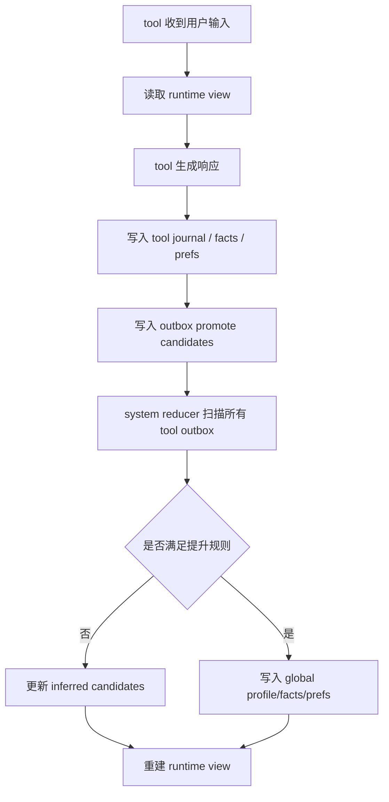
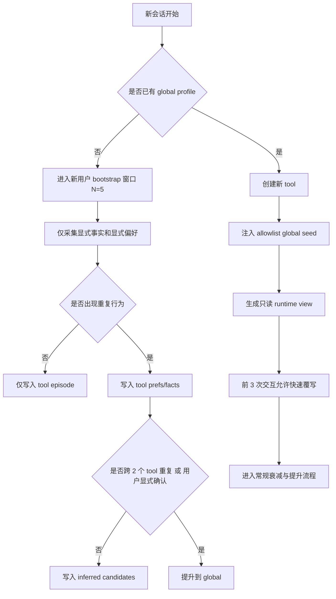

# AI 工具平台记忆隔离架构设计

**Date:** 2026-03-14
**Owner:** Codex
**Status:** Draft
**Scope:** Doramagic 在 OpenClaw 平台上的三层用户记忆架构，约束为纯文件存储、无数据库。

## 1. 目标与约束

Doramagic 需要同时满足三件事：

1. 每个 AI 工具（Skill / Tool）有独立记忆空间，默认不互通。
2. 用户存在跨工具共享的显式画像层，用于语言、输出风格、风险偏好等稳定偏好。
3. 系统还需要一层内部推断记忆，从多个工具的使用模式中学习用户深层偏好，但这层不应直接成为任意工具可见的数据泄露通道。

已知约束：

- 存储层只能使用文件系统，不能依赖数据库。
- 运行环境为 OpenClaw 工作空间。
- 当前 OpenClaw 工作空间偏向扁平 `MEMORY.md`，但该形式不适合作为长期源数据；更合理的方案是以结构化文件为 source of truth，再编译出运行时视图。

## 2. 设计结论

推荐默认采用 `强隔离 + 编译视图` 模式：

- 真实记忆以结构化文件树存储。
- 每个 tool 只对自己的私有目录拥有读写权限。
- tool 对全局画像仅有只读权限。
- 第三层推断记忆由系统内部 reducer/observer 持有，tool 默认无权直接读取。
- tool 运行时不直接扫描真实记忆树，而是读取系统编译出的只读 `MEMORY.md` / `PROFILE.json` 视图。

这是本方案最重要的决策。原因很简单：如果第三层推断记忆直接暴露给 tool，那么“系统推断”本身就会变成跨工具泄露用户行为模式的旁路。

## 3. 隔离模式比较

### 3.1 方案 A：每个 tool 独立运行身份 + 文件 ACL + 运行时视图

特点：

- 每个 tool 对应独立 Unix 用户或独立进程身份。
- 私有目录通过 POSIX ACL 或 Unix 权限隔离。
- tool 实际消费的是 `runtime/views/...` 下的编译视图。

优点：

- 文件层就能完成真实隔离。
- 即使 tool runner 有路径遍历缺陷，也较难读到其他 tool 的目录。
- 审计简单，权限边界清晰。

缺点：

- 运维复杂度高于单进程模型。

结论：**推荐方案**。

### 3.2 方案 B：单服务进程 + 路径白名单

特点：

- 所有 tool 在同一服务身份下运行。
- 运行时通过 allowlist 控制可访问目录。

优点：

- 最容易实现。
- 原型开发快。

缺点：

- 隔离是软的，不是硬的。
- 一旦 runner 漏洞、prompt 注入或路径归一化处理错误，就可能出现越权读取。

结论：适合原型，不适合作为长期默认架构。

### 3.3 方案 C：每个 tool 单独 mount namespace / chroot / 容器根

特点：

- 每个 tool 只看到自己被挂载进去的目录树。

优点：

- 隔离最强。

缺点：

- 调试、部署、资源管理都最重。

结论：适合后期多租户 SaaS，不是当前最优先。

## 4. 推荐目录结构

```text
.openclaw/workspace/doramagic/
├── skills/
├── runtime/
│   └── views/
│       └── <user_id>/
│           └── <tool_id>/
│               ├── MEMORY.md
│               ├── PROFILE.json
│               └── manifest.json
└── memory/
    └── users/
        └── <user_id>/
            ├── _control/
            │   ├── manifest.json
            │   ├── locks/
            │   ├── compaction.cursor
            │   └── reducer.state.json
            ├── global/
            │   ├── profile.json
            │   ├── facts.jsonl
            │   ├── prefs.jsonl
            │   ├── snapshot.md
            │   └── tombstones.jsonl
            ├── inferred/
            │   ├── latent.jsonl
            │   ├── candidates.jsonl
            │   ├── snapshot.internal.md
            │   └── tombstones.jsonl
            └── tools/
                └── <tool_id>/
                    ├── meta.json
                    ├── journal.jsonl
                    ├── facts.jsonl
                    ├── prefs.jsonl
                    ├── working_set.json
                    ├── snapshot.md
                    ├── tombstones.jsonl
                    ├── outbox/
                    │   └── promote_candidates.jsonl
                    └── episodes/
                        └── 2026-03/
                            └── 2026-03-14T09-12-30Z.json
```

## 5. 三层记忆的职责分工

### 5.1 Tool Scope

用途：

- 当前工具内的任务上下文
- 明确的工具内偏好
- 工具专属事实和工作方式

典型内容：

- “在写代码工具里，用户偏好详细解释”
- “在理财工具里，用户要求保守风险提示”

### 5.2 Global Scope

用途：

- 跨工具共享、显式且稳定的用户画像

典型内容：

- 首选语言
- 默认回复长度
- 时区
- 单位制
- 默认风险容忍度
- 输出格式偏好

### 5.3 Inferred Scope

用途：

- 系统从多个工具行为模式中推断出的隐式偏好

典型内容：

- “用户在多个工具中都倾向先看结论再看细节”
- “用户对自动执行更谨慎，偏向先确认再执行”

约束：

- **不直接暴露给 tool**
- 只能影响排序、候选提升、默认值建议
- 必须可追溯到证据链

## 6. 文件格式设计

### 6.1 为什么不用单一 `MEMORY.md`

扁平 Markdown 的问题是：

- 更新只能整文件重写
- 并发冲突难处理
- 结构化检索困难
- 审计和衰减计算麻烦
- 越用越长，质量越来越差

因此本设计把：

- `jsonl` 用于 append-only 事件和记忆条目
- `json` 用于物化工作集
- `md` 用于给 LLM 注入的可读视图

### 6.2 记忆条目 schema

```json
{
  "id": "mem_01HXYZ",
  "kind": "preference",
  "scope": "tool",
  "key": "response.verbosity",
  "value": "detailed",
  "source": "explicit_user",
  "evidence": ["session:2026-03-14T09:12:30Z#msg7"],
  "confidence": 0.98,
  "priority": 80,
  "first_seen_at": "2026-03-14T09:12:30Z",
  "last_seen_at": "2026-03-14T09:12:30Z",
  "last_confirmed_at": "2026-03-14T09:12:30Z",
  "last_accessed_at": "2026-03-14T09:12:30Z",
  "access_count": 3,
  "decay_policy": "time_freq",
  "status": "active"
}
```

字段解释：

- `source`: `explicit_user | observed_behavior | system_inference | imported_seed`
- `kind`: `fact | preference | constraint | pattern`
- `status`: `active | shadowed | stale | contradicted | expired | candidate`

### 6.3 写入规则

所有写入采用：

1. 写入临时文件
2. `fsync`
3. `rename` 原子替换

事件日志使用追加写，快照文件使用整文件原子替换。这样在纯文件系统里最稳妥，也最容易恢复。

## 7. 权限模型

### 7.1 逻辑权限矩阵

| Scope | 当前 tool | 其他 tool | reducer / observer | 说明 |
|---|---|---|---|---|
| `tools/<tool_id>/` | `rw` | `none` | `rw` | 私有记忆 |
| `global/` | `r` | `r` | `rw` | 共享显式画像 |
| `inferred/` | `none` | `none` | `rw` | 系统内部推断层 |
| `runtime/views/<tool_id>/` | `r` | `none` | `rw` | 编译后的只读运行时视图 |

### 7.2 强隔离实现建议

- 每个 tool 使用独立 Unix 用户，如 `dm_u123_tool_writer`
- `memory/users/<user_id>/tools/<tool_id>/` 所属者为该 tool 用户
- `memory/users/<user_id>/global/` 对所有该用户 tool 组开放只读
- `memory/users/<user_id>/inferred/` 仅系统用户可读写
- 视图编译器以系统身份运行，输出到 `runtime/views/...`

### 7.3 轻隔离降级路径

如果当前阶段不能使用独立 Unix 用户，则至少要做：

- 所有文件访问通过统一 memory API 封装
- 使用白名单根目录 + 真实路径归一化
- 对外只开放 `runtime/views/<user_id>/<tool_id>/`
- tool 永远拿不到真实 memory root

## 8. 运行时读写流程



关键约束：

- tool 自己不能直接写 `global/`
- tool 自己不能直接读 `inferred/`
- 所有跨 scope 的提升都必须经过 reducer

## 9. 记忆衰减策略

## 9.1 总体原则

不同类型的记忆，不应使用同一套遗忘策略：

- 显式事实：尽量不删除，只做 `stale` 标记
- 显式偏好：缓慢衰减
- 观察到的行为模式：中速衰减
- 系统推断：快速衰减

推荐统一评分公式：

`effective_score = source_weight * confidence * exp(-lambda_age * age_days) * (1 + ln(1 + access_count))`

这个公式适合纯文件系统，因为它只依赖条目自身元数据，reducer 周期性重算即可，不需要维护复杂缓存结构。

### 9.2 时间衰减：Exponential Decay

公式：

`time_score = base_score * exp(-lambda * age_days)`

伪代码：

```pseudo
function time_score(item, now):
    age_days = days_between(now, item.last_confirmed_at)
    return item.base_score * exp(-item.lambda * age_days)
```

适用场景：

- 临时任务偏好
- 当前项目上下文
- 最近几周的工作状态

建议半衰期：

- tool 级偏好：30 天
- global 显式偏好：180 天
- inferred 模式：14-30 天

### 9.3 使用频率衰减：LRU/LFU 变体

不推荐实现纯 LRU 或纯 LFU，推荐轻量 `LRFU-lite`：

```pseudo
function on_access(item, now):
    delta = days_between(now, item.last_accessed_at)
    item.freq_score = item.freq_score * exp(-item.lambda_freq * delta) + 1
    item.last_accessed_at = now
    item.access_count += 1

function retrieval_score(item, now):
    age_days = days_between(now, item.last_accessed_at)
    return item.freq_score * exp(-item.lambda_age * age_days)
```

适用场景：

- 高频格式偏好
- 稳定工作习惯
- 经常复用的输出模板

设计理由：

- 既考虑近期访问，也考虑长期使用频率
- 对纯文件实现更友好，不需要维护复杂淘汰链表

### 9.4 置信度衰减：推断记忆专用

```pseudo
function inferred_confidence(item, now):
    age_days = days_between(now, item.last_derived_at)
    c = item.initial_confidence * exp(-item.lambda * age_days)

    if item.unconfirmed_cycles > 0:
        c = c * pow(0.5, item.unconfirmed_cycles)

    if item.contradicted_by_explicit:
        c = c * 0.1

    return c
```

适用场景：

- “用户似乎偏好简洁”
- “用户跨工具都偏好先确认再执行”
- “用户可能更喜欢表格输出”

设计理由：

- 推断本来就不是事实
- 长时间未确认时，可信度必须自动下降
- 一旦被显式反证，应快速失效

### 9.5 推荐结论

对 Doramagic 这种纯文件、轻量级、多 tool 的系统，**最实用的是“时间衰减 + 频率加权 + 推断单独降权”混合策略**。

原因：

- 算法简单
- 数据字段少
- reducer 离线重算容易
- 与 JSONL 和快照文件兼容
- 不需要数据库索引或复杂缓存淘汰结构

## 10. 冷启动策略

## 10.1 新用户冷启动

推荐把前 `N = 5` 次有效交互作为 bootstrap 窗口。

策略：

1. 第 1-2 次：只采集显式事实与显式偏好。
2. 第 3-5 次：开始记录重复行为模式，但先留在 tool scope。
3. 至少出现“跨 2 个 tool 重复”或“用户明确确认”，才提升为 global。
4. inferred 层至少等到 6-10 个高质量事件后再生成候选。
5. bootstrap 期间宁可漏记，不要错记。

优先采集字段：

- `language`
- `response.verbosity`
- `response.structure`
- `risk_tolerance`
- `timezone`
- `units`
- `preferred_output_format`

### 10.2 新工具冷启动

当用户已有 global profile，新工具初始化时只注入“安全、可迁移、低泄露风险”的记忆。

允许注入：

- 语言
- 默认回复长度
- 时区
- 单位制
- 输出格式偏好
- 风险容忍度

禁止注入：

- 其他 tool 的任务历史
- 其他 tool 的领域事实
- inferred 原始条目
- 其他 tool 的 episode 或 journal

注入规则：

- 最多 5-8 条 seed
- 每条初始权重乘以 `0.7`
- 新 tool 的前 3 次交互允许快速覆写

### 10.3 冷启动流程图



## 11. 记忆冲突处理

## 11.1 优先级总规则

推荐优先级：

```text
current_session_explicit
> tool_explicit
> global_explicit
> tool_observed_pattern
> inferred_candidate
> system_default
```

其中：

- 当前会话显式指令优先级最高
- tool 内显式记忆优先于 global，但只在该 tool 内生效
- inferred 只能做建议，不可覆盖显式事实

### 11.2 Tool 级记忆与 Global 画像冲突

例子：

- global：用户偏好“简洁”
- tool A：用户多次明确选择“详细”

处理规则：

1. 在 tool A 内使用“详细”
2. global 保留不删
3. 将 global 条目标记为 `shadowed_in_tool:A`
4. 如果 3 个以上 tool 都转向“详细”，再触发 global 复审

### 11.3 推断记忆与事实记忆冲突

例子：

- inferred：用户偏好“详细解释”
- 当前显式反馈：以后默认简洁

处理规则：

1. 显式事实立即生效
2. inferred 条目状态改为 `contradicted`
3. 置信度乘 `0.1`
4. 保留证据链，等待未来重新验证

### 11.4 推荐状态机

```text
candidate -> promoted
candidate -> rejected
active -> shadowed
active -> stale
active -> contradicted
stale -> expired
```

## 12. 物化与压缩策略

因为系统是纯文件存储，必须控制文件膨胀。

建议：

- `journal.jsonl` 永久保留，作为审计日志
- `facts.jsonl` / `prefs.jsonl` 允许 reducer 做定期 compact
- `working_set.json` 只保留当前活跃条目
- `snapshot.md` 只保留适合喂给模型的摘要

Reducer 周期任务：

1. 读取新增 journal
2. 重算有效分数
3. 处理冲突与 tombstone
4. 产出 `working_set.json`
5. 编译 `snapshot.md`
6. 编译 `runtime/views/...`

## 13. OpenClaw 集成建议

OpenClaw 当前文档仍以 `MEMORY.md` 作为工作空间持久化入口，因此不建议直接替换掉这一接口，而是做兼容层：

- 真实存储仍然写到 `memory/users/...`
- tool 启动时只读取 `runtime/views/<user_id>/<tool_id>/MEMORY.md`
- 机器可读版本放在同目录 `PROFILE.json`
- 若未来 OpenClaw 支持结构化 memory API，再逐步移除 `MEMORY.md` 兼容层

这意味着 Doramagic 应当把 `MEMORY.md` 视为编译产物，而不是源数据。

## 14. 最终建议

如果 Doramagic 当前要落第一版，我建议按下面顺序实施：

1. 先实现三层目录结构和 JSONL schema
2. 再实现 reducer + runtime view compiler
3. 默认不让 tool 直接访问 inferred 层
4. 先上线混合衰减公式，不做复杂缓存算法
5. 新用户 bootstrap 采用保守采集策略
6. 新工具只注入 allowlist global seed

这套设计的核心收益不是“记住更多”，而是“只在对的 scope 里记住对的东西”，从而避免记忆污染和跨工具泄露。

## 15. 参考资料

本地上下文：

- `docs/PRODUCT_MANUAL.md` 中 OpenClaw 工作空间当前以扁平 `MEMORY.md` 为持久化入口。
- `docs/plans/2026-03-11-doramagic-end-state-platform-design.md` 中 Suitability Engine 已要求建模用户偏好、风险容忍度和重复成功模式。

外部参考：

- POSIX ACL: https://man7.org/linux/man-pages/man5/acl.5.html
- `setfacl`: https://man7.org/linux/man-pages/man1/setfacl.1.html
- `rename(2)` 原子替换语义: https://man7.org/linux/man-pages/man2/rename.2.html
- `openat2(2)` 路径解析约束: https://man7.org/linux/man-pages/man2/openat2.2.html
- LRFU 论文: https://pure.uos.ac.kr/en/publications/lrfu-a-spectrum-of-policies-that-subsumes-the-least-recently-used/
- ARC 论文: https://www.usenix.org/conference/fast-03/presentation/arc-self-tuning-low-overhead-replacement-cache
- 时间敏感置信度研究: https://aclanthology.org/2024.acl-long.580/
