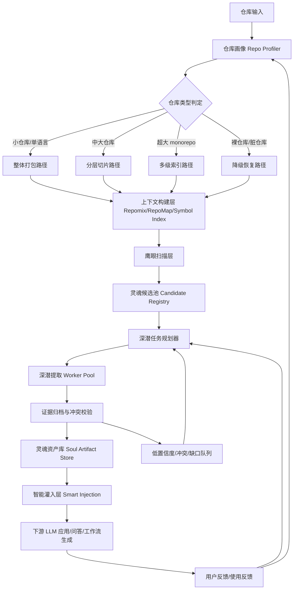

# AllInOne 代码灵魂提取工作流设计

**日期**: 2026-03-08  
**版本**: v0.1  
**性质**: 工作流架构设计文档  
**目标**: 为 AllInOne 设计一套可执行、可扩展、可降级、可增量灌入的“代码灵魂提取工作流”

---

# 一、问题定义

AllInOne 的目标不是“总结一个仓库”，而是**从开源项目中提取可复用的知识、经验、判断规则和最佳实践**，并把这些内容转化为后续 LLM 可以稳定消费的“灵魂资产”。

这里的“灵魂”不是单一文档，而是一组具有以下特征的知识对象：

- **可解释**：普通人能理解这个项目在解决什么问题
- **可追溯**：每个结论都能回到源码/文档/配置/测试/讨论的证据
- **可拆分**：每一部分灵魂都能独立使用，不需要等全仓提取完
- **可增量**：仓库变化后，只更新受影响的灵魂片段
- **可降级**：即使缺 README、缺测试、代码脏乱，也能提取出可用的部分灵魂

因此，AllInOne 需要的不是一个固定 prompt，而是一条**自适应工作流**。

---

# 二、核心结论（先给结论）

我对这套工作流的最终建议是：

> **“先画像，再分流；先鹰眼，再深潜；先证据，再结论；先碎片可用，再整体收敛。”**

也就是说，完整工作流应该由 8 个核心层构成：

1. **仓库画像层**：先判断仓库是什么类型、规模、语言、结构、成熟度
2. **切片规划层**：决定如何打包、如何切块、如何避免被大仓库拖死
3. **鹰眼扫描层**：快速识别项目的灵魂候选区域、核心抽象和高价值模块
4. **深潜提取层**：对高价值区域做分主题深挖，提取规则、流程、架构、边界条件
5. **冲突校验层**：检查不同切片、不同来源之间是否矛盾
6. **灵魂资产层**：把结果存成一组独立可消费的知识对象
7. **智能灌入层**：按用户任务、上下文窗口、置信度动态选择灌入哪些灵魂片段
8. **反馈回路层**：根据提取失败、低置信度、用户追问持续修正工作流策略

这条工作流的关键不是“多强的模型”，而是：

- **如何自适应不同仓库特征**
- **如何决定哪里值得深挖**
- **如何在不完整信息下产出部分可用结果**
- **如何避免一次性大任务失败导致全盘不可用**

---

# 三、设计原则

## 3.1 先画像，后分析

在代码理解里，最大的错误不是分析不够深，而是**用错方法**。

同样是一个 GitHub 仓库：

- 1K 行 Python 工具脚本，适合整体读完
- 100K 行 Java 服务，适合分模块处理
- 1M+ 行 monorepo，必须分层抽取
- 没有 README 的裸仓库，必须先从 entrypoint 和配置文件反推

所以工作流的第一原则是：

> **任何提取动作前，先做仓库画像。**

## 3.2 先鹰眼，后深潜

直接让 LLM 啃完整仓库，最大的问题不是 token，而是**注意力浪费**。

正确方法应当模仿人类专家：

- 第一轮只问：项目的核心概念和关键模块是什么？
- 第二轮才问：某个模块为什么重要？内部规则是什么？
- 第三轮再问：模块与模块之间是什么关系？

这正是 PocketFlow 的“鹰眼 + 深潜”思想的工程化版本。

## 3.3 先证据，后结论

灵魂提取不是写散文，必须保留证据链。否则后续灌入给 LLM 时无法判断：

- 这是事实还是猜测？
- 是源码证据还是 README 自述？
- 多个模块之间是否互相矛盾？

所以每个灵魂对象都要带：

- 来源文件
- 片段位置
- 证据类型
- 置信度
- 推理说明

## 3.4 先碎片可用，再整体收敛

一次性等整仓提取完成再使用，是错误的产品思路。

更好的做法是：

- 先产出 `repo_profile`
- 再产出 `repo_map`
- 再产出 `concept_card`
- 再产出 `workflow_card`
- 再产出 `decision_rule_card`
- 最后才产出 `soul_summary`

这样即使中途失败，前面的产物仍然可用。

---

# 四、参考现有实践后的综合判断

## 4.1 Repomix：解决“代码如何进入 LLM”

Repomix 的价值不是“压缩”，而是把复杂代码仓库变成适合 LLM 消费的打包上下文。

其启发有三点：

1. **打包格式标准化**：把多文件代码仓库转成单一可消费上下文
2. **压缩优先级控制**：函数体、目录树、忽略规则、分片大小可控
3. **可做分段输出**：超大仓库不必硬塞进一次请求

在 AllInOne 中，Repomix 应作为**上下文构建器**，而不是完整提取器。

## 4.2 Aider RepoMap：解决“哪里最值得看”

Aider RepoMap 的核心思想不是简单列目录，而是通过代码引用关系、定义关系和图排序，构造一个**重要性地图**。

它的启发是：

- 不是所有文件都值得被 LLM 平等对待
- 中心性更高、依赖更集中、被更多关键路径引用的代码，更可能承载“灵魂”
- 结构化地图本身就可以作为 LLM 的前置上下文

在 AllInOne 中，RepoMap 思想应扩展为：

- 文件中心性
- 模块中心性
- 概念中心性
- 跨语言边界中心性
- 配置/入口/适配层的桥接权重

## 4.3 PocketFlow 鹰眼 + 深潜：解决“理解顺序”

PocketFlow 的重要贡献，不在某个具体模型，而在**工作顺序**。

它说明：

- 先全局粗看，再局部深挖，效果优于盲目逐文件总结
- 先发现核心抽象，再围绕抽象去读代码，更符合真实工程理解过程
- 结构化工作流比一口气 prompt 更稳

在 AllInOne 中，这应当变成一个严格的分层机制：

- `Eagle Eye` 负责发现候选灵魂
- `Deep Dive` 负责提取高价值知识
- `Merge & Validate` 负责收敛成可消费资产

## 4.4 DeepWiki / RAG 管道：解决“怎么让结果可持续使用”

DeepWiki 类思路的价值在于：

- 提取结果不是一次性回答，而是**长期可检索资产**
- 文档、源码、结构图、摘要之间可以相互索引
- 用户后续问答时，不必重新分析整仓

AllInOne 的灵魂提取，也必须采用类似思路：

- 生成灵魂资产库
- 保持分块可检索
- 支持按任务动态灌入
- 支持增量更新

## 4.5 综合结论

这四类实践分别解决四个不同问题：

- Repomix：上下文打包
- RepoMap：重要性排序
- 鹰眼 + 深潜：分析顺序
- DeepWiki/RAG：结果持久化与再消费

**AllInOne 应该把它们组合成一条统一工作流，而不是选其中之一。**

---

# 五、工作流总架构



这条架构的核心特点是：

- **每一层独立可运行**
- **每一层都可以输出独立资产**
- **失败不会让整个流水线报废**
- **后续可以按需回补，不必从头跑**

---

# 六、仓库画像层（Repo Profiler）

这是整个工作流里最重要的一层。

## 6.1 输入

- Git 仓库 URL / 本地仓库路径
- 可选分支 / commit SHA
- 可选语言提示
- 可选业务领域提示

## 6.2 输出

输出一个 `repo_profile.json`，核心字段建议如下：

```json
{
  "repo_id": "org/project",
  "commit": "sha",
  "total_files": 1284,
  "total_loc": 186542,
  "languages": [{"name": "Python", "ratio": 0.72}, {"name": "TypeScript", "ratio": 0.19}],
  "repo_shape": "single_repo",
  "size_tier": "100k_plus",
  "doc_density": "medium",
  "test_density": "low",
  "buildability": "unknown",
  "structure_quality": "medium",
  "architecture_entropy": "medium_high",
  "entrypoints": ["main.py", "server/app.py", "cli.ts"],
  "important_configs": ["pyproject.toml", "docker-compose.yml"],
  "monorepo_packages": [],
  "risk_flags": ["dynamic_dispatch_heavy", "missing_readme_sections"]
}
```

## 6.3 关键判断维度

### 维度 1：规模

- `tiny`: <= 1K LOC
- `small`: 1K - 10K LOC
- `medium`: 10K - 100K LOC
- `large`: 100K - 1M LOC
- `xlarge`: 1M+ LOC

### 维度 2：仓库形态

- `single_repo`
- `monorepo`
- `library_repo`
- `app_repo`
- `framework_repo`
- `plugin_ecosystem_repo`
- `infra_repo`
- `docs_heavy_repo`
- `config_or_template_repo`

### 维度 3：语言结构

- 单语言
- 主语言 + 辅助脚本
- 前后端混合
- 多服务混合
- 跨语言桥接（例如 Go + TS + Proto）

### 维度 4：成熟度信号

- README 密度
- 示例代码密度
- 测试覆盖密度（不是覆盖率，而是测试存在性与组织度）
- 配置完整度
- CI 文件存在性
- Issue/PR/ADR/Docs 目录存在性

### 维度 5：结构质量

可通过以下特征粗评：

- 目录层级是否清晰
- 命名是否一致
- 是否存在大量 `misc`, `utils`, `temp`, `old`, `legacy`
- 单文件是否过大
- 模块是否相互循环引用过多
- generated/vendor/third_party 是否混在源码中

## 6.4 异常处理

- **无法统计 LOC**：退化为文件数 + 平均文件大小估算
- **语言识别失败**：改用扩展名 + shebang + 文件内容前 200 行猜测
- **仓库不完整**：标记 `profile_incomplete=true`
- **子模块缺失**：记录 `missing_submodules`

## 6.5 设计原因

仓库画像的意义，不是生成报表，而是为后续所有策略选择提供依据。

---

# 七、不同规模仓库的处理策略

## 7.1 1K 行以内：整体理解优先

### 特征

- 通常是脚本、CLI、小工具、demo
- 结构简单
- 整体塞进一个上下文通常可行

### 策略

- 直接用 Repomix 整包
- Eagle Eye 可以很轻
- Deep Dive 直接围绕入口函数和核心文件展开
- 允许一次性生成完整灵魂初稿

### 风险

- 小仓库容易被 README 误导
- demo 仓库可能“看起来完整，实际上只是示例”

### 应对

- 对 README 与源码一致性做快速校验
- 检查是否存在真实业务逻辑而非仅样板代码

## 7.2 10K 行级：模块级理解优先

### 特征

- 已有明确模块结构
- 通常有入口、配置、若干核心模块
- 可以整体看，但不应平均用力

### 策略

- 先生成 RepoMap / 符号索引
- Eagle Eye 输出 5-10 个候选核心模块
- Deep Dive 只打高价值模块
- 生成 `concept_card` + `workflow_card`

### 风险

- 误把工具层当业务灵魂
- 误把测试夹杂的假对象当真实模型

### 应对

- 中心性排序 + entrypoint proximity 联合评分
- 区分 runtime code / test code / mock code

## 7.3 100K 行级：分层切片优先

### 特征

- 不可能依赖单次上下文理解
- 模块多，跨模块关系复杂
- 文档与源码可能出现局部不一致

### 策略

- 先画像，再按模块切片
- 每个切片单独跑 Eagle Eye
- 汇总成全局候选图
- 只对高中心性、跨模块桥接模块做深潜
- 先产出局部灵魂，再合并全局灵魂

### 风险

- 跨块依赖丢失
- 不同模块给出互相矛盾的解释
- 大量重复性基础设施淹没真正灵魂

### 应对

- 引入 `cross_slice_link` 记录跨切片引用
- 引入冲突校验步骤
- 对 `framework glue` 和 `business kernel` 分别建模

## 7.4 1M+ 行 / 巨型 monorepo：层级化索引优先

### 特征

- 一次性理解是错误路线
- 往往包含多个产品、多个 runtime、多个包管理系统
- 不存在“单一灵魂”，而是“灵魂族谱”

### 策略

分三层：

1. **平台层**：整个 monorepo 的共性架构、约束、基建、设计哲学
2. **域层**：按 package / service / app / domain 分出若干子灵魂
3. **模块层**：只在必要时对单模块深潜

### 风险

- 误把 monorepo 当单仓库，导致噪音爆炸
- 子项目之间边界不清，结果互相污染

### 应对

- 先跑 workspace/package graph
- 先识别“哪些目录是独立子系统”
- 把 monorepo 视为**灵魂组合体**，而不是一个整体文档

---

# 八、不同语言与混合语言的差异化策略

## 8.1 Python

### 特征

- 动态性强
- 入口可能分散在 CLI、FastAPI、Django、Celery、脚本入口
- 类型信息不稳定

### 风险

- 调用图不完整
- monkey patch / import side effect 干扰理解

### 策略

- 提高对 `entrypoint`, `settings`, `router`, `management command`, `task queue` 的权重
- 结合 type hints、Pydantic/Dataclass/ORM model 辅助识别领域模型
- 遇到动态分派，采用“证据不足”而不是强推断

## 8.2 JavaScript / TypeScript

### 特征

- 前后端都可能存在
- 框架惯例强（Next.js / NestJS / Express / React / Vite）
- 配置文件和约定目录极重要

### 风险

- 框架胶水多，噪音大
- 前端组件层级会掩盖真正业务规则

### 策略

- 将 `routing`, `state`, `api client`, `schema`, `domain service` 作为重点
- 对 UI 组件与业务规则层分层提取
- TS 类型定义应作为领域模型的重要信号

## 8.3 Java

### 特征

- 结构通常较规范
- 依赖注入、注解、分层架构明显
- 包结构本身就是重要信号

### 风险

- 注解驱动隐藏真实行为
- 框架自动装配造成“显式调用图不完整”

### 策略

- 强化 `Controller-Service-Repository-Config` 分层识别
- 结合 annotation 扫描提取运行时角色
- 更适合生成较稳定的架构和流程卡片

## 8.4 Go

### 特征

- 项目通常结构清晰
- 接口与包边界明确
- 配置和 wiring 往往可读性较高

### 风险

- 很多项目把复杂逻辑藏在 package 内部，不一定有深目录
- 并发逻辑可能难以单次理解

### 策略

- 强化 `cmd/`, `internal/`, `pkg/`, `api/`, `config/` 的语义识别
- 对 goroutine/channel 相关流程生成并发说明卡片
- 对接口实现关系做额外抽取

## 8.5 Rust

### 特征

- 类型系统强，模块边界清晰
- 宏、trait、feature flag 影响理解
- 设计哲学往往埋在类型与模块组织中

### 风险

- 宏和 trait 派生隐藏行为
- feature-gated 代码导致“不同编译配置 = 不同系统行为”

### 策略

- 对 `Cargo.toml`, feature flags, module tree 赋高权重
- 抽取 trait-object 关系和 error type 体系
- 对宏展开不强求完全精确，但要显式标记不确定性

## 8.6 多语言混合仓库

### 特征

- 真正的灵魂常常在跨语言边界
- 例如：Proto/IDL、OpenAPI、GraphQL、消息队列 schema、shared model

### 风险

- 分语言各看各的，最终丢失系统整体性

### 策略

- 单语言理解之后，必须再跑一轮 `cross_language_bridge detection`
- 重点查找：
  - API schema
  - codegen 输出与源 schema
  - shared contracts
  - SDK/Client 对应关系
  - event payload 定义

---

# 九、单仓库 vs monorepo

## 9.1 单仓库

### 目标

- 找到整个系统的核心灵魂

### 做法

- 可以尝试输出单一 `repo_soul_summary`
- 但仍建议内部拆成多个 card，避免过度耦合

## 9.2 monorepo

### 目标

- 不追求一个总灵魂，而是：
  - 一个平台总纲
  - 若干子系统灵魂
  - 一个关系图

### 推荐输出

- `platform_principles.md`
- `package_registry.json`
- `subsystem_soul/<pkg>.md`
- `cross_system_contracts.md`
- `monorepo_dependency_map.json`

### 关键判断条件

满足以下任意两项，可认为是 monorepo：

- 同时存在多个 package/workspace/module 根
- 多个构建系统共存
- 多个独立 app/service 目录
- 根目录只负责统一工具链，不直接承载业务代码

---

# 十、特殊困难仓库的处理策略

## 10.1 裸仓库：没有 README / 没有文档 / 没有测试

### 核心问题

没有显式叙事，只剩下代码本身。

### 处理方式

工作流切换到**行为反推模式**：

1. 找入口：main、server、router、command、setup、init
2. 找配置：env、yaml、toml、json schema
3. 找 I/O 边界：HTTP、DB、MQ、CLI 参数、文件系统
4. 找核心实体：model、schema、dto、struct、type
5. 找关键流程：从入口沿调用路径反推

### 产出策略

- 减少“项目愿景类”结论
- 增加“从代码观察到的行为”描述
- 对缺失的信息显式写“不足证据”

## 10.2 代码质量极差、无结构仓库

### 表现

- 巨型 God file
- utils 横飞
- 命名不统一
- 目录层级混乱
- 复制粘贴逻辑大量存在

### 处理方式

切换到**碎片聚类模式**：

- 不按目录理解，改按功能片段聚类
- 使用符号共现、字符串常量、API 路径、表名、日志前缀来聚类
- 先识别边界，再推断抽象

### 结果预期

- 不追求完美架构图
- 先产出“可疑功能簇”
- 再逐个深潜验证

## 10.3 文档与代码严重不一致

### 处理方式

- 源码优先
- 文档作为“作者意图”证据，不作为事实来源
- 在结论里单独标注“文档/代码冲突”

## 10.4 测试丰富但源码一般

### 处理方式

- 把测试当成“真实行为说明书”
- 提取 Given / When / Then 模式，反推系统规则

## 10.5 生成代码 / vendored 代码 / 三方依赖混入源码

### 处理方式

- 尽量剔除 generated/vendor/build/dist/cache
- 若无法完全剔除，则降低其权重
- 永远不要把 generated code 当成灵魂主体

---

# 十一、边界情况与异常情况清单

下面是必须显式设计的异常面：

| 情况 | 风险 | 处理策略 |
|---|---|---|
| 二进制 / 大文件过多 | token 污染 | 直接过滤 |
| lockfile 超大 | 无价值干扰 | 过滤或仅保留生态信息 |
| Jupyter Notebook | 代码与叙事混杂 | 拆出 code cell 与 markdown cell |
| Proto / OpenAPI / GraphQL schema | 关键契约被忽略 | 作为高优先级输入 |
| 反射 / 注解 / 宏重 | 调用图不完整 | 标注低置信度 + 框架语义补偿 |
| 代码生成链 | 看见的是结果不是源头 | 回溯到 schema / generator config |
| 子模块缺失 | 系统不完整 | 标记缺口，不中断整条链路 |
| CI/build 无法运行 | 无法动态验证 | 切到 no-build 分析模式 |
| 测试全失败 | 误以为系统不可用 | 测试仅作证据，不作硬阻断 |
| 空 README | 文档无效 | 自动降级为源码驱动 |
| 大量 TODO/FIXME | 结论不稳定 | 记录风险，不阻断 |
| 多版本目录并存 | 版本混淆 | 引入版本隔离分析 |
| 插件架构 | 核心逻辑分散 | 先识别插件接口，再汇总能力 |
| 配置驱动系统 | 逻辑藏在配置而非代码 | 强化配置解析 |
| Infra repo | 业务灵魂不在源码，而在编排关系 | 改成拓扑与流程提取 |

---

# 十二、如何自动判断“这个项目的灵魂在哪里”

这是整个系统里最关键的智能化问题。

我建议建立一个 **Soul Locus Score（灵魂承载评分）**。

## 12.1 灵魂候选区域的评分因子

每个文件/模块/包计算一个分数：

### A. 中心性分

- 被多少关键入口路径经过
- 被多少高价值模块引用
- 是否位于依赖图的桥接位置

### B. 语义分

- 是否包含领域名词
- 是否定义核心实体/规则/流程函数
- 是否被 README / docs / tests 高频提到

### C. 边界分

- 是否位于系统边界：router / handler / service / controller / schema / domain / workflow
- 是否连接外部系统（API/DB/MQ）与内部抽象

### D. 决策分

- 是否包含大量条件分支、状态转换、策略选择
- 是否包含关键错误处理和边界判断

### E. 桥接分

- 是否承接跨语言、跨服务、跨模块的契约

## 12.2 明确不应被当成灵魂核心的区域

自动降权：

- generated code
- build output
- vendored deps
- 样板脚手架
- UI 纯展示组件
- 单纯 CRUD repository
- 大型常量定义但无规则的文件

## 12.3 判断结果

最终把仓库分成四类区域：

- **Core Soul Zone**：高度值得深潜
- **Supporting Logic Zone**：支持性知识，可二级深挖
- **Peripheral Zone**：外围实现，仅在需要时补充
- **Noise Zone**：默认跳过

---

# 十三、如何自动调整鹰眼和深潜策略

## 13.1 鹰眼粗细的自动调整

### 粗鹰眼

适用：

- 超大仓库
- monorepo
- 文档丰富仓库
- 明显有良好层次结构

目标：

- 识别系统边界
- 识别子系统
- 识别核心模块

### 中鹰眼

适用：

- 中型仓库
- 单仓多模块
- 文档一般

目标：

- 识别核心概念
- 识别关键流程
- 输出首批候选卡片

### 细鹰眼

适用：

- 小仓库
- 裸仓库
- 结构差的仓库

目标：

- 直接落到函数/文件级别
- 快速构造功能簇

## 13.2 深潜深度的自动调整

### Level 1：概念深潜

回答：

- 这个模块在干什么
- 它的重要输入输出是什么

### Level 2：流程深潜

回答：

- 核心工作流是什么
- 状态如何流转
- 有哪些判断规则

### Level 3：决策深潜

回答：

- 为什么这么设计
- 有哪些边界处理与反直觉约束
- 有哪些踩坑痕迹

## 13.3 自动触发加深条件

当出现以下情况时，自动升级深潜级别：

- 鹰眼结论置信度低
- 多个切片对同一概念描述冲突
- 模块中心性很高但解释很模糊
- 用户高频追问某个区域
- 代码中出现大量条件分支/状态机/策略模式

---

# 十四、处理意外情况的机制

工作流不应该假设“仓库会配合你”。

## 14.1 意外情况分类

### 类型 A：输入异常

- clone 不完整
- 子模块缺失
- 文件编码混乱
- 大量二进制 / 大文件

### 类型 B：结构异常

- 无法识别主语言
- 无法识别入口
- 模块边界混乱

### 类型 C：理解异常

- Eagle Eye 找不到稳定核心
- 多个候选灵魂互相冲突
- 深潜结果无法验证

### 类型 D：输出异常

- 生成结果过于空泛
- 证据不足
- 同一概念重复产出多个版本

## 14.2 统一处理原则

- **不阻断整条链路**
- **记录异常并产出部分可用结果**
- **把“未知”显式写出来**
- **把未解决问题回流到缺口队列**

## 14.3 缺口队列（Gap Queue）

建议对以下问题统一进队列：

- 未识别入口
- 关键概念低置信度
- 模块边界不清
- 文档与源码冲突
- 契约来源不明
- 规则解释不完整

后续可以：

- 自动二次深潜
- 等用户追问再补
- 等增量更新时补

---

# 十五、逐步工作流设计（输入 / 输出 / 判断条件 / 异常处理）

## Step 1：Repository Intake

### 输入

- repo URL / 本地路径
- branch / commit
- 可选忽略规则

### 输出

- 标准化仓库快照
- 文件清单
- 原始元数据

### 判断条件

- 仓库是否可读取
- 是否存在子模块 / workspace / package roots

### 异常处理

- clone 失败：终止并返回 intake error
- 部分文件缺失：记录 warning，允许继续

---

## Step 2：Repo Profiler

### 输入

- 文件清单
- 基础元数据

### 输出

- `repo_profile.json`

### 判断条件

- 规模 tier
- 单仓 / monorepo
- 主语言 / 混合语言
- 文档密度 / 测试密度 / 结构质量

### 异常处理

- 画像不完整也允许继续
- 低置信度字段显式标注

---

## Step 3：Slice Planner

### 输入

- `repo_profile.json`

### 输出

- `slice_plan.json`

### 判断条件

- 小仓：整体打包
- 中仓：模块打包
- 大仓：层级打包
- monorepo：子系统打包
- 裸仓：入口反推打包

### 异常处理

- 若模块边界不清，改为“目录 + 符号簇”混合切片

---

## Step 4：Context Builder

### 输入

- 仓库快照
- `slice_plan.json`

### 输出

- `repomix_bundle/*`
- `repo_map.json`
- `symbol_index.json`
- `config_index.json`

### 判断条件

- 是否需要压缩
- 是否需要拆片
- 是否需要额外提取 schema/config

### 异常处理

- Repomix 失败：退化为目录树 + 关键文件原文
- 部分语言无法 parse：退化为文本模式

---

## Step 5：Eagle Eye Scan

### 输入

- context bundle
- repo map
- symbol index
- repo profile

### 输出

- `candidate_registry.json`
- `repo_overview.md`
- `candidate_scores.json`

### 判断条件

- 哪些模块属于 Core Soul Zone
- 哪些概念值得深潜
- 哪些区域应降权跳过

### 异常处理

- 若候选不足：自动放宽扫描粒度
- 若候选过多：提高中心性阈值

---

## Step 6：Deep Dive Planner

### 输入

- `candidate_registry.json`
- `repo_profile.json`

### 输出

- `deep_dive_tasks.jsonl`

### 判断条件

- 对每个候选分配深潜级别
- 选择概念类 / 流程类 / 规则类 / 契约类 / 架构类任务

### 异常处理

- 若任务过多：按中心性、差异性、跨模块价值裁剪

---

## Step 7：Deep Dive Workers

### 输入

- `deep_dive_tasks.jsonl`
- 对应切片源码/文档/配置/测试

### 输出

- `concept_card/*.md`
- `workflow_card/*.md`
- `decision_rule_card/*.md`
- `contract_card/*.md`
- `architecture_card/*.md`

### 判断条件

- 是否证据充分
- 是否有跨片依赖
- 是否需要追加补充上下文

### 异常处理

- 证据不足：输出 `low_confidence_card`
- 解释冲突：进入 conflict queue
- 需要补充：自动回拉相邻切片

---

## Step 8：Merge & Validate

### 输入

- 全部 card
- 证据索引

### 输出

- `soul_summary.md`
- `conflict_report.md`
- `coverage_report.json`

### 判断条件

- 不同 card 是否互相矛盾
- 是否覆盖了核心候选区域
- 是否存在明显空洞

### 异常处理

- 冲突存在：不阻断，但显式列出
- 覆盖率不足：保持部分发布，不等待全补齐

---

## Step 9：Soul Artifact Store

### 输入

- 所有 card 和报告

### 输出

- 标准化灵魂资产库

### 建议资产结构

```text
repo_profile.json
repo_overview.md
repo_map.json
candidate_registry.json
concept_card/
workflow_card/
decision_rule_card/
contract_card/
architecture_card/
conflict_report.md
coverage_report.json
soul_summary.md
```

### 异常处理

- 单个资产失败不影响整个资产库发布

---

## Step 10：Smart Injection

### 输入

- 用户问题 / 下游任务
- 灵魂资产库
- token budget

### 输出

- 动态灌入包 `injection_bundle`

### 判断条件

- 当前任务需要哪些 card
- 高置信度优先
- 与问题最近的证据优先
- 预算不足时先保留结构卡、流程卡、规则卡

### 异常处理

- 若相关灵魂不存在：返回 gap hint，不假装知道

---

# 十六、步骤解耦设计

AllInOne 不应把工作流做成“大事务”。

## 16.1 解耦原则

每一步都必须：

- 有明确输入契约
- 有明确输出契约
- 可单独重跑
- 可缓存
- 可并行
- 可被下游直接消费

## 16.2 典型解耦方式

### A. 画像与提取解耦

`repo_profile` 失败，不代表不能做 `repo_map`。

### B. 鹰眼与深潜解耦

可以只做鹰眼，就先对外提供 `repo_overview`。

### C. 各类 card 解耦

- `workflow_card` 可以先用
- `decision_rule_card` 可以后补
- `contract_card` 可以单独更新

### D. 校验与发布解耦

即便存在冲突，也可以发布高置信度资产。

---

# 十七、智能灌入机制：为什么必须“部分可用”

如果灵魂只能整包使用，会出现三个问题：

1. 大仓库提取周期太长
2. 小问题不需要整仓灵魂
3. 一个低质量模块会拖垮整包结果

## 17.1 建议的灵魂最小单元

每个最小单元都应有：

- `artifact_id`
- `artifact_type`
- `title`
- `summary`
- `body`
- `evidence[]`
- `confidence`
- `coverage_scope`
- `dependencies[]`
- `freshness`

## 17.2 灌入优先级建议

### 问“这个项目是干什么的”

优先灌入：

- `repo_profile`
- `repo_overview`
- `architecture_card`

### 问“某个功能怎么实现”

优先灌入：

- `workflow_card`
- 相关 `concept_card`
- 相应证据片段

### 问“有哪些业务规则/最佳实践”

优先灌入：

- `decision_rule_card`
- `conflict_report`
- `soul_summary` 的 rules 部分

---

# 十八、关键判断逻辑（可执行分支规则）

下面给出一组可以直接工程化的判断逻辑。

## 18.1 仓库分流规则

```text
IF total_loc <= 10k AND language_count <= 2
  THEN use whole-repo eagle-eye + direct deep-dive

ELSE IF 10k < total_loc <= 100k
  THEN use module slicing + candidate scoring

ELSE IF total_loc > 100k AND repo_shape != monorepo
  THEN use hierarchical slicing + cross-slice merge

ELSE IF repo_shape == monorepo
  THEN build package graph first, then extract subsystem souls
```

## 18.2 裸仓库分流规则

```text
IF readme_missing AND tests_missing
  THEN switch to behavior-reconstruction mode
       prioritize entrypoints, configs, I/O boundaries, models
```

## 18.3 脏仓库分流规则

```text
IF structure_quality == low OR architecture_entropy == high
  THEN reduce directory-based trust
       increase symbol-cluster and string-pattern clustering
```

## 18.4 深潜升级规则

```text
IF candidate_score >= high AND confidence <= medium
  THEN deepen one more level

IF conflict_detected == true
  THEN schedule reconciliation task

IF user_queries_on_same_area >= threshold
  THEN increase priority and refresh artifact
```

## 18.5 发布规则

```text
IF artifact_confidence >= high
  THEN publish immediately
ELSE IF artifact_confidence == medium AND evidence_count >= minimum
  THEN publish with caution label
ELSE
  put into gap queue and do not treat as stable soul
```

---

# 十九、为什么这样设计：关键决策说明

## 决策 1：必须先做仓库画像

**原因**：不同仓库的最优理解方式差异极大；不先分流，后面所有步骤都容易用错方法。

## 决策 2：必须采用鹰眼 + 深潜

**原因**：大仓库的真正瓶颈不是上下文大小，而是注意力分配；先全局，再局部，是最稳的理解顺序。

## 决策 3：必须把结果拆成独立 card

**原因**：产品需要增量可用、部分可用、按需灌入，而不是一次性大摘要。

## 决策 4：必须保留证据链和置信度

**原因**：灵魂资产最终会喂给 LLM。没有证据和置信度，后续系统无法做质量控制。

## 决策 5：冲突不应阻断整条链路

**原因**：现实中的仓库本来就会有不一致。产品应该学会“带着不完美继续产出部分价值”。

## 决策 6：monorepo 必须被视为灵魂组合体

**原因**：很多超大仓库没有单一灵魂，只有平台原则 + 子系统灵魂 + 契约网络。

---

# 二十、建议的最终产物形态

对一个仓库，最终建议至少产出以下 7 类成果：

1. `repo_profile.json` —— 仓库画像
2. `repo_overview.md` —— 全局理解
3. `repo_map.json` —— 结构与重要性地图
4. `concept_card/*` —— 核心概念
5. `workflow_card/*` —— 核心流程
6. `decision_rule_card/*` —— 判断规则 / 边界条件 / 最佳实践
7. `soul_summary.md` —— 适合直接灌入下游 LLM 的高层总结

如果仓库复杂，再追加：

- `contract_card/*`
- `architecture_card/*`
- `conflict_report.md`
- `gap_queue.jsonl`
- `coverage_report.json`

---

# 二十一、最小可行版本（MVP）建议

如果 AllInOne 要先做一个最小可用版本，我建议按下面顺序实现：

## MVP-1

- Repo Profiler
- Repomix 打包
- RepoMap / 简易重要性排序
- Eagle Eye Scan
- `repo_profile + repo_overview + concept_card`

## MVP-2

- Deep Dive Planner
- workflow / rules card
- evidence & confidence 机制
- basic conflict detection

## MVP-3

- monorepo 支持
- cross-language bridge detection
- smart injection bundle builder
- 增量更新与反馈闭环

---

# 二十二、最终建议

如果只用一句话总结这套设计：

> **AllInOne 的代码灵魂提取，不应该被实现成“一次性大总结器”，而应该被实现成“自适应、分层、证据驱动、增量可用的灵魂生产流水线”。**

最优路线不是：

- 先把全仓塞给 LLM，再指望它理解一切；

而是：

- 先判断仓库类型；
- 再决定上下文构建策略；
- 再用鹰眼找灵魂候选；
- 再用深潜把高价值区域提成可复用资产；
- 最后按用户任务动态灌入。

这条路线最稳健，也最适合真正工程化落地。

---

# 二十三、附：建议直接落地的数据对象

## 23.1 `repo_profile`

用于判断怎么分析。

## 23.2 `candidate_registry`

用于判断“灵魂在哪里”。

## 23.3 `deep_dive_tasks`

用于调度深潜 worker。

## 23.4 `artifact_store`

用于让每一部分灵魂独立可用。

## 23.5 `injection_bundle`

用于让下游 LLM 只拿当前任务最需要的那部分灵魂。

---

# 二十四、参考实践（建议纳入工程说明）

以下实践对本设计有直接启发：

- **Repomix**：适合做仓库打包、压缩和分片的基础设施  
  - https://github.com/yamadashy/repomix
- **Aider RepoMap**：适合借鉴“仓库重要性地图”和结构化上下文思路  
  - https://aider.chat/docs/repomap.html
- **PocketFlow / Eagle Eye + Deep Dive**：适合借鉴“先总览后深挖”的理解顺序  
  - https://github.com/The-Pocket/PocketFlow
- **DeepWiki**：适合借鉴“提取结果要成为长期可检索资产”的思路  
  - https://deepwiki.com/

在 AllInOne 中，这些不应被当成互斥方案，而应被组合成统一流水线。
