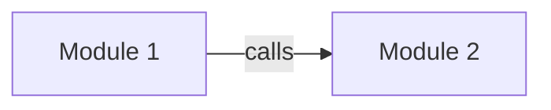

# AllInOne 灵魂提取详细方案（长上下文强推理模型优化版）

**日期**: 2026-03-08  
**角色**: AllInOne 首席提取工程师  
**版本**: v1.0  
**目标**: 设计一套完整、可执行、可验证的“灵魂提取”方案，将开源项目中的代码知识、社区经验、踩坑记录提取为 LLM 可消费的结构化知识卡片。  
**目标文件**: `/Users/tangsir/Documents/openclaw/allinone/docs/research/20260308_codex_soul_extraction_detailed_plan.md`

---

# 一、执行摘要

## 1.1 结论先行

AllInOne 的最佳提取方案，不应是“给一个大 prompt，让模型总结整个仓库”，而应是一个 **分阶段、可回退、可验证、以证据为中心** 的提取流水线。

本报告推荐采用以下主路径：

> **Repomix 负责上下文打包，Eagle Eye 负责识别灵魂所在，Deep Dive 负责抽取卡片，Community Pipeline 负责提取真实踩坑经验，Judge + Auto Validation 负责质量门控，Gap Queue 负责管理不确定性。**

## 1.2 默认假设

本方案默认面向：

- **长上下文、强推理模型**
- 能稳定处理 `Repomix --compress` 的中大型代码包
- 能在多轮提取中保持结构化输出

因此，本报告中的 prompt 默认优先为 frontier 模型优化，而不是优先为便宜小模型优化。  
降本与兼容策略仍会提供，但属于次级路径。

## 1.3 核心思想

整套方案基于六个工程原则：

1. **先画像，后提取**：先知道仓库是什么，再决定怎么提取。
2. **先鹰眼，后深潜**：先找到灵魂候选区，再精读。
3. **先证据，后结论**：卡片必须可追溯。
4. **先卡片，后汇总**：先产出独立可用知识对象，再做整体收敛。
5. **先保守，再补全**：不确定就进 Gap Queue，不要强行脑补。
6. **代码半魂优先保证真实性，社区半魂补充真实使用经验**。

## 1.4 最终输出

本方案的最终产物是一组 Markdown + YAML frontmatter 知识卡片：

- `concept_card`
- `workflow_card`
- `decision_rule_card`
- `contract_card`
- `architecture_card`

并辅以一组中间资产：

- `repo_profile`
- `eagle_eye_identity`
- `eagle_eye_module_map`
- `eagle_eye_soul_locus`
- `deep_dive_queue`
- `judge_report`
- `gap_queue`

---

# 二、设计前提与统一约定

## 2.1 为什么 prompt 主要用英文

本报告中的 `System Prompt` 和 `User Prompt` 优先使用英文，不是因为最终用户语言是英文，而是因为：

- 强模型在结构化提取任务上，英文指令通常更稳定；
- 代码标识符、路径、注释、API 名称本就以英文居多；
- 英文 prompt 更容易跨模型迁移。

但输出卡片中的自然语言字段可以按产品策略切换：

- 默认建议：**卡片正文用简洁英文，最终面向用户服务时再按用户语言生成回答**；
- 如果 AllInOne 内部知识库明确是中文优先，也可把 prompt 中的 plain-language fields 调整为中文。

## 2.2 统一字段约定

### 证据等级

- `E1`: 源码 / 测试 / 官方文档 / schema / route / config
- `E2`: Maintainer issue / PR / release note
- `E3`: 高质量社区共识 / 多次复现
- `E4`: 弱 anecdotal evidence

### 置信度

- `high`
- `medium`
- `low`

### 推断强度

- `explicit`
- `strong_inference`
- `weak_hypothesis`

### 状态

- `draft`
- `active`
- `deprecated`
- `rejected`

## 2.3 中间产物优先于一次性总结合成

最佳实践不是“一步到位生成整套灵魂”，而是分层保存中间产物：

1. `repo_profile`
2. `eagle_eye_identity`
3. `eagle_eye_module_map`
4. `eagle_eye_soul_locus`
5. `deep_dive_queue`
6. `cards`
7. `judge_report`
8. `gap_queue`

原因：

- 失败可回退
- 可增量重跑
- 可局部修复
- 便于后续自动评估

## 2.4 统一变量命名

下文 prompt 中会反复使用以下变量：

- `{{repo_profile_yaml}}`
- `{{repomix_compressed}}`
- `{{repomix_full_locus_pack}}`
- `{{eagle_eye_identity_md}}`
- `{{eagle_eye_module_map_md}}`
- `{{eagle_eye_soul_locus_md}}`
- `{{current_locus_yaml}}`
- `{{issue_thread_md}}`
- `{{discussion_thread_md}}`
- `{{pr_thread_md}}`

---

# 三、完整提取流水线总览

## 3.1 总流程

```text
Repo Input
  -> Repo Profile
  -> Eagle Eye / Identity
  -> Eagle Eye / Module Map
  -> Eagle Eye / Soul Locus Ranking
  -> Deep Dive Queue
  -> L1 Deep Dive / Concept
  -> L2 Deep Dive / Workflow + Contract
  -> L3 Deep Dive / Decision Rule + Architecture
  -> Community Pipeline / Tier 1 + Tier 2 + Tier 3
  -> Merge & Validate
  -> Judge
  -> Gap Queue
  -> Final Soul Cards
```

## 3.2 阶段与产物对应表

| 阶段 | 输入 | 输出 | 目标 |
|---|---|---|---|
| Repo Profile | 仓库元信息、目录树、语言统计 | `repo_profile.yaml` | 判断仓库形态和提取路径 |
| Eagle Eye 1 | `repo_profile` + `Repomix --compress` | `eagle_eye_identity.md` | 识别项目身份和核心概念 |
| Eagle Eye 2 | 上一步输出 + `Repomix --compress` | `eagle_eye_module_map.md` | 识别核心模块与关系 |
| Eagle Eye 3 | 上两步输出 + `Repomix --compress` | `eagle_eye_soul_locus.md` | 确定灵魂候选区和深潜优先级 |
| L1 Deep Dive | locus 完整代码包 | `concept_card` | 提取“做什么” |
| L2 Deep Dive | locus 完整代码包 + L1 卡片 | `workflow_card` + `contract_card` | 提取“怎么流” |
| L3 Deep Dive | locus 完整代码包 + L1/L2 卡片 | `decision_rule_card` + `architecture_card` | 提取“为什么这样设计” |
| Community Tier 1 | Issues/PRs/Discussions 原始线程 | `tier1_candidates.jsonl` | 免费规则初筛 |
| Community Tier 2 | Tier 1 候选 | `tier2_classified.jsonl` | 相关性评分 + 类型分类 |
| Community Tier 3 | Tier 2 高分线程 | 社区卡片 | 提取踩坑经验和未文档化规则 |
| Merge & Validate | 所有卡片和中间报告 | `judge_report.md` + `gap_queue.yaml` | 去重、验证、找缺口 |

---

# 四、代码半魂提取——鹰眼阶段

## 4.1 输入与输出

### 输入

- `repo_profile.yaml`
- `Repomix --compress` 输出
- 可选补充：
  - README 摘要
  - entrypoint 文件列表
  - package / build / config 摘要
  - release note 摘要

### 输出

- `eagle_eye_identity.md`
- `eagle_eye_module_map.md`
- `eagle_eye_soul_locus.md`
- `deep_dive_queue.yaml`

### 鹰眼阶段目标

鹰眼阶段不负责写最终卡片。它负责回答三个问题：

1. 这个项目是什么？
2. 它主要由哪几块组成？
3. 灵魂最可能藏在哪些文件/模块里？

---

## 4.2 Step 1：识别项目身份和核心概念

### 目标

从压缩后的仓库视图中识别：

- 项目在解决什么问题
- 面向谁
- 运行时最重要的 5-10 个核心概念
- 每个概念最可能锚定在哪些文件/模块

### System Prompt

```text
You are AllInOne's Eagle Eye extractor for code soul extraction.

Your job is to infer a project's identity and its core concepts from a compressed repository view.
You are not allowed to invent implementation details that are not grounded in the provided input.

Priorities:
1. Be faithful to the repository evidence.
2. Prefer broad architectural concepts over low-level utilities.
3. Produce concept candidates that are useful for later deep-dive extraction.
4. Explicitly mark uncertainty instead of guessing.

Output rules:
- Output in Markdown only.
- Use the exact template requested by the user.
- Keep concept count between 5 and 10.
- For each concept, include evidence file paths.
- Do not output chain-of-thought or hidden reasoning.
- If evidence is weak, say so explicitly in the confidence field.
```

### User Prompt

```text
Task: Identify the project's identity and core concepts from the compressed repository view.

Input artifacts:
- Repo profile:
{{repo_profile_yaml}}

- Compressed repository pack from Repomix:
{{repomix_compressed}}

Instructions:
1. Infer the project's primary purpose in plain language.
2. Infer the likely user/operator of the project.
3. Identify 5-10 core concepts that appear central to runtime behavior, architecture, or user value.
4. For each concept, provide:
   - concept_name
   - one_sentence_definition
   - why_it_matters
   - likely_anchor_files
   - confidence (high|medium|low)
   - evidence_note
5. Separate "core concept" from "supporting utility".
6. Add an "open questions" section listing uncertainties that must be resolved in deep dive.

Output using this exact Markdown template.
```

### 输出模板

```md
---
artifact_id: EE-IDENTITY-001
stage: eagle_eye
repo: {{repo_id}}
commit: {{commit_sha}}
input: repomix_compressed
schema_version: 1
confidence: provisional
---

# Eagle Eye Identity Report

## Project Identity
- **Primary Purpose**:
- **Likely User / Operator**:
- **System Type**:
- **One-Sentence Plain Explanation**:

## Core Concepts
| concept_id | concept_name | one_sentence_definition | why_it_matters | likely_anchor_files | confidence | evidence_note |
|---|---|---|---|---|---|---|
| C01 |  |  |  |  | high |  |
| C02 |  |  |  |  | medium |  |

## Likely Non-Core / Supporting Utilities
- {{utility_or_helper}}
- {{utility_or_helper}}

## Open Questions For Deep Dive
- Q1:
- Q2:
- Q3:
```

---

## 4.3 Step 2：识别核心模块和模块关系

### 目标

从压缩视图中抽出：

- 核心模块
- 模块职责
- 模块之间的数据流 / 调用流 / 依赖关系
- 可能的 entrypoint / orchestrator / state owner

### System Prompt

```text
You are AllInOne's Eagle Eye module mapper.

Your job is to map the repository into a small number of meaningful runtime or architectural modules.
Do not mirror the folder tree mechanically.
Infer modules by responsibility, control flow, state ownership, and boundary role.

Priorities:
1. Group files by runtime responsibility, not just by directory.
2. Highlight orchestrators, entrypoints, stateful components, adapters, and boundary layers.
3. Surface inter-module relationships that matter for later deep dive.
4. Mark uncertainty explicitly.

Output rules:
- Output in Markdown only.
- Use the exact template requested by the user.
- Prefer 4-8 modules unless the repo clearly requires more.
- Include evidence file paths for every module.
- Do not output hidden reasoning.
```

### User Prompt

```text
Task: Identify the core modules of the repository and map their relationships.

Input artifacts:
- Repo profile:
{{repo_profile_yaml}}

- Step 1 identity report:
{{eagle_eye_identity_md}}

- Compressed repository pack from Repomix:
{{repomix_compressed}}

Instructions:
1. Identify 4-8 core modules.
2. For each module, provide:
   - module_name
   - responsibility
   - key_files
   - entry_or_support_role
   - owned_concepts
   - confidence
3. Identify:
   - likely entrypoints
   - likely orchestrators
   - likely state owners
   - likely external boundary adapters
4. Map the most important relations between modules:
   - calls
   - data flows
   - dependency direction
   - configuration/control edges
5. Add a shortlist of modules that deserve deep dive first.

Output using the exact Markdown template.
```

### 输出模板

```md
---
artifact_id: EE-MODULES-001
stage: eagle_eye
repo: {{repo_id}}
commit: {{commit_sha}}
input: repomix_compressed
schema_version: 1
confidence: provisional
---

# Eagle Eye Module Map

## Core Modules
| module_id | module_name | responsibility | key_files | role | owned_concepts | confidence |
|---|---|---|---|---|---|---|
| M01 |  |  |  | entry/orchestrator/domain/adapter/support |  | high |
| M02 |  |  |  |  |  | medium |

## Structural Roles
- **Likely Entrypoints**:
- **Likely Orchestrators**:
- **Likely State Owners**:
- **Likely External Boundary Adapters**:

## Critical Relationships
| from_module | to_module | relationship_type | what_flows | evidence_files | confidence |
|---|---|---|---|---|---|
| M01 | M02 | calls/data_flow/dependency/config |  |  | high |

## Mermaid Sketch


## Deep Dive Priority Candidates
1. {{module_id}} - {{reason}}
2. {{module_id}} - {{reason}}

## Open Questions
- Q1:
- Q2:
```

---

## 4.4 Step 3：计算 Soul Locus Score

### 目标

找出“灵魂所在”的高价值文件 / 模块，决定深潜优先级。  
这里不是找最大文件，而是找最能承载：

- 核心概念
- 关键工作流
- 重要决策
- 约束与边界
- 架构 trade-off

### Soul Locus Score 维度与权重

| 维度 | 权重 | 含义 |
|---|---:|---|
| `Domain Centrality` | 20 | 是否直接承载核心业务/领域概念 |
| `Execution Influence` | 15 | 是否影响主执行路径或主用户流程 |
| `Orchestration Power` | 15 | 是否编排多个模块、流程或状态转换 |
| `Data / State Gravity` | 15 | 是否拥有关键数据结构、状态或生命周期 |
| `Rule Density` | 10 | 是否包含显著条件判断、校验、分支规则 |
| `Boundary Importance` | 10 | 是否是外部接口、API、持久层、消息边界 |
| `Cross-Module Bridge` | 10 | 是否连接多个模块或层次 |
| `Concept Density` | 5 | 是否高密度体现核心术语/抽象 |

### 总分公式

```text
Soul Locus Score
= 0.20*Domain Centrality
+ 0.15*Execution Influence
+ 0.15*Orchestration Power
+ 0.15*Data/State Gravity
+ 0.10*Rule Density
+ 0.10*Boundary Importance
+ 0.10*Cross-Module Bridge
+ 0.05*Concept Density
```

### 分数解释

- `85-100`: Primary Soul Locus，必须优先深潜
- `70-84`: Secondary Soul Locus，应纳入第一轮深潜
- `55-69`: Supporting Locus，仅在相关任务时深潜
- `<55`: Context Only，不作为优先灵魂候选

### System Prompt

```text
You are AllInOne's Soul Locus scorer.

Your job is to rank files or modules by how likely they are to contain the project's "soul":
core concepts, key workflows, critical contracts, decision logic, and architectural intent.

Do not rank by file size or popularity alone.
Use the provided scoring dimensions explicitly.
Every score must be tied to repository evidence.

Priorities:
1. Identify the loci most worth full-code deep dive.
2. Distinguish primary soul loci from supporting context.
3. Keep scoring calibrated; do not give everything a high score.
4. Recommend the next deep-dive queue.

Output rules:
- Output Markdown only.
- Use the exact template requested by the user.
- Score at module or file granularity, whichever is more meaningful.
- Include at least 8 and at most 15 loci.
- Include the dimensional breakdown for each top locus.
- Do not output hidden reasoning.
```

### User Prompt

```text
Task: Compute Soul Locus Scores and decide which files/modules deserve deep dive first.

Input artifacts:
- Repo profile:
{{repo_profile_yaml}}

- Step 1 identity report:
{{eagle_eye_identity_md}}

- Step 2 module map:
{{eagle_eye_module_map_md}}

- Compressed repository pack from Repomix:
{{repomix_compressed}}

Scoring dimensions and weights:
- Domain Centrality: 20
- Execution Influence: 15
- Orchestration Power: 15
- Data/State Gravity: 15
- Rule Density: 10
- Boundary Importance: 10
- Cross-Module Bridge: 10
- Concept Density: 5

Instructions:
1. Rank 8-15 candidate soul loci.
2. Each locus may be a file or a small module cluster.
3. For each locus, provide:
   - locus_id
   - locus_name
   - type (file|module_cluster)
   - paths
   - dimensional score breakdown
   - final soul_locus_score
   - why_this_locus_matters
   - likely_deep_dive_levels (L1/L2/L3)
   - likely_card_outputs
4. End with a recommended deep-dive queue in execution order.
5. Explicitly list weak-evidence loci that should not be over-trusted.

Output using the exact Markdown template.
```

### 输出模板

```md
---
artifact_id: EE-SOUL-LOCUS-001
stage: eagle_eye
repo: {{repo_id}}
commit: {{commit_sha}}
input: repomix_compressed
schema_version: 1
confidence: provisional
---

# Soul Locus Ranking

## Ranked Loci
| locus_id | locus_name | type | paths | domain | execution | orchestration | state | rules | boundary | bridge | concept | final_score | likely_deep_dive_levels | likely_card_outputs |
|---|---|---|---|---:|---:|---:|---:|---:|---:|---:|---:|---:|---|---|
| L01 |  | file |  | 18 | 14 | 12 | 13 | 8 | 9 | 9 | 4 | 87 | L1,L2,L3 | concept,workflow,contract |
| L02 |  | module_cluster |  |  |  |  |  |  |  |  |  | 78 | L2,L3 | workflow,decision_rule,architecture |

## Why Top Loci Matter
- **L01**:
- **L02**:
- **L03**:

## Weak-Evidence / Watchlist Loci
- {{path_or_module}} - {{why_uncertain}}
- {{path_or_module}} - {{why_uncertain}}

## Recommended Deep Dive Queue
1. {{locus_id}} - {{why_first}}
2. {{locus_id}} - {{why_second}}
3. {{locus_id}} - {{why_third}}

## Extraction Risks
- R1:
- R2:
```

---

## 4.5 鹰眼阶段合格标准

### 六条硬规则

1. **身份清晰**：必须能用一句人话解释项目用途。  
2. **概念有锚点**：每个核心概念必须绑定路径。  
3. **模块不是目录复述**：按职责和边界划分，而不是目录名照抄。  
4. **Soul Locus 有区分度**：分数不能都挤在一个窄区间。  
5. **跨步骤一致**：核心概念、核心模块、top loci 必须能互相对应。  
6. **存在不确定性声明**：必须有 open questions 或 weak-evidence loci。  

### 通过线

满足以下条件才允许进入深潜：

- 识别出 `5-10` 个核心概念
- 识别出 `4-8` 个核心模块
- 排出 `8-15` 个 soul loci
- 前 `3-5` 个 loci 能覆盖主用户流程或核心架构骨架
- 有明确 `deep_dive_queue`

### 回退策略

若鹰眼不合格，按顺序补救：

1. 补 `repo_profile` 和入口文件摘要
2. 对 top 20 可疑文件跑轻量 symbol map / RepoMap
3. 重跑 Step 2 和 Step 3
4. 仍失败则进入“大仓库/脏仓库降级路径”

---

# 五、代码半魂提取——深潜阶段

## 5.1 深潜阶段原则

深潜阶段严格分三层：

- `L1`: 概念提取——做什么
- `L2`: 流程提取——怎么流
- `L3`: 决策提取——为什么这样设计

不建议把这三层混在一个 prompt 里。混在一起最容易出现：

- 概念和流程互相污染
- 流程说不清状态变化
- 决策意图没有证据边界
- 输出卡片职责混乱

## 5.2 深潜输入与调度

每次深潜任务建议输入：

- `repo_profile.yaml`
- `eagle_eye_identity.md`
- `eagle_eye_module_map.md`
- `eagle_eye_soul_locus.md`
- `current_locus.yaml`
- locus 的完整代码包（来自 Repomix 完整版，不压缩）
- 相邻文件 / 测试 / schema / validator / config（如有）

建议顺序：

1. `L1`
2. `L2`
3. `L3`
4. 同 locus 内小范围 merge

---

## 5.3 L1 Deep Dive：概念提取——做什么

### 目标

从某个高价值 locus 的完整代码中提取：

- 它解决的核心问题
- 核心对象 / 抽象 / 概念边界
- 输入输出语义
- 与其他概念的关系
- 面向非技术用户的解释方式

### L1 System Prompt

```text
You are AllInOne's L1 Deep Dive extractor for code soul extraction.

Your job is to read the full code of a high-value locus and extract concept-level knowledge:
what the locus is, what problem it solves, what abstractions it defines, and what boundaries it has.

You must stay grounded in the provided code and nearby evidence.
Do not invent design intent unless it is explicitly visible from code structure, naming, comments, tests, or configuration.
If a concept is only weakly supported, mark it as uncertain.

Your output is not a code summary.
Your output must produce reusable concept cards for later LLM consumption.

Priorities:
1. Identify domain-significant concepts, not helpers.
2. Define each concept clearly and in plain language.
3. Distinguish definition, responsibility, boundary, and relation.
4. Tie every concept to file-level evidence.
5. Prefer fewer, stronger concepts over many weak ones.

Output rules:
- Output Markdown only.
- Use the exact concept_card template requested by the user.
- Generate 1 to 3 concept cards for this locus.
- Do not output chain-of-thought or hidden reasoning.
- Do not produce workflow or architecture cards in this step.
```

### L1 User Prompt

```text
Task: Perform an L1 Deep Dive on the following soul locus and extract concept-level knowledge.

Input artifacts:
- Repo profile:
{{repo_profile_yaml}}

- Eagle Eye identity report:
{{eagle_eye_identity_md}}

- Eagle Eye module map:
{{eagle_eye_module_map_md}}

- Eagle Eye soul locus report:
{{eagle_eye_soul_locus_md}}

- Current locus metadata:
{{current_locus_yaml}}

- Full-code pack for this locus and closely related files:
{{repomix_full_locus_pack}}

Instructions:
1. Identify the 1-3 strongest concepts defined or embodied by this locus.
2. For each concept, explain:
   - what it is
   - what problem it solves
   - why it matters to the project
   - what it is NOT
   - how to explain it to a non-technical user
3. Anchor every concept in concrete files, functions, classes, schemas, routes, or tests.
4. If multiple files jointly define one concept, treat them as one concept and explain the split.
5. If the locus appears to implement infrastructure rather than domain concepts, say so explicitly.
6. Add unresolved questions if the concept boundary is still ambiguous.

Output using the exact concept_card Markdown template once per concept.
```

### `concept_card` 模板

```md
---
id: {{card_id}}
project: {{project_id}}
layer: project
type: concept_card
schema_version: 1
card_version: 1.0.0
status: draft
origin_domain: code
origin_sources:
  - type: source_code
    ref: {{primary_file}}
confidence: {{high|medium|low}}
evidence_level: E1
freshness: current
extraction_stage: L1
locus_id: {{locus_id}}
related_modules: [{{module_ids}}]
---

# Concept: {{concept_name}}

## Definition
{{What this concept is, in precise plain language.}}

## Problem It Solves
{{What problem or responsibility this concept exists to handle.}}

## Why It Matters
{{Why this concept is central to project behavior, user value, or architecture.}}

## Boundaries
- **Is**: {{what it includes}}
- **Is Not**: {{what it does not include}}
- **Out of Scope**: {{what adjacent concern belongs elsewhere}}

## Evidence Anchors
- `{{file_path_1}}`: {{why this file matters}}
- `{{file_path_2}}`: {{why this file matters}}

## Relations
- **Depends On**: {{other concepts/contracts/workflows if visible}}
- **Used By**: {{modules/workflows if visible}}
- **Related To**: {{adjacent concepts}}

## User Explanation
{{How to explain this concept to a non-technical user in one or two sentences.}}

## Extraction Notes
- **Confidence**: {{high|medium|low}}
- **Ambiguities**:
  - {{ambiguity_1}}
  - {{ambiguity_2}}
```

### `concept_card` 验收规则

1. 不是源码复述，而是“概念是什么”  
2. 必须有 `Is / Is Not / Out of Scope`  
3. 必须有非技术用户可理解的解释  
4. 至少 1 个明确锚点，最好 2-3 个  
5. 粒度应是“可复用心智单元”，不是整个系统，也不是 helper  

---

## 5.4 L2 Deep Dive：流程提取——怎么流

### 目标

从完整代码中提取：

- 主要执行流程
- 数据 / 状态 / 控制流
- 关键输入输出
- 错误分支、状态转换、边界条件
- 不变量与接口约束

L2 同时输出：

- `workflow_card`
- `contract_card`

### L2 System Prompt

```text
You are AllInOne's L2 Deep Dive extractor for code soul extraction.

Your job is to extract execution flow and contracts from a high-value locus:
how work moves, how data or state changes, what inputs and outputs exist,
what checks happen, and what constraints or invariants are enforced.

You must stay grounded in the code, tests, config, and route/schema definitions provided.
Do not infer hidden business purpose beyond what the evidence supports.

Your output must produce reusable workflow_card and contract_card artifacts.

Priorities:
1. Capture the real execution path, not a guessed ideal path.
2. Identify trigger, steps, branches, outputs, and failure modes.
3. Extract explicit contracts and strong implied invariants.
4. Separate workflow from contract: flow vs constraint.
5. Ground every major step or rule in evidence.

Output rules:
- Output Markdown only.
- Use the exact templates requested by the user.
- Generate 1-2 workflow cards and 1-3 contract cards for this locus.
- Do not output chain-of-thought or hidden reasoning.
- Do not produce decision_rule or architecture cards in this step.
```

### L2 User Prompt

```text
Task: Perform an L2 Deep Dive on the following soul locus and extract execution flows and contracts.

Input artifacts:
- Repo profile:
{{repo_profile_yaml}}

- Eagle Eye identity report:
{{eagle_eye_identity_md}}

- Eagle Eye module map:
{{eagle_eye_module_map_md}}

- Eagle Eye soul locus report:
{{eagle_eye_soul_locus_md}}

- Current locus metadata:
{{current_locus_yaml}}

- L1 concept cards already extracted for this locus:
{{l1_concept_cards_md}}

- Full-code pack for this locus and closely related files:
{{repomix_full_locus_pack}}

Instructions:
1. Identify the most important execution flow or state transition embodied by this locus.
2. Describe:
   - trigger
   - prerequisites
   - ordered steps
   - branching conditions
   - state/data transitions
   - outputs or side effects
   - failure paths
3. Then extract the explicit and strongly implied contracts:
   - input shape
   - output shape
   - validation rules
   - invariants
   - state transition constraints
   - required preconditions
4. Use tests, schemas, route definitions, validators, enums, and guards as strong evidence.
5. If multiple flows exist, prioritize the primary user or system-critical path.

Output:
- First emit workflow_card(s) using the workflow template.
- Then emit contract_card(s) using the contract template.
```

### `workflow_card` 模板

```md
---
id: {{card_id}}
project: {{project_id}}
layer: project
type: workflow_card
schema_version: 1
card_version: 1.0.0
status: draft
origin_domain: code
origin_sources:
  - type: source_code
    ref: {{primary_file}}
confidence: {{high|medium|low}}
evidence_level: E1
freshness: current
extraction_stage: L2
locus_id: {{locus_id}}
related_concepts: [{{concept_ids}}]
---

# Workflow: {{workflow_name}}

## Purpose
{{What this workflow accomplishes.}}

## Trigger
{{What starts this workflow.}}

## Preconditions
- {{precondition_1}}
- {{precondition_2}}

## Main Flow
1. {{step_1}}
2. {{step_2}}
3. {{step_3}}

## Branches / Alternate Paths
- **If {{condition}}**: {{alternate_behavior}}
- **If {{condition}}**: {{alternate_behavior}}

## State / Data Transitions
- **Before**: {{state_before}}
- **After**: {{state_after}}
- **Artifacts Changed**: {{entities / records / messages / cache / files}}

## Outputs / Side Effects
- {{output_or_side_effect_1}}
- {{output_or_side_effect_2}}

## Failure Modes
- {{failure_mode_1}}
- {{failure_mode_2}}

## Evidence Anchors
- `{{file_path_1}}`: {{evidence_use}}
- `{{file_path_2}}`: {{evidence_use}}
- `{{test_path}}`: {{what test confirms}}

## Notes
- **Confidence**: {{high|medium|low}}
- **Known Gaps**:
  - {{gap_1}}
  - {{gap_2}}
```

### `contract_card` 模板

```md
---
id: {{card_id}}
project: {{project_id}}
layer: project
type: contract_card
schema_version: 1
card_version: 1.0.0
status: draft
origin_domain: code
origin_sources:
  - type: source_code
    ref: {{primary_file}}
confidence: {{high|medium|low}}
evidence_level: E1
freshness: current
extraction_stage: L2
locus_id: {{locus_id}}
related_workflows: [{{workflow_ids}}]
---

# Contract: {{contract_name}}

## Scope
{{What interface, state boundary, or validation surface this contract governs.}}

## Inputs
- **Field / Input**: {{name}} — {{meaning}} — {{required/optional}}
- **Field / Input**: {{name}} — {{meaning}} — {{required/optional}}

## Outputs
- **Output / Result**: {{name}} — {{meaning}}
- **Output / Result**: {{name}} — {{meaning}}

## Invariants
- {{invariant_1}}
- {{invariant_2}}

## Validation / Guards
- {{rule_1}}
- {{rule_2}}

## State Transition Constraints
- {{constraint_1}}
- {{constraint_2}}

## Violations / Failure Behavior
- {{what happens when contract is violated}}

## Evidence Anchors
- `{{file_path_1}}`: {{why this proves the contract}}
- `{{file_path_2}}`: {{why this proves the contract}}
- `{{test_path}}`: {{what test confirms}}

## Notes
- **Confidence**: {{high|medium|low}}
- **Ambiguities**:
  - {{ambiguity_1}}
```

### L2 验收规则

#### `workflow_card`

1. 必须有 `Trigger`  
2. `Main Flow` 必须是 ordered steps  
3. 必须有 `Failure Modes`  
4. 必须体现 before/after 或数据变化  
5. 最好至少有一条 test / schema / route / validator 证据  

#### `contract_card`

1. 必须是约束，不是流程  
2. 必须包含 invariant 或 guard  
3. 必须说明 violation 后果  
4. 优先使用 schema、enum、validator、guard、test 等强证据  

---

## 5.5 L3 Deep Dive：决策提取——为什么这么设计

### 目标

从完整代码和相邻证据中提取：

- 为什么系统采用某种实现方式
- 关键权衡点是什么
- 哪些规则不是语法要求，而是设计选择
- 哪些结构体现了架构意图

L3 输出：

- `decision_rule_card`
- `architecture_card`

### L3 System Prompt

```text
You are AllInOne's L3 Deep Dive extractor for code soul extraction.

Your job is to extract decision logic and architectural intent from a high-value locus:
why the system appears to be designed this way, what trade-offs are visible,
what routing or prioritization rules exist, and what architectural role this locus plays.

You must distinguish:
- explicit evidence
- strong inference
- weak hypothesis

Never present hypothesis as fact.
If the code does not support a design-intent claim, say so.

Your output must produce reusable decision_rule_card and architecture_card artifacts.

Priorities:
1. Extract real decision logic visible in conditions, guards, routing, fallback, ordering, and tests.
2. Infer architecture only when supported by repeated structural evidence.
3. Surface trade-offs and reasons, but mark inference strength.
4. Avoid generic software advice.
5. Stay project-specific and evidence-grounded.

Output rules:
- Output Markdown only.
- Use the exact templates requested by the user.
- Generate 1-3 decision_rule cards and 1 architecture_card for this locus unless evidence is insufficient.
- Do not output hidden reasoning.
```

### L3 User Prompt

```text
Task: Perform an L3 Deep Dive on the following soul locus and extract decision logic and architectural intent.

Input artifacts:
- Repo profile:
{{repo_profile_yaml}}

- Eagle Eye identity report:
{{eagle_eye_identity_md}}

- Eagle Eye module map:
{{eagle_eye_module_map_md}}

- Eagle Eye soul locus report:
{{eagle_eye_soul_locus_md}}

- Current locus metadata:
{{current_locus_yaml}}

- L1 concept cards for this locus:
{{l1_concept_cards_md}}

- L2 workflow and contract cards for this locus:
{{l2_cards_md}}

- Full-code pack for this locus and closely related files:
{{repomix_full_locus_pack}}

Instructions:
1. Identify decision logic visible in:
   - branching
   - fallback behavior
   - ordering
   - prioritization
   - validation severity
   - state transition gating
2. For each decision rule, explain:
   - the condition
   - the decision/action
   - why this rule likely exists
   - what trade-off it reflects
   - evidence strength
3. Then identify the architectural role of this locus:
   - what boundary or layer it belongs to
   - what dependencies it manages
   - how it fits into the broader system
   - what design trade-offs are visible
4. Distinguish explicit fact, strong inference, and weak hypothesis.
5. If architectural intent cannot be justified, say so and keep the card narrow.

Output:
- First emit decision_rule_card(s).
- Then emit one architecture_card.
```

### `decision_rule_card` 模板

```md
---
id: {{card_id}}
project: {{project_id}}
layer: project
type: decision_rule_card
schema_version: 1
card_version: 1.0.0
status: draft
origin_domain: code
origin_sources:
  - type: source_code
    ref: {{primary_file}}
confidence: {{high|medium|low}}
evidence_level: {{E1|E2}}
freshness: current
extraction_stage: L3
locus_id: {{locus_id}}
related_workflows: [{{workflow_ids}}]
---

# Decision Rule: {{rule_name}}

## Rule
{{If X condition is true, the system chooses Y behavior.}}

## Trigger Condition
{{The condition or situation that activates this rule.}}

## Decision / Behavior
{{The actual branch, routing, fallback, rejection, or priority behavior.}}

## Why This Likely Exists
{{Short explanation grounded in code/tests/structure.}}

## Trade-Off
- **Optimizes For**: {{speed/safety/consistency/simplicity/etc.}}
- **Gives Up**: {{flexibility/completeness/performance/etc.}}

## Evidence Strength
- **Level**: {{explicit|strong_inference|weak_hypothesis}}
- **Notes**: {{why}}

## Evidence Anchors
- `{{file_path_1}}`: {{why it supports the rule}}
- `{{file_path_2}}`: {{why it supports the rule}}
- `{{test_path}}`: {{what it confirms}}

## Failure / Edge Case Relevance
{{When this rule becomes visible or important.}}

## Notes
- **Confidence**: {{high|medium|low}}
- **Ambiguities**:
  - {{ambiguity_1}}
```

### `architecture_card` 模板

```md
---
id: {{card_id}}
project: {{project_id}}
layer: project
type: architecture_card
schema_version: 1
card_version: 1.0.0
status: draft
origin_domain: code
origin_sources:
  - type: source_code
    ref: {{primary_file}}
confidence: {{high|medium|low}}
evidence_level: {{E1|E2}}
freshness: current
extraction_stage: L3
locus_id: {{locus_id}}
related_modules: [{{module_ids}}]
---

# Architecture: {{architecture_topic}}

## Architectural Role
{{What layer, boundary, or structural role this locus plays.}}

## Responsibilities
- {{responsibility_1}}
- {{responsibility_2}}

## Upstream Dependencies
- {{what calls or configures this locus}}
- {{what inputs it depends on}}

## Downstream Effects
- {{what modules, data, or boundaries this locus influences}}

## Structural Pattern
{{e.g. orchestrator, adapter, state manager, validation gateway, domain service, pipeline stage}}

## Visible Trade-Offs
- {{tradeoff_1}}
- {{tradeoff_2}}

## Non-Goals / Exclusions
- {{what this locus intentionally does not own}}

## Evidence Anchors
- `{{file_path_1}}`: {{why it supports the architecture view}}
- `{{file_path_2}}`: {{why it supports the architecture view}}
- `{{test_or_config_path}}`: {{supporting evidence}}

## Inference Boundary
- **Explicit Facts**:
  - {{fact_1}}
- **Strong Inferences**:
  - {{inference_1}}
- **Weak Hypotheses**:
  - {{hypothesis_1}}

## Notes
- **Confidence**: {{high|medium|low}}
- **Open Questions**:
  - {{question_1}}
```

### L3 验收规则

#### `decision_rule_card`

1. 必须是条件驱动  
2. 必须有 trade-off  
3. 必须区分证据强弱  
4. 必须项目特定，不能是通用鸡汤  

#### `architecture_card`

1. 必须回答结构角色  
2. 必须回答 upstream / downstream 边界  
3. 必须包含 non-goals  
4. 必须显式控制推断边界  

---

## 5.6 深潜阶段整体质量门槛

每个 locus 深潜完成后，至少满足：

- `1-3` 张 `concept_card`
- `1-2` 张 `workflow_card`
- `1-3` 张 `contract_card`
- `1-3` 张 `decision_rule_card`
- `1` 张 `architecture_card`

最低证据要求：

- 每张卡至少 1 个源码锚点
- 高价值卡建议 2-3 个锚点
- 流程 / 契约 / 决策卡最好有 test / schema / route / validator 佐证

回退策略：

- 代码太碎 → 回退到更高一级 module cluster
- 流程看不出来 → 补测试、schema、route、validator
- 设计意图不足 → 缩小 L3 输出范围，剩余进入 Gap Queue
- 多文件冲突 → 不强合并，进入后续 Merge & Validate

---

# 六、社区半魂提取

## 6.1 社区半魂的目标

代码半魂解决：

- 这个项目是什么
- 它怎么工作
- 为什么看起来这样设计

社区半魂补齐：

- 真实世界中哪里最容易踩坑
- Maintainer 实际是怎么解释 / 拒绝 / workaround 的
- 哪些问题长期 unresolved，但对用户很重要
- 哪些约束没有正式文档化，却在讨论里反复出现

## 6.2 数据采集策略

### 优先数据源与顺序

优先顺序建议为：

1. **GitHub Issues**
2. **GitHub PR review threads**
3. **GitHub Discussions**
4. **Release notes / changelog references**
5. 其他外部社区（Hacker News、Stack Overflow、博客）作为扩展层

本报告聚焦 GitHub 原生三类源。

### GitHub Issues 筛选规则

优先抓取：

- `comments >= 3`
- 含代码块 / stack trace / config 片段
- 标题或正文含：
  - `bug`
  - `error`
  - `fail`
  - `unexpected`
  - `regression`
  - `performance`
  - `memory leak`
  - `migration`
  - `docs gap`
  - `workaround`
  - `why`
  - `design`
  - `validate`
  - `state`
  - `cache`
  - `retry`
  - `timeout`
- 标签命中：
  - `bug`
  - `question`
  - `discussion`
  - `performance`
  - `security`
  - `docs`
  - `wontfix`
  - `stale`
- 作者或评论者包括：
  - `OWNER`
  - `MEMBER`
  - `COLLABORATOR`
  - 核心提交者

排除：

- bot 消息
- `+1`, `same here`, `thanks`
- 纯 CI 日志
- 纯模板未填写内容

### GitHub Discussions 筛选规则

优先抓取：

- 有 accepted answer 的 Q&A
- comments/replies 较多的架构 / 使用方式讨论
- 标题含 `best practice`, `why`, `how should`, `is it expected`, `recommended`
- maintainer 回答明确的讨论

### GitHub PRs 筛选规则

优先抓取：

- merged bugfix PR
- reverted PR
- review 讨论很长的 PR
- 触及高 Soul Locus 模块的 PR
- 标题含：
  - `fix`
  - `revert`
  - `refactor`
  - `breaking`
  - `migration`
  - `validation`
  - `retry`
  - `cache`
  - `perf`

### 长尾失败 Issue 的处理

以下类型虽然常被常规爬虫忽略，但对“社区半魂”非常有价值：

- `wontfix`
- `stale`
- `not planned`
- 讨论跨度长于 30 天
- 评论数大于 20
- 多个用户复现但最终没有 merge fix

这些线程往往包含：

- 为什么官方不修
- 临时 workaround
- 系统边界与 trade-off
- “此路不通”的失败经验

### 长尾失败 Issue 的专门保留规则

若满足任一条件，强制保留进入 Tier 2：

- `label in {wontfix, stale, not planned}` 且 `comments >= 8`
- discussion 时长 `>= 14 days`
- 至少一位 maintainer 明确解释 why-not
- 出现多个 workaround 候选
- 涉及高 Soul Locus 模块

## 6.3 贡献者权重机制

社区知识不能“人人同权”。建议引入 `contributor_weight`，但必须记住：

> **贡献者权重可以影响可信度，不可以推翻代码事实。**

### 角色权重基线

| 角色 | 基线权重 |
|---|---:|
| Owner / Maintainer | 1.00 |
| Member / Collaborator | 0.90 |
| 核心贡献者（merged PR > 20 或 top 5% committers） | 0.80 |
| 常规贡献者（merged PR 1-20） | 0.65 |
| 高质量外部报告者（有复现、有代码、有版本信息） | 0.55 |
| 普通外部用户 | 0.40 |
| 低质量噪音账号 / bot-like | 0.10 |

### 线程级可信度建议公式

```text
thread_credibility
= 0.40 * max_contributor_weight
+ 0.25 * reproducibility_score
+ 0.15 * consensus_score
+ 0.10 * resolution_signal
+ 0.10 * recency_factor
```

### 各项解释

- `reproducibility_score`: 是否包含版本、环境、复现步骤、日志
- `consensus_score`: 是否多位独立用户确认同一现象
- `resolution_signal`: 是否有 accepted answer / merged PR / maintainer reply
- `recency_factor`: 是否仍与当前版本窗口相关

### 实际作用方式

- Tier 2 中作为分类特征
- Tier 3 提取后写入卡片元数据
- Merge 阶段用于冲突裁决优先级

---

## 6.4 Step 2：Tier 1 规则过滤 Prompt（免费，关键词+长度+语言）

Tier 1 的本质是 **低成本保留有技术价值的候选**。  
最佳实践是：**规则优先，prompt 补充语言/语义判断**。

### 建议前置规则（无需模型）

先做纯规则过滤：

- `body_length >= 80 chars` 或 `comments_total >= 3`
- 至少命中一个技术关键词或包含代码块 / stack trace
- 语言必须在支持集合内：`en`, `zh`, `ja`, `ru`, `es`
- 过滤 bot / CI / release automation / dependabot

规则无法确定时，再交给一个免费本地小模型或最便宜分类模型执行下述 prompt。

### Tier 1 System Prompt

```text
You are AllInOne's Tier 1 community filter.

Your job is to cheaply decide whether a community thread is worth deeper analysis.
This is a high-recall filter, not a final quality judge.

Keep threads that likely contain technical substance, debugging context, design discussion,
version-specific behavior, workaround details, or maintainer explanations.

Reject threads that are mostly social noise, bots, duplicated acknowledgements, or empty templates.

Output rules:
- Return JSON only.
- Use the exact schema requested by the user.
- Be conservative: when uncertain, keep rather than reject.
```

### Tier 1 User Prompt

```text
Task: Apply a cheap keep-or-reject filter to the following community thread.

Metadata:
{{thread_metadata_json}}

Thread content:
{{thread_content_md}}

Filtering heuristics:
- Prefer KEEP if the thread includes technical details, version context, code snippets, stack traces, workaround attempts, design explanations, or repeated independent reproduction.
- Prefer REJECT if the thread is mostly thanks, +1, bot output, empty issue template, or no technical substance.
- If language is unsupported or content is too short to judge, say so.

Output JSON with:
{
  "thread_id": "string",
  "decision": "KEEP|REJECT|REVIEW",
  "reason_codes": ["technical_detail", "has_code", "maintainer_reply", "too_short", "bot_noise", "unsupported_language"],
  "language": "string",
  "length_bucket": "short|medium|long",
  "keyword_hits": ["string"],
  "notes": "string"
}
```

### Tier 1 通过策略

- `KEEP`：直接进入 Tier 2
- `REVIEW`：若触及高 Soul Locus 模块，则进入 Tier 2；否则抽样人工复检
- `REJECT`：丢弃，但保留原始 thread id 便于审计

---

## 6.5 Step 3：Tier 2 小模型分类 Prompt（相关性评分 + 内容类型分类）

Tier 2 的目标是：

- 为候选线程打 `relevance_score`
- 识别内容类型
- 判断是否值得大模型深提取

### 推荐内容类型枚举

- `root_cause_analysis`
- `workaround`
- `design_debate`
- `migration_note`
- `integration_bug`
- `performance_issue`
- `security_warning`
- `docs_gap`
- `usage_question`
- `noise`

### Tier 2 System Prompt

```text
You are AllInOne's Tier 2 community classifier.

Your job is to score a community thread for extraction relevance and classify its knowledge type.
You are not extracting final knowledge cards yet.

Priorities:
1. Estimate whether this thread contains reusable project knowledge.
2. Distinguish root cause, workaround, design debate, migration note, docs gap, and noise.
3. Consider contributor weight, reproducibility, and maintainer involvement.
4. Prefer reusable insight over one-off user confusion.

Output rules:
- Output JSON only.
- Use the exact schema requested by the user.
- Give a relevance score from 0 to 100.
- If uncertain, lower confidence rather than over-scoring.
```

### Tier 2 User Prompt

```text
Task: Score the following community thread for extraction relevance and classify its content type.

Thread metadata:
{{thread_metadata_json}}

Contributor signals:
{{contributor_signals_json}}

Thread credibility features:
{{thread_credibility_features_json}}

Thread content:
{{thread_content_md}}

Instructions:
1. Assign a relevance score from 0 to 100 for whether this thread should go to Tier 3 extraction.
2. Choose one primary content type and up to two secondary types.
3. Explain whether the thread contains reusable insight, version-specific behavior, or merely a one-off support exchange.
4. Estimate extraction value.

Output JSON with this exact schema:
{
  "thread_id": "string",
  "relevance_score": 0,
  "primary_type": "root_cause_analysis|workaround|design_debate|migration_note|integration_bug|performance_issue|security_warning|docs_gap|usage_question|noise",
  "secondary_types": ["string"],
  "reusability": "high|medium|low",
  "version_specificity": "none|possible|strong",
  "maintainer_signal": "high|medium|low",
  "recommended_action": "extract|hold|reject",
  "why": "string",
  "confidence": "high|medium|low"
}
```

### Tier 2 通过线

- `relevance_score >= 70`：进入 Tier 3
- `55-69`：若 thread 关联高 Soul Locus 模块或 maintainer_signal=high，则进入 Tier 3
- `<55`：不进入 Tier 3，除非是长尾失败 issue

---

## 6.6 Step 4：Tier 3 大模型提取 Prompt（输出知识卡片）

Tier 3 负责把高价值线程提炼成社区知识卡片。  
它不应该逐字总结整串讨论，而应提炼出：

- 问题根因
- 可复用 workaround
- 隐含约束
- 决策理由
- 版本边界

### Tier 3 System Prompt

```text
You are AllInOne's Tier 3 community soul extractor.

Your job is to transform a high-value community thread into reusable project knowledge cards.
You must extract only reusable insight, not conversation history.

You must distinguish:
- verified maintainer-backed insight
- community-supported workaround
- unresolved hypothesis

Never turn a weak anecdote into a strong rule.
If the thread is valuable but inconclusive, emit a gap note instead of over-claiming.

Priorities:
1. Extract reusable insight that helps future users or future LLM responses.
2. Preserve version boundaries and confidence.
3. Prefer decision_rule, workflow, contract, or concept cards only when justified.
4. Encode source and credibility metadata clearly.
5. Keep cards narrow and precise.

Output rules:
- Output Markdown only.
- Use the exact card templates requested by the user.
- Emit only the cards strongly supported by the thread.
- If no card is safe to emit, emit a gap_note block.
- Do not output hidden reasoning.
```

### Tier 3 User Prompt

```text
Task: Extract reusable community knowledge cards from the following project thread.

Input artifacts:
- Thread metadata:
{{thread_metadata_json}}

- Tier 2 classification:
{{tier2_classification_json}}

- Contributor signals:
{{contributor_signals_json}}

- Related code-side cards if available:
{{related_code_cards_md}}

- Thread content:
{{thread_content_md}}

Instructions:
1. Extract only reusable, project-relevant knowledge.
2. Prefer these outputs when justified:
   - decision_rule_card
   - workflow_card
   - contract_card
   - concept_card
3. For each card, include:
   - version applicability
   - evidence strength
   - contributor/maintainer credibility summary
   - explicit uncertainty if unresolved
4. If the thread mainly documents a failed path, extract the anti-pattern or emit a gap note.
5. If the thread conflicts with code-side evidence, downgrade confidence and mark for merge review.

Output using the community card templates below. Emit only supported cards.
```

### 社区卡片模板（在标准卡片上增加社区字段）

#### Community `decision_rule_card`

```md
---
id: {{card_id}}
project: {{project_id}}
layer: project
type: decision_rule_card
schema_version: 1
card_version: 1.0.0
status: draft
origin_domain: community
origin_sources:
  - type: {{issue|discussion|pr_review}}
    ref: {{thread_ref}}
confidence: {{high|medium|low}}
evidence_level: {{E2|E3|E4}}
freshness: {{current|version_bound|stale_risk}}
valid_for_versions: {{version_window}}
thread_credibility: {{0.00-1.00}}
maintainer_signal: {{high|medium|low}}
extraction_stage: community_tier3
---

# Decision Rule: {{rule_name}}

## Rule
{{Reusable decision or anti-pattern from the thread.}}

## Trigger Condition
{{When this rule becomes relevant.}}

## Community Insight
{{What the thread teaches future users.}}

## Source Summary
- **Thread Type**: {{issue/discussion/pr_review}}
- **Resolution Status**: {{resolved/unresolved/wontfix/stale/not_planned}}
- **Maintainer Involvement**: {{yes/no/partial}}

## Version Scope
{{Applicable versions or version uncertainty.}}

## Evidence Strength
- **Level**: {{explicit|strong_inference|weak_hypothesis}}
- **Why**: {{brief explanation}}

## Recommended Use
{{How later LLM responses should use this rule.}}

## Evidence Anchors
- `{{thread_ref}}`: {{what it supports}}
- `{{comment_ref}}`: {{what it supports}}

## Notes
- **Confidence**: {{high|medium|low}}
- **Known Risks**:
  - {{risk_1}}
```

#### Community `workflow_card`

```md
---
id: {{card_id}}
project: {{project_id}}
layer: project
type: workflow_card
schema_version: 1
card_version: 1.0.0
status: draft
origin_domain: community
origin_sources:
  - type: {{issue|discussion|pr_review}}
    ref: {{thread_ref}}
confidence: {{high|medium|low}}
evidence_level: {{E2|E3}}
freshness: {{current|version_bound|stale_risk}}
valid_for_versions: {{version_window}}
thread_credibility: {{0.00-1.00}}
maintainer_signal: {{high|medium|low}}
extraction_stage: community_tier3
---

# Workflow: {{workflow_name}}

## Purpose
{{What the community-discovered workflow achieves.}}

## When To Use
{{What problem or scenario this workflow addresses.}}

## Steps
1. {{step_1}}
2. {{step_2}}
3. {{step_3}}

## Failure / Pitfall Addressed
{{What breaks if this workflow is ignored.}}

## Version Scope
{{Applicable versions or uncertainty.}}

## Evidence Anchors
- `{{thread_ref}}`: {{why this workflow is justified}}

## Notes
- **Confidence**: {{high|medium|low}}
```

#### Gap Note 模板

```md
---
id: {{gap_id}}
project: {{project_id}}
type: gap_note
origin_domain: community
thread_ref: {{thread_ref}}
status: open
reason: {{insufficient_evidence|conflict_with_code|version_unclear|maintainer_disagreement}}
---

# Gap Note: {{short_title}}

## Why No Safe Card Was Emitted
{{Explain why the thread is valuable but inconclusive.}}

## What Appears To Be True
- {{candidate_insight_1}}

## Why It Is Still Uncertain
- {{uncertainty_1}}
- {{uncertainty_2}}

## Next Best Action
- {{code_to_check_or_thread_to_collect}}
```

---

## 6.7 长尾失败 Issue 的专门处理策略

对 `wontfix`、`stale`、长期讨论 Issue，不应简单丢弃，而应用以下策略：

### 情况 A：Maintainer 明确解释 why-not

产出优先级：

- `decision_rule_card`
- `architecture_card`（若解释涉及系统边界）

### 情况 B：多用户反复复现，但无官方修复

产出优先级：

- `workflow_card`（workaround）
- `decision_rule_card`（avoidance rule）
- 或 `gap_note`

### 情况 C：讨论很长但结论摇摆

优先产出：

- `gap_note`

不要把未达成共识的讨论硬写成正式规则。

### 长尾失败 Issue 的产品价值

这类线程常常提供：

- 失败路径
- 不可行方案
- 边界声明
- Maintainer 的价值排序

这些内容恰恰最像“社区半魂”。

---

# 七、大仓库处理方案

## 7.1 什么时候从 Repomix 直读切换到 Map/Reduce 或 DeepWiki

最佳实践不是按 LOC 单一阈值切，而是综合四个指标：

- 压缩后 token 体积
- 文件数量
- package / service 数量
- 跨模块依赖复杂度

### 推荐阈值

| 仓库级别 | 建议标准 | 处理策略 |
|---|---|---|
| 小仓库 | `<= 80k` 压缩 tokens，`<= 500` 文件，单仓单主语言 | 直接 `Repomix --compress` 跑 Eagle Eye，再按 loci 深潜 |
| 中仓库 | `80k-220k` 压缩 tokens，`500-1500` 文件 | `Repomix --compress` + 模块级 Eagle Eye + 有界 Deep Dive |
| 大仓库 | `220k-600k` 压缩 tokens，`1500-5000` 文件，或多 package | Map/Reduce；必要时加 DeepWiki 风格索引 |
| 超大 / Monorepo | `> 600k` 压缩 tokens，`> 5000` 文件，或 `> 6` 个服务/包 | 先做 package graph / product slice，再分治提取；DeepWiki 可作为长期降级路径 |

### 明确切换条件

一旦满足以下任一条件，应从“直接读 Repomix”切到 Map/Reduce：

- 单次 Eagle Eye prompt 超过目标模型稳定输入上限的 `60-70%`
- top loci 跨越超过 `40` 个关键文件
- 同一轮中需要跨模块跳转三次以上才能解释主流程
- 仓库天然是 workspace / monorepo，模块边界明显

一旦满足以下任一条件，应考虑 DeepWiki / 索引式路径：

- 深潜阶段频繁需要“按需回查远处文件”
- 依赖图巨大，单个 locus 无法独立解释
- 需要跨多轮迭代式 retrieval，而不是一次性批处理

## 7.2 Map/Reduce 总体策略

### Map 阶段目标

对每个模块块（chunk / slice）提取局部知识：

- 本地概念
- 本地主流程
- 本地契约
- 本地决策
- 外部依赖 / 未解析关系

### Reduce 阶段目标

合并所有局部摘要，产出：

- 全局身份
- 全局模块图
- 全局 soul loci
- 跨块冲突列表
- 深潜优先队列

---

## 7.3 Map Prompt

### Map System Prompt

```text
You are AllInOne's Map-phase extractor for large repositories.

Your job is to summarize one bounded module cluster so that a later Reduce-phase model can merge many such summaries.
Do not attempt full global architecture claims from a local chunk.

Priorities:
1. Extract local concepts, flows, contracts, and decisions only within this chunk.
2. Clearly mark unresolved external dependencies.
3. Preserve evidence anchors and uncertainty.
4. Produce a compact but merge-friendly summary.

Output rules:
- Output Markdown only.
- Use the exact template requested by the user.
- Stay local; do not over-generalize.
```

### Map User Prompt

```text
Task: Summarize this module cluster for later global reduction.

Repo profile:
{{repo_profile_yaml}}

Cluster metadata:
{{cluster_metadata_yaml}}

Cluster code pack:
{{cluster_code_pack}}

Instructions:
1. Identify the cluster's local purpose.
2. List the strongest local concepts.
3. Describe one or two key local workflows.
4. Extract notable contracts and decision logic.
5. Explicitly list unresolved dependencies on other clusters.

Output with this template:
```

### Map 输出模板

```md
---
artifact_id: MAP-CLUSTER-{{cluster_id}}
repo: {{repo_id}}
cluster: {{cluster_id}}
schema_version: 1
---

# Cluster Summary: {{cluster_name}}

## Local Purpose
{{short summary}}

## Local Concepts
- {{concept_1}}
- {{concept_2}}

## Local Workflows
- {{workflow_1}}
- {{workflow_2}}

## Local Contracts
- {{contract_1}}

## Local Decision Logic
- {{decision_1}}

## External Dependencies / Unknowns
- {{dependency_1}}
- {{dependency_2}}

## Evidence Anchors
- `{{path_1}}`
- `{{path_2}}`
```

---

## 7.4 Reduce Prompt

### Reduce System Prompt

```text
You are AllInOne's Reduce-phase extractor for large repositories.

Your job is to merge many local cluster summaries into a global project view.
Use only the evidence present in the cluster summaries.
Do not invent cross-cluster relationships unless multiple summaries support them.

Priorities:
1. Produce a coherent global identity and module map.
2. Identify cross-cluster orchestration and shared concepts.
3. Surface conflicts and missing links.
4. Recommend the first deep-dive queue.

Output rules:
- Output Markdown only.
- Use the exact template requested by the user.
- Distinguish facts from inferred connections.
```

### Reduce User Prompt

```text
Task: Merge the following cluster summaries into a global Eagle Eye report.

Repo profile:
{{repo_profile_yaml}}

Cluster summaries:
{{cluster_summaries_md}}

Instructions:
1. Infer the project's global purpose.
2. Merge local concepts into 5-10 global concepts.
3. Merge cluster roles into 4-10 meaningful modules.
4. Identify cross-cluster orchestration, data flow, and shared boundaries.
5. Produce a soul locus ranking and a deep-dive queue.
6. Explicitly list conflicts and missing evidence.

Output:
- Eagle Eye identity report
- Eagle Eye module map
- Soul locus ranking
- Conflict list
```

## 7.5 Monorepo 分治策略

Monorepo 不应直接当成一个项目整体做 Eagle Eye。最佳实践是：

### 第一步：做 package / service graph

优先识别：

- workspace packages
- apps / services
- shared libs
- infra / tooling packages
- docs / examples

### 第二步：划分 product slices

每个 `product slice` 应尽量对应一个对外可理解的产品能力或运行单元：

- 一个 API 服务
- 一个前端应用
- 一个 worker
- 一个 CLI

### 第三步：每个 slice 单独跑完整流水线

即：

- slice 级 `repo_profile`
- slice 级 Eagle Eye
- slice 级 Deep Dive
- slice 级社区提取（按标签或路径关联）

### 第四步：再做 monorepo-level integration cards

只在最后补充：

- shared packages 的作用
- slice 之间的调用与数据边界
- monorepo 的统一约束 / 配置 / 构建模式

### Monorepo 中要避免的错误

- 直接让模型吃整个 monorepo 目录树后“一把梭”总结
- 把共享工具包误当成产品核心
- 把 docs / examples / templates 混入主 soul loci

---

# 八、质量验证

## 8.1 LLM-as-Judge Prompt

Judge 的目标不是“文笔漂亮不漂亮”，而是判断：

- 卡片是否忠实于证据
- 是否足够可用
- 是否边界清晰
- 是否过度脑补

### Judge System Prompt

```text
You are AllInOne's extraction judge.

Your job is to evaluate whether extracted soul artifacts are faithful, useful, well-bounded,
and safe to promote into the project soul library.

You must judge the artifact against its evidence, not against generic software knowledge.

Evaluate using these dimensions:
1. Faithfulness to evidence
2. Boundary clarity
3. Reusability for later LLM consumption
4. Appropriate confidence / uncertainty handling
5. Non-redundancy and specificity

Output rules:
- Output Markdown only.
- Use the exact template requested by the user.
- Give a verdict: PASS | REVISE | REJECT.
- Be strict about unsupported claims.
```

### Judge User Prompt

```text
Task: Judge the following extracted artifact.

Artifact type:
{{artifact_type}}

Artifact content:
{{artifact_md}}

Supporting evidence:
{{supporting_evidence_md}}

Related artifacts if relevant:
{{related_artifacts_md}}

Instructions:
1. Score each dimension from 1 to 5.
2. Identify unsupported claims.
3. Identify missing but necessary boundaries or uncertainty notes.
4. Decide whether this artifact should PASS, REVISE, or REJECT.
5. If REVISE, give concrete fixes.

Output using this exact template.
```

### Judge 输出模板

```md
# Judge Report

## Verdict
- **Decision**: PASS | REVISE | REJECT
- **Reason**: {{short reason}}

## Dimension Scores
| Dimension | Score (1-5) | Notes |
|---|---:|---|
| Faithfulness |  |  |
| Boundary Clarity |  |  |
| Reusability |  |  |
| Confidence Handling |  |  |
| Specificity / Non-Redundancy |  |  |

## Unsupported or Weak Claims
- {{claim_1}}
- {{claim_2}}

## Required Revisions
1. {{fix_1}}
2. {{fix_2}}

## Promotion Recommendation
- {{promote_to_active / keep_draft / send_to_gap_queue}}
```

## 8.2 自动验证规则

LLM judge 不应单独承担所有验证。必须有一层自动规则校验。

### 格式检查

- YAML frontmatter 可解析
- `type` 属于允许枚举
- `confidence` 属于允许枚举
- `origin_domain` 与 `evidence_level` 组合合理
- 必填字段齐全

### 引用验证

- `ref` 路径在 repo 中存在
- `thread_ref` 格式合法
- 代码路径若不存在，直接打回

### 一致性检查

- `workflow_card.related_concepts` 指向存在的 `concept_card`
- `contract_card.related_workflows` 指向存在的 `workflow_card`
- `decision_rule_card` 中提到的条件应能在代码或 thread 中找到依据
- `architecture_card.related_modules` 应与 Eagle Eye 模块图兼容

### 冲突检查

- 两张 contract 卡对同一状态转移给出相反约束
- 两张 workflow 卡描述同一触发器却输出不一致
- 社区卡与代码卡结论冲突但未降级 confidence

### 去重检查

- 标题近似 + 证据路径重叠 + 语义相似度过高时，标记为 merge candidate

## 8.3 Gap Queue：不确定内容的处理流程

Gap Queue 不是失败垃圾桶，而是提取系统的重要组成部分。

### 进入 Gap Queue 的典型原因

- 证据不足
- 跨 locus 冲突
- 版本窗口不确定
- 社区与代码结论冲突
- 设计意图只有弱假设
- 需要额外测试 / config / release note

### Gap Queue 状态机

- `open`
- `retry_scheduled`
- `resolved`
- `retired`

### Gap Queue 建议模板

```yaml
- gap_id: GAP-{{id}}
  project: {{project_id}}
  source_stage: {{eagle_eye|L1|L2|L3|community_tier3|judge}}
  reason: {{insufficient_evidence|conflict|version_unclear|unsupported_claim}}
  priority: {{high|medium|low}}
  description: "{{short summary}}"
  next_action:
    - {{collect_tests}}
    - {{check_release_notes}}
    - {{inspect_adjacent_module}}
  related_refs:
    - {{file_or_thread_ref}}
  status: open
```

### Gap Queue 的工程价值

- 防止模型乱补完
- 为后续增量提取提供明确待办
- 让系统知道“不知道什么”

---

# 九、推荐的合并与冲突裁决规则

当代码半魂与社区半魂同时存在时，建议使用以下优先级：

1. `E1` 代码 / 测试 / schema / route / config
2. `E2` maintainer issue / PR / release note
3. `E3` 社区多次复现 / 高质量 workaround
4. `E4` anecdotal threads

### 冲突处理原则

- 若社区线程与代码现状冲突，优先相信代码，但保留线程作为 `version_bound` 或 `stale_risk`
- 若代码无法直接解释真实用户故障，而社区有高质量 workaround，则保留社区卡，并要求 `confidence != high`
- 若 maintainer 明确声明边界或非目标，即使代码结构允许某种做法，也应提取为高价值 `decision_rule_card`

---

# 十、完整示例：一个中型 Express.js REST API 项目

## 10.1 假设项目简介

项目名：`taskforge-api`  
规模：约 `5000 LOC`  
技术栈：`Express.js + TypeScript + PostgreSQL + JWT + Zod`  
主要功能：项目与任务管理、认证、通知、审计日志。

### 假设目录

```text
src/
  app.ts
  routes/
    auth.ts
    tasks.ts
    projects.ts
  controllers/
    authController.ts
    taskController.ts
  services/
    authService.ts
    taskService.ts
    projectService.ts
  repositories/
    taskRepo.ts
    projectRepo.ts
  middleware/
    auth.ts
    errorHandler.ts
  validators/
    taskSchema.ts
    authSchema.ts
  events/
    notifier.ts
  models/
    task.ts
    project.ts
tests/
  tasks.create.spec.ts
  auth.refresh.spec.ts
```

---

## 10.2 Repo Profile 示例

### 输入样本

```yaml
repo_id: acme/taskforge-api
commit: a1b2c3d
total_files: 94
total_loc: 5120
languages:
  - name: TypeScript
    ratio: 0.91
  - name: SQL
    ratio: 0.06
repo_shape: single_repo
size_tier: medium
doc_density: medium
test_density: medium
entrypoints:
  - src/app.ts
```

### 预期判断

- 走 `Repomix --compress` 的直读 Eagle Eye 路径
- 不需要 DeepWiki
- 可直接对 top loci 做有界 Deep Dive

---

## 10.3 Eagle Eye Step 1 示例

### 输入样本（压缩包片段）

```text
src/app.ts -> mounts auth, tasks, projects routes; uses auth middleware and error handler
src/routes/tasks.ts -> POST /tasks, PATCH /tasks/:id, DELETE /tasks/:id
src/services/taskService.ts -> createTask, completeTask, deleteTask; validates ownership; emits notifier events
src/repositories/taskRepo.ts -> insertTask, updateTaskStatus, softDeleteTask
src/validators/taskSchema.ts -> zod schema for task input
src/middleware/auth.ts -> verifies JWT and attaches user
tests/tasks.create.spec.ts -> rejects invalid payload; rejects cross-project creation; creates audit event
```

### 输出样本

```md
# Eagle Eye Identity Report

## Project Identity
- **Primary Purpose**: Provide a REST API for authenticated project and task management.
- **Likely User / Operator**: Web or mobile app developers integrating project/task workflows.
- **System Type**: Stateful CRUD API with auth, validation, and event side effects.
- **One-Sentence Plain Explanation**: It is the backend that receives task requests, checks permissions and rules, saves tasks, and triggers side effects like notifications.

## Core Concepts
| concept_id | concept_name | one_sentence_definition | why_it_matters | likely_anchor_files | confidence | evidence_note |
|---|---|---|---|---|---|---|
| C01 | Task | The core work item managed by the API. | Central user-facing entity. | src/models/task.ts, src/services/taskService.ts | high | Appears across routes, services, repo, tests |
| C02 | Project Ownership | The rule that tasks belong to a project and a user/project boundary must be respected. | Drives authorization and validation. | src/services/taskService.ts, tests/tasks.create.spec.ts | high | Visible in service checks and tests |
| C03 | Auth Session | The authenticated user context attached to each protected request. | Governs who can mutate data. | src/middleware/auth.ts, src/routes/*.ts | high | Route-level protection and JWT middleware |
| C04 | Validation Boundary | The schema gate that rejects malformed requests before persistence. | Prevents invalid state and clarifies API contract. | src/validators/taskSchema.ts, src/controllers/taskController.ts | high | Zod schemas and controller wiring |
| C05 | Notification Side Effect | The asynchronous or secondary behavior triggered after successful task changes. | Explains downstream effects beyond DB writes. | src/events/notifier.ts, src/services/taskService.ts | medium | Visible in service calls, exact delivery semantics unclear |
```

---

## 10.4 Eagle Eye Step 2 示例

### 输出样本

```md
# Eagle Eye Module Map

## Core Modules
| module_id | module_name | responsibility | key_files | role | owned_concepts | confidence |
|---|---|---|---|---|---|---|
| M01 | HTTP API Layer | Accept routes, parse requests, delegate to services | src/app.ts, src/routes/*.ts, src/controllers/*.ts | entry | C01,C04 | high |
| M02 | Auth Gateway | Verify JWT and attach request user context | src/middleware/auth.ts, src/services/authService.ts | boundary | C03 | high |
| M03 | Task Domain Service | Enforce task/project rules and orchestrate persistence + side effects | src/services/taskService.ts | orchestrator | C01,C02,C05 | high |
| M04 | Persistence Layer | Read/write task and project state in DB | src/repositories/*.ts | adapter | C01,C02 | high |
| M05 | Notification Adapter | Emit task-related notifications | src/events/notifier.ts | adapter | C05 | medium |

## Critical Relationships
| from_module | to_module | relationship_type | what_flows | evidence_files | confidence |
|---|---|---|---|---|---|
| M01 | M02 | calls | authenticated request context | src/app.ts, src/routes/tasks.ts | high |
| M01 | M03 | calls | validated task commands | src/controllers/taskController.ts | high |
| M03 | M04 | data_flow | task/project mutations | src/services/taskService.ts, src/repositories/taskRepo.ts | high |
| M03 | M05 | side_effect | task created/completed events | src/services/taskService.ts, src/events/notifier.ts | medium |
```

---

## 10.5 Eagle Eye Step 3 示例

### 输出样本

```md
# Soul Locus Ranking

## Ranked Loci
| locus_id | locus_name | type | paths | domain | execution | orchestration | state | rules | boundary | bridge | concept | final_score | likely_deep_dive_levels | likely_card_outputs |
|---|---|---|---|---:|---:|---:|---:|---:|---:|---:|---:|---:|---|---|
| L01 | Task Service Core | file | src/services/taskService.ts | 19 | 15 | 15 | 13 | 9 | 7 | 10 | 5 | 93 | L1,L2,L3 | concept,workflow,contract,decision_rule,architecture |
| L02 | Task Validation Boundary | module_cluster | src/validators/taskSchema.ts + src/controllers/taskController.ts | 14 | 13 | 8 | 9 | 10 | 9 | 7 | 4 | 74 | L1,L2 | concept,contract,workflow |
| L03 | Auth Request Context | module_cluster | src/middleware/auth.ts + src/services/authService.ts | 15 | 12 | 9 | 10 | 8 | 10 | 8 | 3 | 75 | L1,L2,L3 | concept,contract,decision_rule |
```

### 推荐深潜顺序

1. `L01` `src/services/taskService.ts`
2. `L02` validation boundary cluster
3. `L03` auth request context cluster

---

## 10.6 L1 示例：`concept_card`

### 输入样本（局部代码片段）

```ts
export async function createTask(input, user) {
  taskSchema.parse(input)
  const project = await projectRepo.findById(input.projectId)
  if (!project || project.ownerId !== user.id) throw new ForbiddenError()
  const task = await taskRepo.insertTask({ ...input, status: 'open', ownerId: user.id })
  await notifier.taskCreated(task)
  return task
}
```

### 输出样本

```md
---
id: P-taskforge-CONCEPT-001
project: taskforge-api
layer: project
type: concept_card
schema_version: 1
card_version: 1.0.0
status: draft
origin_domain: code
origin_sources:
  - type: source_code
    ref: src/services/taskService.ts
confidence: high
evidence_level: E1
freshness: current
extraction_stage: L1
locus_id: L01
related_modules: [M03]
---

# Concept: Task Ownership

## Definition
Task ownership is the rule that a user may create or mutate tasks only within a project they own.

## Problem It Solves
It prevents cross-project or cross-user task mutation.

## Why It Matters
This is the main safety boundary between authenticated access and unauthorized task changes.

## Boundaries
- **Is**: an authorization rule tied to project membership/ownership
- **Is Not**: generic JWT verification
- **Out of Scope**: notification delivery semantics

## Evidence Anchors
- `src/services/taskService.ts`: checks project owner before insertion
- `tests/tasks.create.spec.ts`: confirms cross-project creation is rejected

## User Explanation
The API only lets you create or change tasks inside projects you are allowed to control.
```

---

## 10.7 L2 示例：`workflow_card` + `contract_card`

### `workflow_card` 输出样本

```md
# Workflow: Create Task

## Purpose
Create a new task inside a user-owned project.

## Trigger
Authenticated `POST /tasks` request.

## Preconditions
- Request carries valid JWT-derived user context
- Request payload passes task schema validation
- Target project exists and belongs to the requester

## Main Flow
1. Controller receives request and delegates validated payload
2. Service validates payload against `taskSchema`
3. Service loads project and checks ownership
4. Repository inserts new task with default `open` status
5. Notification adapter emits task-created side effect
6. API returns created task

## Failure Modes
- Invalid payload -> validation error
- Project missing -> not found or forbidden path
- Ownership mismatch -> forbidden error
```

### `contract_card` 输出样本

```md
# Contract: CreateTaskInput

## Scope
Input boundary for task creation requests.

## Inputs
- **title** — human-readable task name — required
- **projectId** — target project identifier — required
- **description** — optional details — optional

## Invariants
- `projectId` must resolve to an existing project
- requester must own the project
- created task starts in `open` state

## Validation / Guards
- `taskSchema` rejects malformed payloads
- service rejects cross-project creation

## Violations / Failure Behavior
- malformed input -> validation error
- wrong owner -> forbidden error
```

---

## 10.8 L3 示例：`decision_rule_card` + `architecture_card`

### `decision_rule_card` 输出样本

```md
# Decision Rule: Validate Before Ownership Lookup

## Rule
If the payload is malformed, reject it before loading project ownership state.

## Trigger Condition
Incoming create-task request reaches service layer.

## Decision / Behavior
Run schema validation first, then do ownership lookup.

## Why This Likely Exists
The code places schema validation at the entry of `createTask`, suggesting an intentional cheap-reject boundary before DB work.

## Trade-Off
- **Optimizes For**: simplicity and early failure
- **Gives Up**: slightly richer authorization-first diagnostics
```

### `architecture_card` 输出样本

```md
# Architecture: Task Service as Domain Orchestrator

## Architectural Role
The task service is the domain orchestration layer between HTTP entrypoints, persistence, and side effects.

## Responsibilities
- enforce project/task rules
- sequence persistence and notification side effects

## Upstream Dependencies
- controllers and routes call it with validated request data

## Downstream Effects
- writes task state via repository
- emits notification events

## Structural Pattern
domain service orchestrator

## Non-Goals / Exclusions
- does not parse JWT directly
- does not own HTTP response formatting
```

---

## 10.9 社区半魂示例

### 假设 Issue 线程

**Issue #148**: `Duplicate tasks created when mobile client retries after timeout`

**正文片段**：

```text
When the mobile app times out and retries POST /tasks, we sometimes get duplicate task rows.
We use the same payload but there is no request idempotency.
```

**Maintainer 回复片段**：

```text
This is expected in current versions. We do not dedupe createTask by payload.
If clients need retry safety, they should send an idempotency key.
We may add first-class support later, but not planned for now.
```

### Tier 1 输出样本

```json
{
  "thread_id": "issue-148",
  "decision": "KEEP",
  "reason_codes": ["technical_detail", "maintainer_reply"],
  "language": "en",
  "length_bucket": "medium",
  "keyword_hits": ["retry", "duplicate", "timeout", "idempotency"],
  "notes": "Contains maintainer-backed explanation of duplicate creation behavior."
}
```

### Tier 2 输出样本

```json
{
  "thread_id": "issue-148",
  "relevance_score": 88,
  "primary_type": "workaround",
  "secondary_types": ["design_debate", "integration_bug"],
  "reusability": "high",
  "version_specificity": "possible",
  "maintainer_signal": "high",
  "recommended_action": "extract",
  "why": "Maintainer confirms current behavior and suggests idempotency-key workaround.",
  "confidence": "high"
}
```

### Tier 3 输出样本

```md
---
id: P-taskforge-DECISION-COMM-001
project: taskforge-api
layer: project
type: decision_rule_card
schema_version: 1
card_version: 1.0.0
status: draft
origin_domain: community
origin_sources:
  - type: issue
    ref: github:acme/taskforge-api#148
confidence: medium
evidence_level: E2
freshness: version_bound
valid_for_versions: "<=1.6.x"
thread_credibility: 0.89
maintainer_signal: high
extraction_stage: community_tier3
---

# Decision Rule: Client-Side Retry Requires Idempotency Key

## Rule
If clients may retry `POST /tasks` after timeouts, they should attach an idempotency key because current server behavior does not dedupe by payload.

## Trigger Condition
Mobile or unreliable network clients retry task creation requests.

## Community Insight
Duplicate rows are not considered a server bug in current versions; retry safety is delegated to clients.

## Source Summary
- **Thread Type**: issue
- **Resolution Status**: not_planned
- **Maintainer Involvement**: yes

## Version Scope
Likely applies to current versions discussed in issue #148; exact future support unknown.

## Recommended Use
Use as a version-bound warning when advising clients on retry behavior.
```

这个例子很好地体现了：

- 代码半魂未必能直接看出“重复创建是有意不处理还是遗漏”
- 社区半魂能补出 Maintainer 的真实边界声明

---

# 十一、最终推荐执行顺序

如果要把本方案真正跑成一套稳定 SOP，推荐执行顺序如下：

1. 先实现 `repo_profile` 生成
2. 实现 Eagle Eye 三步 prompt 链
3. 实现 `deep_dive_queue` 生成逻辑
4. 实现 L1 / L2 / L3 深潜 prompt 链
5. 实现 Tier 1 / Tier 2 / Tier 3 社区流水线
6. 实现 Judge 与自动验证
7. 实现 Gap Queue
8. 最后实现跨卡片 merge / dedupe / conflict resolution

原因是：

- 前四步先保证“代码半魂”稳定
- 再用社区半魂补充真实经验
- 最后用 judge + gap system 控制质量

---

# 十二、最终结论

AllInOne 的“灵魂提取”最佳实践，不是一个万能 prompt，而是一套 **分阶段提取协议**。

这套协议的核心设计可以概括为：

> **Eagle Eye 找方向，Deep Dive 抽结构，Community Pipeline 补经验，Judge 把关质量，Gap Queue 管理未知。**

其中最关键的成功因素有五个：

1. **强制中间产物化**：不要一口气直接出最终灵魂。
2. **Prompt 分层明确**：L1/L2/L3 各司其职。
3. **证据边界清楚**：所有卡片都要知道自己凭什么成立。
4. **社区知识不迷信、不忽略**：用 contributor weight 和 version scope 去约束它。
5. **不确定内容显式入队**：宁可进入 Gap Queue，也不要让模型瞎补完。

如果这套方案被执行得足够严格，AllInOne 最终得到的不会只是“仓库总结”，而是：

> **一套可追溯、可维护、可被 LLM 稳定消费、并且能持续进化的项目灵魂提取系统。**

