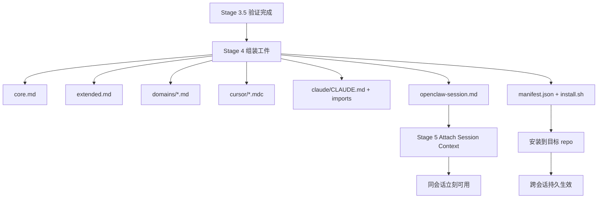

# Soul Extractor 注入协议设计 + 验证深度强化 + 研究方法论评估报告（Codex）

> 日期：2026-03-09  
> 任务文件：`20260309_codex_injection_and_methodology_task.md`

## 执行摘要

### 结论先行

1. **当前最紧迫的问题确实是注入协议，而不是再多提几张卡。**  
   你们现在已经能稳定“生产 AI 燃料”，但还没有一条低摩擦、可复用、可自消费的“烧燃料”路径。  
   来源：`[L1][L4][L7]`；置信度：**高**

2. **推荐方案不是单选 A/B/C/D/E/F，而是“分层注入 + 双路径落地”。**  
   - **持久注入**：导出目标工具原生上下文文件并可选自动安装  
   - **会话注入**：提取完成后，在同一 OpenClaw 会话里显式读取精简注入层  
   来源：`[S1][S2][S3][S4][L4]`；置信度：**高**

3. **对于 Cursor，建议把 `.cursorrules` 降为兼容产物，主产物改为 `.cursor/rules/*.mdc`。**  
   Cursor 官方文档当前主推的是 Project Rules 及其规则类型（Always / Auto Attached / Agent Requested / Manual），这天然支持“核心规则永远注入 + 领域规则按需注入”的分层模型。  
   来源：`[S1]`；置信度：**高**

4. **对于 Claude Code，`CLAUDE.md` 最适合做分层注入的骨架文件。**  
   Anthropic 官方文档明确说明 Claude Code 会从多个层级读取 `CLAUDE.md`，且支持 `@path/to/import` 导入其他 markdown 文件。因此你们可以把 `CLAUDE.md` 变成一个轻量入口，而不是把全部知识挤进一个大文件。  
   来源：`[S2]`；置信度：**高**

5. **Stage 3.5 当前的硬校验有价值，但软审查几乎肯定偏弱。**  
   本地 v0.7 结果里，`SK-20ILL.md` 这种不存在的文件引用只被记为 warning，且软审查没有触发任何修改。更合理的下一步是：
   - 一部分 warnings 升级为 shadow-block / error
   - 引入对抗性软审查和“植入缺陷”实验  
   来源：`[L1][L5][L6][L8]`；置信度：**高**

6. **你们当前的“三方研究法”总体有效，但已经开始出现“结论继承大于独立发现”的风险。**  
   它适合探索期，但要进入稳定决策期，必须加上：
   - clean-room 研究轨
   - red-team 研究轨
   - “新发现 / 重复 / 反驳 / 推断”标签体系  
   来源：`[L1][L2][L3]` + 推理；置信度：**中高**

### 总优先级排序

我对本轮所有问题的优先级排序如下：

1. **P0 — 注入协议：持久安装 + 同会话自消费**
2. **P0 — 验证强化：warning 分级 + 软审查重构 + seeded defects**
3. **P1 — 跨模型验证实验矩阵**
4. **P1 — 注入量分层与 domain-slice 注入**
5. **P2 — 研究方法论升级（clean-room + red-team + claim ledger）**
6. **P3 — RAG / 向量库 / skill 化复用**

---

## 一、研究范围与证据

本报告覆盖三块：

1. 注入协议设计
2. 验证深度强化
3. 研究方法论评估

### 本地证据

- `[L1]` `Documents/vibecoding/allinone/experiments/exp01-v04-minimax/research/20260309_codex_injection_and_methodology_task.md`
- `[L2]` `Documents/vibecoding/allinone/experiments/exp01-v04-minimax/research/20260309_codex_community_signals_report.md`
- `[L3]` `Documents/vibecoding/allinone/experiments/exp01-v04-minimax/research/20260309_codex_evolution_directions_report.md`
- `[L4]` `Documents/vibecoding/allinone/skills/soul-extractor/scripts/assemble-output.sh`
- `[L5]` `Documents/vibecoding/allinone/skills/soul-extractor/scripts/validate_extraction.py`
- `[L6]` `Documents/vibecoding/allinone/skills/soul-extractor/stages/STAGE-3.5-review.md`
- `[L7]` `Documents/vibecoding/allinone/experiments/exp04-v07-superpowers/superpowers/inject/.cursorrules`
- `[L8]` `Documents/vibecoding/allinone/experiments/exp04-v07-superpowers/superpowers/soul/validation_summary.md`
- `[L9]` `Documents/vibecoding/allinone/experiments/exp01-v04-minimax/research/20260309_three_party_evolution_synthesis.md`

### 官方 / 一手来源

- `[S1]` Cursor Docs — Project Rules: https://docs.cursor.com/context/rules-for-ai
- `[S2]` Anthropic Docs — Claude Code Memory / `CLAUDE.md`: https://docs.anthropic.com/en/docs/claude-code/memory
- `[S3]` OpenClaw Docs — System Prompt Hooks / `bootstrap-extra-files`: https://docs.openclaw.ai/development/system-prompt
- `[S4]` OpenClaw Docs — Tools / file tools: https://docs.openclaw.ai/usage/tools
- `[S5]` OpenAI Docs — File Search Guide: https://platform.openai.com/docs/guides/tools-file-search
- `[S6]` OpenAI Docs — Evals Guide: https://platform.openai.com/docs/guides/evals
- `[S7]` OpenAI Docs — Graders Guide: https://platform.openai.com/docs/guides/graders/

### 重要现实约束

1. **Soul Extractor 既面向“提取源仓库”，又面向“消费目标仓库”。**
   - 例如：提取的是 `python-dotenv`
   - 真正需要注入的，可能是用户自己的业务 repo  
   这是注入协议设计里最容易被忽略的分叉点。  
   来源：`[L1][L4]` + 推理；置信度：**高**

2. **当前输出体量并不算大，但也绝不是“免费上下文”。**
   我本地样本显示：
   - `superpowers` 的 `.cursorrules` 约 `7000` bytes / `6444` chars / `959` 词
   - `python-dotenv` 的 `.cursorrules` 约 `5975` bytes / `5515` chars / `813` 词  
   粗略估计已经进入“低千级 token”的量级；作为单 repo core pack 还可接受，但不适合无限叠加。  
   来源：`[L7]` + 本地统计；置信度：**中高**

---

## 二、问题 1：注入协议（Injection Protocol）

## 2.1 六种注入方式的工程可行性对比

| 方式 | 工程可行性 | 适合作为 P0 吗 | 主要问题 | 结论 |
|------|-----------|---------------|---------|------|
| A. 手动复制 | 极高 | 可作兜底 | 摩擦大、容易忘、不可规模化 | 仅保留为 fallback |
| B. 自动复制 | 高 | **是** | 需要目标 repo 路径 | **推荐作为持久注入主线** |
| C. 即时注入 | 高 | **是** | 只在当前会话有效、占上下文 | **推荐作为同会话主线** |
| D. RAG 式 | 中 | 否 | 系统复杂度高、现在偏重 | 中长期再做 |
| E. System prompt | 中高 | 内部可用 | 平台依赖强、跨工具差 | 适合 OpenClaw 内部增强 |
| F. Skill 化 | 中 | 否 | 不是“被动注入”，而是“主动调用” | 适合复用，不适合作为基础协议 |

### 我的推荐

**推荐用一个混合协议，而不是押注单一方式：**

- **P0-1：B 自动复制 / 安装**  
  面向 Cursor / Claude Code 的持久注入
- **P0-2：C 同会话即时注入**  
  面向 OpenClaw 执行 Soul Extractor 的 agent 自己
- **P1：E 平台级 system prompt / bootstrap 集成**  
  面向 OpenClaw 自己的产品化体验
- **P3：D/F**  
  RAG 与 skill 化是增强层，不是当下主路

来源：`[S1][S2][S3][S4][S5][L4]`；置信度：**高**

---

## 2.2 当前最合理的协议：分层注入 + 双路径落地

我建议把注入协议分成 **artifact 层** 和 **delivery 层**。

### Artifact 层：先把产物做成“可装配”的

Stage 4 不应该只输出两个大文件：
- `.cursorrules`
- `CLAUDE.md`

而应该输出一组**分层产物**：

```text
inject/
  manifest.json
  install.sh
  openclaw-session.md
  core.md
  extended.md
  domains/
    PD-001.md
    PD-002.md
  cursor/
    soul-core.mdc
    soul-extended.mdc
    soul-domain-PD-001.mdc
  claude/
    CLAUDE.md
    soul-core.md
    soul-domain-PD-001.md
  compatibility/
    .cursorrules
```

### Delivery 层：再决定怎么送达

1. **安装到目标 repo**（持久）
2. **附加到当前会话**（临时）
3. **导出给用户手动安装**（fallback）

### 推荐原则

> **先把知识做成“可切片、可安装、可附加”的工件，再谈具体工具怎么吃。**

来源：`[L4][L7][S1][S2]`；置信度：**高**

---

## 2.3 Cursor 路线：建议从 `.cursorrules` 升级为 Project Rules

### 官方现状

Cursor 官方文档当前主推的是 **Project Rules**，并区分：
- Always
- Auto Attached
- Agent Requested
- Manual  
来源：`[S1]`；置信度：**高**

### 这对 Soul Extractor 的意义

你们正好可以把“注入量控制”直接映射到 Cursor 的规则类型：

#### L0：Core Rules → Always

内容：
- 项目本质一句话
- Top 5 关键规则
- Top 3 社区陷阱

目标：
- 任何会话都要带上
- 控制在最小体量

#### L1：Extended Pack → Agent Requested

内容：
- 全部规则卡摘要
- 核心概念摘要
- 关键 workflow 摘要

目标：
- 当 Agent 在较复杂任务中需要更多上下文时再附加

#### L2：Domain Slice → Manual / Agent Requested

内容：
- 某个问题域的定向 pack

目标：
- 只在相关任务中注入

### 工程建议

Stage 4 应新增 Cursor 专用导出：

```text
inject/cursor/soul-core.mdc
inject/cursor/soul-domain-PD-001.mdc
```

并在 `install.sh` 中支持：

```bash
mkdir -p "$TARGET_REPO/.cursor/rules"
cp "$OUTPUT_DIR/inject/cursor/"*.mdc "$TARGET_REPO/.cursor/rules/"
```

### 对 `.cursorrules` 的建议

不要立刻删掉，但应降级为：
- compatibility export
- 给老工作流或通用工具用

而不是主产物。  
来源：`[S1][L4]`；置信度：**高**

---

## 2.4 Claude Code 路线：把 `CLAUDE.md` 变成骨架文件

### 官方现状

Anthropic 官方文档说明：
- Claude Code 会从当前目录及父目录读取 `CLAUDE.md`
- `CLAUDE.md` 支持通过 `@path/to/import` 导入其他 markdown 文件  
来源：`[S2]`；置信度：**高**

### 这意味着什么

Soul Extractor 不必把所有内容都塞进一个大 `CLAUDE.md`。更好的做法是：

```markdown
# Project Knowledge Pack

@./.claude/soul/core.md
@./.claude/soul/domain-config-loading.md
```

### 推荐导出结构

```text
inject/claude/
  CLAUDE.md
  soul-core.md
  soul-extended.md
  soul-domain-PD-001.md
```

### 推荐安装方式

```bash
mkdir -p "$TARGET_REPO/.claude/soul"
cp "$OUTPUT_DIR/inject/claude/soul-core.md" "$TARGET_REPO/.claude/soul/"
cp "$OUTPUT_DIR/inject/claude/soul-domain-PD-001.md" "$TARGET_REPO/.claude/soul/"
cp "$OUTPUT_DIR/inject/claude/CLAUDE.md" "$TARGET_REPO/CLAUDE.md"
```

### 好处

1. **更容易控制注入量**
2. **更适合问题域拆解**
3. **更容易升级**
4. **用户仍然能看懂和手改**

来源：`[S2][L4]`；置信度：**高**

---

## 2.5 OpenClaw 自消费：当前“做不到”不是能力问题，而是协议问题

### 结论

**Soul Extractor 完全可以在同一会话里消费自己的产出，但不能靠模型“自己想到去读”。必须把它变成一个显式阶段。**

### 依据

- 你们当前的 AI 回复“做不到”，实质上是在说“平台没有自动扫描机制”  
  来源：`[L1]`
- 但 OpenClaw 有文件工具，可读工作区文件；系统 prompt 还支持 `bootstrap-extra-files` 这类附加文件机制  
  来源：`[S3][S4]`

### 我的判断

这件事要分两层：

#### P0：Skill 层解决

新增：

> **Stage 5 — Attach & Consume**

它不做“神秘内化”，只做**显式读取和确认**：

1. 读取 `inject/openclaw-session.md`
2. 读取用户选择的 domain pack（可选）
3. 在对话中确认：
   - 已加载哪些知识层
   - 当前回答将基于哪些规则与概念

#### P1：平台层解决

如果你们控制 OpenClaw 平台，可以继续推进：
- session 级 `attach-context` 机制
- workspace 级 memory files 自动加载
- 或把 Stage 4 产物挂入 `bootstrap-extra-files` 类似的会话配置

### 为什么 P0 先放 skill 层

- 你们现在就能做
- 不依赖平台改动
- 能立刻验证“自消费”是否真的提升回答质量

### 为什么长期仍应上平台层

- 否则每个 skill 都要重复造“Attach Stage”
- 平台自动附加比 prompt 中提醒模型“去读文件”更稳

来源：`[S3][S4][L1]`；置信度：**高**

---

## 2.6 是否应该增加 Stage 5？

### 我的建议

**应该增加，但名字不建议叫“内化”。建议叫：**

> **Stage 5 — Attach Session Context**

### 原因

“内化”这个词太像黑箱，难以验证。  
而 `Attach Session Context` 是可检查的：
- 附加了哪些文件
- 附加了多少字符
- 附加后能回答哪些问题

### 推荐输入

- `inject/openclaw-session.md`
- `inject/domains/<id>.md`（可选）
- `soul/validation_report.json`（仅供风险提示，不直接注入全部）

### 推荐输出

```markdown
已附加 Soul Extractor 注入层：
- core: loaded
- domain: PD-001 loaded
- approx size: 2.1 KB
- validation status: pass with 1 warning
```

### 推荐伪代码

```python
def stage5_attach_session(output_dir, domain_id=None):
    core = read_file(f"{output_dir}/inject/openclaw-session.md")
    domain = read_file(f"{output_dir}/inject/domains/{domain_id}.md") if domain_id else ""
    validation = load_json(f"{output_dir}/soul/validation_report.json")

    attached = [core]
    if domain:
        attached.append(domain)

    summary = summarize_attached_layers(attached, validation)
    print_to_user(summary)
    return attached
```

### 注意

Stage 5 解决的是：
- **同会话可用性**

它不解决：
- **跨会话持久化**
- **用户其他工具自动识别**

这些仍然需要 install protocol。

---

## 2.7 注入量控制：当前不算爆炸，但必须开始分层

### 当前体量

本地样本：

| 样本 | bytes | chars | words | 结论 |
|------|------:|------:|------:|------|
| `superpowers` `.cursorrules` | 7000 | 6444 | 959 | 已是低千 token 级别 |
| `python-dotenv` `.cursorrules` | 5975 | 5515 | 813 | 同样不可无限叠加 |

来源：`[L7]` + 本地统计；置信度：**中高**

### 工程判断

- 单 repo 全量 pack：现在还可接受
- 多 repo 叠加：很快会冲掉上下文预算
- 大型项目未来必然需要 domain slicing

### 推荐三层注入预算

#### Layer 0：Core（默认注入）

目标：`<= 2 KB` 或非常保守的低千 token 内

包含：
- 一句话本质
- Top 5 关键规则
- Top 3 社区陷阱
- 1 个关键 workflow 提示

#### Layer 1：Extended（按需）

目标：`<= 8 KB`

包含：
- 全部规则摘要
- 3 个核心概念
- 3 个 workflow 摘要

#### Layer 2：Domain Slice（按任务）

目标：每个 slice `2–4 KB`

包含：
- 特定问题域的概念 / 规则 / workflow

### 核心原则

> **永远不要把“完整知识包”默认为“永远注入”。**

### 推荐新增文件

```json
{
  "artifacts": {
    "core": {"bytes": 1820},
    "extended": {"bytes": 6880},
    "domain_PD_001": {"bytes": 2410}
  },
  "recommended_default": "core"
}
```

这可以写到 `inject/manifest.json`。  
来源：`[L3][L4][L7][S1][S2]`；置信度：**高**

---

## 2.8 我推荐的 Stage 4/5 注入架构



### 推荐 `manifest.json`

```json
{
  "version": "0.1",
  "source_repo": "obra/superpowers",
  "validation": {
    "overall_pass": true,
    "warnings": 1
  },
  "layers": {
    "core": {"path": "inject/core.md", "bytes": 1820},
    "extended": {"path": "inject/extended.md", "bytes": 6880},
    "PD-001": {"path": "inject/domains/PD-001.md", "bytes": 2410}
  },
  "targets": {
    "cursor": {"path": "inject/cursor/soul-core.mdc"},
    "claude_code": {"path": "inject/claude/CLAUDE.md"},
    "openclaw_session": {"path": "inject/openclaw-session.md"}
  }
}
```

### 推荐 `install.sh`

```bash
#!/bin/bash
set -euo pipefail
TARGET_REPO="${1:?Usage: install.sh <target_repo>}"
TOOL="${2:-auto}"

mkdir -p "$TARGET_REPO/.cursor/rules" "$TARGET_REPO/.claude/soul"

cp inject/cursor/*.mdc "$TARGET_REPO/.cursor/rules/" 2>/dev/null || true
cp inject/claude/soul-*.md "$TARGET_REPO/.claude/soul/" 2>/dev/null || true
cp inject/claude/CLAUDE.md "$TARGET_REPO/CLAUDE.md" 2>/dev/null || true
cp inject/compatibility/.cursorrules "$TARGET_REPO/.cursorrules" 2>/dev/null || true

echo "Installed Soul Extractor knowledge pack to $TARGET_REPO"
```

---

## 三、问题 2：验证深度强化

## 3.1 `SK-20ILL.md` 这种 warning 应该升级吗？

### 我的判断

**应该升级，但不是一步到位地把所有 source warning 都变成 hard error。**

### 为什么

在 v0.7 真实样本里：
- `DR-001` 的 source file ref 指向一个不存在的文件
- 但整轮验证仍然 `PASS`，traceability 还显示 `100%`  
  来源：`[L5][L8]`；置信度：**高**

这说明当前指标与 gate 之间存在错位：
- 用户会把“引用不存在文件”理解为证据失真
- 但系统把它当 warning，不阻断产物生成

### 我建议的分级

#### Level A：Hard Error（立即阻断）

1. `sources` 为空
2. 社区卡引用的 Issue / Advisory 不存在
3. `severity` / `card_type` / `card_id` 非法
4. duplicate IDs
5. **高严重度或核心卡片**引用不存在的源文件
6. 某张卡片所有 source 都失效

#### Level B：Shadow Error（先记录 would-block，不立刻阻断）

1. 普通代码规则引用不存在文件
2. file 存在但 line 精度不足
3. CHANGELOG 引用无法精确锚定版本块

#### Level C：Warning（保留）

1. 场景略泛
2. 概念卡缺少某个非关键章节
3. 规则可执行性弱但并非错误

### 为什么要有 Shadow Error

因为你们担心的是：
- 弱模型会频繁被拦截
- 导致整个链路不稳定

Shadow mode 正好可以先测：
- 如果这些 warning 真升级，会阻断多少任务？
- 哪些 warning 是高频 false positive？

### 对 `SK-20ILL.md` 这个具体例子

我建议：
- **在 v0.8 进入 shadow-error**
- **在 v0.9 升为 hard error**（前提是 false positive 低）

来源：`[L5][L8]`；置信度：**高**

---

## 3.2 当前软审查为什么像“走过场”？

### 我的判断

更可能的原因不是“卡片完美”，而是：

1. **审查 prompt 太宽、太礼貌、太顺从**
2. **生成者和审查者是同一模型、同一上下文流**
3. **没有强制 reviewer 提供负面发现或证据对抗**
4. **没有 seeded defects，无法测 reviewer 的真实检出率**

### 当前 prompt 的问题

你们现在的 `STAGE-3.5-review.md` 要求 reviewer：
- 逐张审查
- pass / warn / fail
- fail 就改  

但它没有要求 reviewer：
- 必须列出至少一个潜在问题并论证是否成立
- 必须引用卡内具体句子
- 必须对照源证据摘录
- 必须先假定卡片可能有缺陷

因此 reviewer 很容易“平滑放行”。  
来源：`[L6]`；置信度：**高**

---

## 3.3 软审查怎么改才更有效？

### 推荐改法：从“友好 reviewer”改成“对抗 reviewer”

#### 方案 A：单卡对抗审查（推荐 MVP）

输入：
- 单张卡
- 它的 source 摘录
- fixed rubric
- 明确目标：找出最可能的问题，而不是证明它没问题

#### 推荐 rubric

```yaml
card_id: DR-101
verdict: pass | warn | fail
scores:
  evidence_alignment: 0-1
  specificity: 0-1
  realism: 0-1
  actionability: 0-1
  severity_fit: 0-1
must_fix:
  - ...
nice_to_fix:
  - ...
review_evidence:
  - "The scenario mentions Docker, but no source supports Docker-specific behavior."
```

#### Prompt 设计原则

- 用“找错”而不是“评估是否还行”
- 强制 reviewer 给出至少一个 candidate flaw
- 若无 flaw，必须说明“为什么没有”
- 强制引用卡中原句

### 方案 B：双 reviewer（后续）

- Reviewer 1：spec critic
- Reviewer 2：content critic

这更稳，但比 MVP 更重。

### 方案 C：跨模型 reviewer（推荐做实验，不推荐当 P0 依赖）

- 生成模型 A
- 审查模型 B

这个更有价值，但要先做实验矩阵。

来源：`[L6][S6][S7]`；置信度：**中高**

---

## 3.4 建议加入“植入缺陷”实验（seeded defects）

### 结论

**这是验证软审查有效性的最快办法。**

### 原因

如果不人为植入已知错误，你们永远分不清：
- reviewer 全部 pass 是因为质量真好
- 还是 reviewer 根本不会挑错

### 推荐植入的 defect 类型

1. 不存在的文件引用
2. 错误的 Issue 编号
3. 场景过于抽象
4. severity 偏高 / 偏低
5. do/don't 与 rule 不一致
6. 把社区问题写成代码固有行为

### 推荐实验设计

- 从一组通过验证的卡片中复制出一份 `seeded` 版本
- 每张人工植入 1 个 defect
- 让 reviewer 跑同样流程
- 统计：
  - `recall`：有多少植入缺陷被抓到
  - `precision`：抓出来的问题里有多少真是问题
  - `false pass rate`

### 这是 P0 还是 P1？

我把它列为 **P0.5 / P1 起点**。  
因为它直接决定你们要不要信任当前软审查。

来源：`[S6][S7]` + 本地实验推理；置信度：**高**

---

## 3.5 跨模型验证怎么设计？

### 目标

回答三个问题：

1. 更弱模型会不会产生更多 hard failures？
2. 更强模型 reviewer 会不会抓出更多软问题？
3. 哪种 extractor × reviewer 组合的性价比最好？

### 推荐实验矩阵

#### 维度 1：Extractor Model

- MiniMax-M2.5（当前弱模型基线）
- 一个中等模型
- 一个强模型

#### 维度 2：Reviewer Model

- 同模型自审
- 更强模型审
- 对抗 reviewer prompt

#### 维度 3：Repo 类型

- 小库：`python-dotenv`
- 方法论 rich-text 项目：`superpowers`
- 中型框架/工具库：再选 1 个

### 固定条件

- 同一 repo commit
- 同一 artifacts cache
- 同一 `community_signals`
- 同一 hard validator

### 输出指标

#### 结构类
- hard fail rate
- warning rate
- source validity

#### 软审查类
- seeded defect recall
- seeded defect precision
- modification rate
- modification usefulness（judge 评分）

#### 下游任务类
- 注入后回答准确率
- token 增量
- 完成时间 / 成本

### 推荐最小实验表

| Extractor | Reviewer | Repo | Seeded? | 关注指标 |
|----------|----------|------|---------|---------|
| MiniMax | MiniMax | superpowers | 否 | hard fail / no-op review |
| MiniMax | 强模型 | superpowers | 否 | review uplift |
| MiniMax | MiniMax | superpowers | 是 | seeded defect recall |
| 强模型 | MiniMax | superpowers | 是 | weak reviewer ceiling |
| MiniMax | 强模型 | python-dotenv | 是 | repo transferability |

### 为什么推荐先做“同 repo 多模型”，再做“多 repo”

因为当前你们最想回答的是 reviewer 是否有效，不是 repo 泛化能力。

来源：`[S6][S7][L8]`；置信度：**高**

---

## 四、问题 3：研究方法论评估

## 4.1 你们现在这套三方研究法有效吗？

### 我的结论

**有效，但已经接近它的“第一阶段上限”。**

### 它为什么有效

你们当前的角色分工其实很自然：
- Opus：战略 / WHY / 护城河
- Codex：工程 / 约束 / 落地
- Gemini：产品 / 用户价值 / 交互

这带来了三个好处：

1. **减少单模型单视角偏差**
2. **并行探索速度快**
3. **综合后更容易发现“共识 vs 分歧”**

这从你们的三方综合文档里已经体现得很明显。  
来源：`[L9]`；置信度：**高**

### 它为什么开始有风险

1. **后续轮次越来越依赖前序结论**
2. **每个模型的“独立发现空间”被压缩**
3. **综合文档会形成新的锚点**
4. **模型容易继承 framing，而不是重新审题**

换句话说：

> 这套方法在探索初期是“多视角并行”，进入中后期则容易变成“多模型共识放大器”。

来源：`[L2][L3][L9]` + 推理；置信度：**中高**

---

## 4.2 上下文污染：知识积累还是确认偏差？

### 结论

**两者都会发生。关键不是消灭前序上下文，而是把“继承”与“独立”分开记录。**

### 我建议的判断标准

对于每条新结论，标四个状态之一：

- `NEW`：此前报告未出现
- `CONFIRMED`：独立重复验证前序结论
- `CONTRADICTED`：明确反驳前序结论
- `INFERRED`：基于已有结论推出来的，不算独立发现

### 为什么这样有用

因为现在最大的问题不是“有没有前序上下文”，而是：

> **你们目前缺少一种机制，去区分“真正新增信息”和“更漂亮地重复旧信息”。**

### 推荐 claim ledger

```yaml
- claim_id: CL-017
  statement: "Cursor 主路径应切换为 Project Rules 而非单文件 .cursorrules"
  first_seen_in: codex_injection_methodology
  status: NEW
  evidence:
    - S1
  confidence: high

- claim_id: CL-009
  statement: "验证闭环必须先做"
  first_seen_in: three_party_evolution_synthesis
  status: CONFIRMED
  evidence:
    - L3
    - L9
  confidence: high
```

### 推荐继承规则

下一轮研究不应该喂“完整旧报告”，而应该喂：

1. 执行摘要
2. open questions
3. claim ledger
4. 关键原始证据列表

而不是 1000 行全文。

来源：`[L9]` + 推理；置信度：**高**

---

## 4.3 如何改进这套研究方法？

## 改进 1：加一条 Clean-Room 轨道

### 做法

每轮至少有一个研究者只看：
- 原始任务
- 原始证据
- 最小上下文

不看前序结论。

### 作用

- 检测锚定偏差
- 保留真正独立的视角

### 什么时候必须启用

- 当上一轮已经形成“强结论”
- 当问题开始转向战略判断
- 当你们准备做产品路线决策

---

## 改进 2：加一条 Red-Team 轨道

### 做法

明确指派一方去反对当前主结论，例如：
- “为什么不应该优先做 WHY？”
- “为什么 RAG 才是对的，而不是文件注入？”
- “为什么 validation gate 会拖垮弱模型链路？”

### 作用

- 防止太快收敛
- 找到主方案的脆弱边界

### 关键原则

Red team 不是抬杠，而是：
- 必须给替代方案
- 必须用证据反驳
- 必须说明主方案在哪些条件下失效

---

## 改进 3：新发现 / 重复 / 反驳显式标注

### 做法

每份报告都加一个小节：

```markdown
## Novelty Ledger
- NEW: 4
- CONFIRMED: 6
- CONTRADICTED: 1
- INFERRED: 5
```

### 为什么

这样你们就能知道某轮研究到底有没有增量，而不是只看篇幅。

---

## 改进 4：用“原始证据优先级”替代“前序结论优先级”

### 做法

在综合时优先看：
1. 原始实验
2. 官方文档
3. 本地脚本 / 样本
4. 前序研究结论

### 为什么

后者是派生品，不应压过原始证据。

---

## 改进 5：引入方法论上的 holdout 问题

### 做法

每轮留一个不公开给其他研究者的问题，只给综合者或最终决策者验证：
- 后续研究是否真的有新发现
- 还是只是放大已经共享的结论

### 作用

它像一个“研究集成测试”。

---

## 4.4 我对自己这份报告的局限

### 1. 我有明显的工程偏置

我天然更重视：
- 可执行性
- 可验证性
- 分层架构
- 渐进式 rollout

这可能让我低估了某些战略性、叙事性、护城河型判断的重要性。  
来源：自我评估；置信度：**高**

### 2. 我没有在真实 OpenClaw / Cursor / Claude Code 会话里端到端验证注入效果

我能确认：
- 本地产物结构
- 官方文档机制
- 现有脚本行为

但还不能证明：
- 某个 Stage 5 设计在真实产品里一定最顺
- Cursor / Claude Code 实际加载后一定带来同样体感提升

### 3. 我对方法论的评价部分，更多是“工程研究流程设计”而不是学术元研究

因此这里的建议应被理解为：
- 高实用价值的流程建议
- 不是形式化研究方法的充分理论证明

---

## 五、我给出的整体推荐架构

## 5.1 最推荐的近期方案

### P0：先补“可用闭环”

1. Stage 4 输出分层工件：`core / extended / domains / manifest / install.sh`
2. 新增 Stage 5：`Attach Session Context`
3. `assemble-output.sh` 支持 `--target-repo <path>`
4. Cursor 主产物切到 `.cursor/rules/*.mdc`
5. Claude 主产物切到 `CLAUDE.md + imports`

### P0：同时补“可信闭环”

6. 新增 warning 分级：warning / shadow-error / hard-error
7. 把不存在的核心 source ref 纳入 shadow-error
8. 重写软审查为对抗 reviewer
9. 做 seeded defects 测试 reviewer recall

### P1：做实验验证

10. 跑 extractor × reviewer × repo 的最小矩阵
11. 比较：full pack vs core pack vs domain pack 的下游问答效果

### P2：升级研究方法

12. 每轮加 clean-room / red-team
13. 维护 claim ledger
14. 用 novelty ledger 量化“新信息”

---

## 5.2 不推荐的方案

1. **继续只输出 `.cursorrules` 和 `CLAUDE.md` 两个大文件**
2. **把“同会话自消费”寄希望于模型自己想到去读文件**
3. **在没有 seeded defects 的情况下相信软审查有效**
4. **过早上 RAG / 向量库，把简单问题复杂化**
5. **每轮都把完整旧报告全文喂给下一轮研究者**

---

## 六、优先级排序（最终版）

### P0（立即做）

1. **注入协议最小闭环**
   - `manifest.json`
   - `install.sh`
   - Cursor/Claude 分层导出
   - Stage 5 session attach

2. **验证强化最小闭环**
   - warning 分级
   - 对抗 reviewer
   - seeded defect 实验

### P1（1–2 周）

3. **domain slice 注入**
4. **跨模型验证矩阵**
5. **平台级 OpenClaw 自动附加机制探索**

### P2（后续升级）

6. **研究方法 clean-room / red-team 正式化**
7. **RAG / vector store**
8. **knowledge-pack skill 化复用**

---

## 七、一句话总结

> **你们下一步最该做的，不是再提更多知识，而是把知识“装得进去、带得起来、验证得过”。**  
> 注入协议解决“能不能烧”，验证强化解决“烧得准不准”，研究方法升级解决“我们是不是在集体自我说服”。

---

## 参考来源

### 官方 / 外部

- `[S1]` Cursor Docs — Project Rules  
  https://docs.cursor.com/context/rules-for-ai
- `[S2]` Anthropic Docs — Claude Code Memory / `CLAUDE.md`  
  https://docs.anthropic.com/en/docs/claude-code/memory
- `[S3]` OpenClaw Docs — System Prompt Hooks / `bootstrap-extra-files`  
  https://docs.openclaw.ai/development/system-prompt
- `[S4]` OpenClaw Docs — Tools / file tools  
  https://docs.openclaw.ai/usage/tools
- `[S5]` OpenAI Docs — File Search Guide  
  https://platform.openai.com/docs/guides/tools-file-search
- `[S6]` OpenAI Docs — Evals Guide  
  https://platform.openai.com/docs/guides/evals
- `[S7]` OpenAI Docs — Graders Guide  
  https://platform.openai.com/docs/guides/graders/

### 本地

- `[L1]` `Documents/vibecoding/allinone/experiments/exp01-v04-minimax/research/20260309_codex_injection_and_methodology_task.md`
- `[L2]` `Documents/vibecoding/allinone/experiments/exp01-v04-minimax/research/20260309_codex_community_signals_report.md`
- `[L3]` `Documents/vibecoding/allinone/experiments/exp01-v04-minimax/research/20260309_codex_evolution_directions_report.md`
- `[L4]` `Documents/vibecoding/allinone/skills/soul-extractor/scripts/assemble-output.sh`
- `[L5]` `Documents/vibecoding/allinone/skills/soul-extractor/scripts/validate_extraction.py`
- `[L6]` `Documents/vibecoding/allinone/skills/soul-extractor/stages/STAGE-3.5-review.md`
- `[L7]` `Documents/vibecoding/allinone/experiments/exp04-v07-superpowers/superpowers/inject/.cursorrules`
- `[L8]` `Documents/vibecoding/allinone/experiments/exp04-v07-superpowers/superpowers/soul/validation_summary.md`
- `[L9]` `Documents/vibecoding/allinone/experiments/exp01-v04-minimax/research/20260309_three_party_evolution_synthesis.md`
