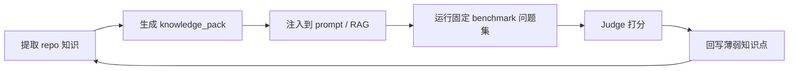
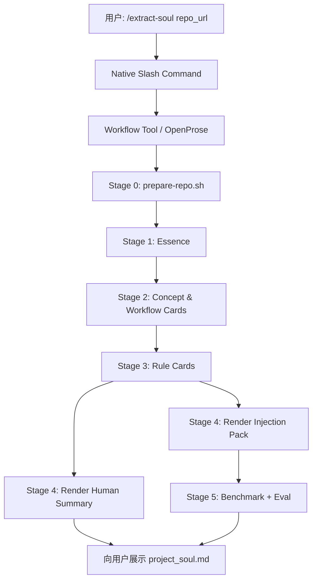

# Soul Extractor 研究报告（Codex）

> 日期：2026-03-09  
> 结论先行：当前问题不是单一的“弱模型不听话”，而是 **发现面、执行面、产出面、验证面** 同时断裂。最关键的短期修复不是继续打磨一份 6.7KB 的 `SKILL.md`，而是先把 **Skill 的注册/加载面** 和 **脚本执行面** 变成确定性流程；否则后面的 prompt 优化、卡片格式优化都会被上游随机性吞掉。

---

## 一、执行摘要

### 1. 最重要的五个判断

1. **你们现在很可能先问错了问题。**
   真正的问题不是“如何让 MiniMax 稳定执行一个复杂 Skill”，而是“如何把 repo 提取这件事拆成一个弱模型也不会偏航的确定性工作流”。  
   来源：`[S1][S2][S4][S7][S8][L4]`；置信度：**高**

2. **Skill 触发失败，优先怀疑“加载面不对”，不要优先怀疑 prompt。**
   我本地复查到当前 OpenClaw 配置是 `remote gateway`，指向 `tang@openclaw.local`。这意味着把 skill 装在本机 `~/.openclaw/skills` 并不等于远端运行时能看到它；而且当前本机配置里没有显式的 `skillPaths`。  
   来源：`[L1][S1][S2]`；置信度：**高**

3. **即使 Skill 被发现，单靠自然语言 Skill 也不能保证脚本一定被调用。**
   OpenClaw 的基础 skill 机制本质上仍是“把技能列表注入 system prompt，让模型自己决定是否读、是否用”。要保证 `prepare-repo.sh` 一定执行，应该改成 **slash command + tool dispatch** 或 **OpenProse/Lobster 编排**。  
   来源：`[S1][S2][S4]`；置信度：**高**

4. **产出应该采用“双层产物”，但只能有一个 canonical source。**
   推荐把“AI 可注入知识包”作为 canonical source，再从它派生出给人看的 `project_soul.md`。如果反过来让 Markdown 文档既承担人类阅读，又承担机器注入，会继续两头不讨好。  
   来源：`[S5][S6][L4]` + 推理；置信度：**中高**

5. **闭环必须显式产品化：提取 → 注入 → 提问 → 评分 → 反馈。**
   只要没有注入协议和评测协议，就回答不了 CEO 的核心追问：“这些文件拿来做什么？”  
   来源：`[S5][S6]` + 本地任务定义 `[L2][L4]`；置信度：**高**

### 2. 推荐方案（一句话）

**推荐方案：把 `soul-extractor` 从“大段 prompt skill”重构成“命令驱动的四阶段流水线”：先用确定性工具准备 repo，再用小 prompt 分阶段提取，再产出 AI 注入包和人类摘要，最后跑固定 benchmark 做验证。**

### 3. 备选方案（一句话）

**备选方案：接受模型分工——MiniMax 只做 30 秒概览/预览，完整提取仅交给强模型或异步批处理。**

---

## 二、研究方法与证据范围

本报告结合三类证据：

1. **OpenClaw 官方文档**：skills、system prompt、tools、OpenProse。
2. **本地现场证据**：当前机器上的 OpenClaw 配置、现有 `soul-extractor` skill、`prepare-repo.sh`、既有实验记录。
3. **一手研究/官方平台文档**：多指令遵从研究（Curse of Instructions、IFScale）以及 OpenAI File Search / Evals 的闭环设计文档。

说明：

- 关于“OpenClaw 是否有 first-class skill DAG/链式编排”，官方文档没有直接写“没有”，本报告将其表述为 **“未见基础 skill 系统提供原生链式编排；若要多阶段，需要借助 OpenProse/Lobster/命令分阶段”**。这属于**基于文档边界的工程推断**。
- 关于 Cursor / `CLAUDE.md` 等 repo 规则文件，本报告只把它们当成 **注入协议方向**，不把它们当成本次调研的核心证据源，以避免引用不充分。

---

## 三、Q1：OpenClaw Skill 系统的正确用法

### Q1-1. Skill 的发现、匹配、触发机制到底是什么？

- **发现（discovery）是会话启动时完成的，不是用户发消息时临时扫盘。** OpenClaw 会在 session start 时加载 enabled skill paths 下的 skill，并将“可用 skills 列表”注入 system prompt。  
  来源：`[S1][S2]`；置信度：**高**

- **匹配（match）本质是模型侧选择，不是硬编码关键词路由。** 文档明确写到：agent 在需要时会用 `Read` 去打开技能目录中的 `SKILL.md`；system prompt 里也只是把技能列表展示给模型。换句话说，普通对话里的“提取灵魂 …”更接近 **LLM 语义选择**，而不是 deterministic router。  
  来源：`[S1][S2]`；置信度：**高**

- **因此，“用户说了 skill 名，但 agent 说没找到”通常不是 prompt 问题，而是 skill 根本没有出现在当次 session 的技能列表里。**  
  来源：`[S1][S2]` + 推理；置信度：**高**

### Q1-2. 自定义 skill 如何正确注册？需要什么配置？

- **不是每个 skill 都要写进 `openclaw.json`；但 skill 所在目录必须在被扫描的 skill path 里。** 官方文档提到 `settings.skillPaths`，说明“是否被扫描”是配置面的事情，而不是仅靠文件存在。  
  来源：`[S1]`；置信度：**高**

- **如果希望用户稳定调用，不要只依赖自然语言；应显式暴露 slash command。** 官方提供 `commands.nativeSkills`，可以把 skill 自动注册为 slash command，并支持参数、直接 tool dispatch、关闭 model invocation。  
  来源：`[S1]`；置信度：**高**

- **`requires.bins` 会影响 skill 是否可见。** 官方文档写明 skills 会按 available binaries / env 过滤。你们的 `soul-extractor` 前置依赖是 `git`、`node`、`npx`；若运行时环境缺任意一个，skill 可能在 session start 就被过滤掉。  
  来源：`[S1][L2]`；置信度：**高**

### Q1-3. 这次 Skill 触发失败，最可能的根因是什么？

我认为有三个优先级很高的根因，按概率排序：

1. **本机装了 skill，但 OpenClaw 实际跑在远端 gateway。**
   当前本机 `~/.openclaw/openclaw.json` 明确配置了 `gateway.mode = remote`，目标是 `tang@openclaw.local`。这意味着真正执行 session / skills / tools 的环境很可能是远端，而不是你当前这台机器。若 skill 只装在本机，远端自然“看不见”。  
   来源：`[L1]`；置信度：**高**

2. **未显式配置 `skillPaths`，导致自定义 skill 目录未被扫描。**
   我在当前本机配置里没有看到 `skillPaths`，同时本机也不存在 `~/.openclaw/skills/soul-extractor`。当前 skill 真正位于 repo 内：`/Users/tang/Documents/vibecoding/allinone/skills/soul-extractor/`。如果远端没有同步这一路径，session 就不会加载它。  
   来源：`[L1][L2]`；置信度：**高**

3. **`requires.bins` 过滤。**
   这是文档级已知机制。若远端运行时没有 `npx` / `node`，该 skill 即便路径正确也会被排除。  
   来源：`[S1][L2]`；置信度：**中高**

### Q1-4. 有没有 skill 链式调用 / 多阶段执行机制？

- **基础 skill 系统里，没有看到原生“skill A 自动调用 skill B”的第一类机制。** Skills 文档主要描述的是“技能发现 + 模型按需读取 + slash command dispatch”。  
  来源：`[S1]`；置信度：**中高**

- **OpenClaw 官方给出的多阶段/工作流方向是 OpenProse 和 Lobster，而不是继续堆一个更大的 `SKILL.md`。** `/prose` 用于 workflow/structured output，Lobster 是更重型的工具流。  
  来源：`[S4][S1]`；置信度：**高**

- **子代理（subagent）不是这个问题的首选。** 官方 system prompt 文档明确说 minimal prompt mode 会省略 Skills，因此不要把“多阶段 skill”寄希望于 subagent 自动继承 skill 能力。  
  来源：`[S2]`；置信度：**高**

### Q1-5. 参考用法：什么样的触发方式更稳？

**推荐触发顺序：**

1. **最稳**：`/extract-soul <repo>` 这类 native slash command。
2. **次稳**：`/skill soul-extractor <repo>` 这类显式技能调用。
3. **最不稳**：纯自然语言“提取灵魂 <url>”，让模型自己猜要不要触发 skill。

结论：**把“skill 自动匹配”降级成锦上添花，不要把它当产品主入口。**  
来源：`[S1][S2]`；置信度：**高**

---

## 四、Q2：Agent 对脚本调用和输出路径的控制

### Q2-1. 如何确保 agent 调用 `prepare-repo.sh`，而不是自己重做？

- **答案：不要“确保模型听话”，要“把脚本变成模型绕不过去的入口”。**  
  来源：`[S1][S4]`；置信度：**高**

具体做法有两类：

#### 方案 A：Slash command 直接 dispatch 到 tool（推荐）

把入口改成：

```yaml
---
name: extract-soul
description: deterministic repo extraction workflow
args:
  - name: repo
    description: GitHub URL or local path
command-dispatch: tool
command-tool: <workflow-tool>
disable-model-invocation: true
---
```

这里 `<workflow-tool>` 可以是 OpenProse / Lobster / 自定义 wrapper tool。核心思想是：

- 用户输入 `/extract-soul <repo>`
- OpenClaw **直接** 调度工具
- 工具第一步执行 `prepare-repo.sh`
- 后续才进入模型阶段

这样脚本调用就从“prompt 里的建议”变成“工作流的第一步”。  
来源：`[S1][S4]`；置信度：**高**

#### 方案 B：把准备阶段拆成单独命令

如果暂时不接 OpenProse，就至少拆成：

- `/extract-soul-prepare <repo>`
- `/extract-soul-survey <job_id>`
- `/extract-soul-cards <job_id>`
- `/extract-soul-rules <job_id>`

这样即便还是 skill，也把“准备 repo”从大 prompt 中抽离成一个确定阶段。  
来源：`[S1]` + 工程推理；置信度：**中高**

### Q2-2. 如何控制 agent 的文件输出路径？

- **不要让模型往 `~/...` 这种用户家目录绝对路径写。** OpenClaw 文档说明 relative paths 默认相对 workspace；若不开 sandbox，absolute path 理论上能访问 host 文件系统，但这恰恰意味着路径更容易漂移。  
  来源：`[S3]`；置信度：**高**

- **推荐做法：每次任务创建 job workspace，再只允许相对路径。**

建议输出结构：

```text
workspace/
  jobs/
    <job_id>/
      artifacts/
      knowledge_pack/
      human/
      injections/
      eval/
```

- `prepare-repo.sh` 第二个参数强制传 `./jobs/<job_id>`
- 后续所有模型阶段只允许写 `./jobs/<job_id>/...`
- 最终向用户回报 job 路径或导出 zip

这样路径不会再跟着 agent 自己的默认工作目录乱跑。  
来源：`[S3][L3]`；置信度：**高**

### Q2-3. OpenClaw 的 sandbox / 执行机制对 bash 有什么限制？

- **OpenClaw 的 shell 工具本身可执行 `bash`、`git`、`node`、`sed` 等命令。**  
  来源：`[S3]`；置信度：**高**

- **但“能执行 shell”不等于“模型就会按你写的脚本去执行”。** 这是 prompt-following 问题，不是 shell capability 问题。  
  来源：`[S3][L2]` + 推理；置信度：**高**

- **skills 还能配置 `commands.autoAllowSkills`，对 skill 所需命令自动放行。** 这有利于减少“执行前再确认”的摩擦，但前提是 skill 已成功加载。  
  来源：`[S1]`；置信度：**中高**

### Q2-4. 对你们这条链路的工程建议

把 repo 准备阶段设计为 **唯一可信入口（single source of truth）**：

```text
User -> /extract-soul <repo>
     -> workflow tool
     -> prepare-repo.sh <repo> ./jobs/<job_id>
     -> parse READY/repo/output/full/compressed
     -> stage-specific model prompts
```

不要再让模型“自己决定是否 clone、是否 repomix、是否写到 ~/soul-output”。

---

## 五、Q3：弱模型指令遵从的工程解法

### Q3-1. 结论：要从“prompt engineering”转向“workflow engineering”

- `Curse of Instructions` 和 `IFScale` 都支持一个方向性的结论：**当同时约束条目增多时，模型整体遵从率会急剧下降；越弱的模型，越经不起长 prompt + 多目标 + 多格式约束。**  
  来源：`[S7][S8][L4]`；置信度：**高**

- 这意味着你们现在这份 6.7KB、20+ 约束的 `SKILL.md` 对弱模型天然不友好。  
  来源：`[L2][L4][S7][S8]`；置信度：**高**

### Q3-2. 如果 OpenClaw 支持，应该怎么拆？如果不支持，怎么绕？

**推荐拆成 4 个阶段，每阶段只保留 3–5 条“硬约束”：**

#### Stage 0：Prepare（工具阶段，无模型自由）

- 输入：repo URL / local path
- 工具：`prepare-repo.sh`
- 输出：`artifacts/packed_compressed.xml` + 统一 job path

#### Stage 1：Essence（弱模型可胜任）

- 目标：只回答“项目本质”
- 产物：`00-project-essence.yaml` + `00-project-essence.md`
- 硬约束：
  1. 必须引用证据文件
  2. 必须回答 5 个第一性原理问题
  3. 必须给一句话总结

#### Stage 2：Cards（中等复杂度）

- 目标：3 张概念卡 + 3 张工作流卡
- 每种卡给 **1 个完整 few-shot 示例**
- 不做规则卡

#### Stage 3：Rules（高复杂度，可切强模型）

- 目标：5–10 张规则卡
- 只要求一个格式：IF/THEN + 场景 + 影响 + 证据
- 如果模型层级较弱，可先要求 5 张，后续增量扩展

#### Stage 4：Render + Eval（工具/模板阶段）

- 从 canonical knowledge pack 渲染 `project_soul.md`
- 生成注入包和 benchmark

**如果暂时不用 OpenProse/Lobster，就用多个 slash command 明确串联；不要继续押注“一条自然语言消息启动完整提取”。**  
来源：`[S1][S4][S7][S8][L4]`；置信度：**高**

### Q3-3. Few-shot example 的最佳实践

我给出的工程建议是：

1. **每一类高价值产物只放 1 个完整正例，不放 3 个半截示例。**
2. **few-shot 要紧贴输出规格之前，别散落在全文。**
3. **用完整 card 示例替代抽象模板描述。**
4. **弱模型阶段不要同时给概念卡、工作流卡、规则卡三种格式。**

理由：

- 多指令遵从研究支持“约束数量越多，整体失败概率越高”；
- 你们自己的本地实验也已观察到“模板理解尚可，复杂约束与数量目标掉得最厉害”。

这部分没有在 OpenClaw 文档中找到“官方 best practice 数字阈值”，所以这里是 **基于一手研究 + 本地实验 + 提示工程常识的工程建议**。  
来源：`[S7][S8][L4]`；置信度：**中高**

### Q3-4. “必须完成、不要中途停止”这类行为指令是否有用？

- **有一点帮助，但远远不够。**
- 它可以作为补充提醒，但不应承担可靠性职责。
- 真正有效的是：
  - 明确阶段完成条件
  - 工具阶段无模型自由
  - 输出文件名和数量由模板/编排层锁定
  - 每阶段结束即回报进度

结论：**“不要停”不是控制手段，顶多是祈祷。**  
来源：`[S7][S8]` + 本地实验 `[L4]`；置信度：**中高**

### Q3-5. 单文件 `SKILL.md` 的极限优化方案

如果因为产品节奏，短期内必须继续使用单文件 Skill，我建议至少做下面五件事：

1. **最前面只保留 3 条最高优先级规则**
   - 先运行 `prepare-repo.sh`
   - 所有输出写到 `./jobs/<job_id>/...`
   - 完成 4 个阶段前不要结束

2. **把“概念卡 / 工作流卡 / 规则卡”分成独立小节，每节前放一个完整示例**

3. **删掉所有礼貌性元指令**
   - 例如“请仔细阅读”“请确保高质量输出”这类文本，几乎只会消耗预算

4. **把“至少 5，目标 10”改成单一硬目标**
   - 对弱模型：先固定 5
   - 对强模型：单独 workflow 扩展到 10+

5. **把最终 `project_soul.md` 改为渲染产物，而不是让模型自由重写**

来源：`[L2][L4][S7][S8]`；置信度：**中高**

---

## 六、Q4：产品闭环设计

### Q4-1. 提取产出的定位：面向人、面向 AI，还是两者兼顾？

**推荐答案：两者兼顾，但只能有一个 canonical source。**

我建议：

- **canonical source = `knowledge_pack/`（机器可注入）**
  - 结构化 YAML / JSON
  - 每条知识必须含证据、适用范围、置信度

- **derived artifacts = `human/`（给人看的摘要）**
  - `project_soul.md`
  - `TOP-5-pitfalls.md`
  - `start-here.md`

原因：

1. CEO 追问的是“AI 变强的燃料”，所以必须有机器可消费的 canonical layer。
2. 用户又需要即时感知价值，所以必须有一个人类可读的短摘要。
3. 如果只做人类文档，就没有稳定注入协议；如果只做机器包，用户看不到价值。

来源：`[S5][S6][L4]` + 推理；置信度：**高**

### Q4-2. 注入协议的可行方案

我建议把注入协议分为三层：

#### 层 A：短上下文注入（最快落地）

- 从 `knowledge_pack` 渲染一份轻量规则文件：
  - `CLAUDE.md`
  - `project-rules.md`
  - `openclaw-context.md`

- 用于：
  - coding assistant 的 repo 级常驻上下文
  - OpenClaw agent 的附加上下文文件

优点：实现快；缺点：上下文容量有限。  
来源：本地任务背景 `[L4]` + 工程推理；置信度：**中高**

#### 层 B：RAG / File Search 注入（推荐的中期主路）

- 将 `knowledge_pack` 写入向量/检索系统
- 用户提问时，仅检索相关卡片注入上下文

这与 OpenAI File Search 的产品思路一致：把大语料切块、索引、检索，在问答时注入。  
来源：`[S5]`；置信度：**高**

#### 层 C：任务前置摘要注入（体验增强）

- 用户第一次进入 repo 会话时，自动注入：
  - 一句话本质
  - 3 个核心概念
  - 5 个高危规则

这样用户能立刻感知“AI 确实更懂这个项目了”。  
来源：`[L4]` + 推理；置信度：**中高**

### Q4-3. 如何设计验证闭环？

**推荐闭环：Extract → Inject → Ask → Judge → Feedback**



建议最小可行版 benchmark：

1. 这个项目解决什么问题？
2. 核心承诺是什么？
3. 主流程是什么？
4. 最容易踩的 3 个坑是什么？
5. 在某个真实场景下应该怎么正确使用？
6. 某个错误做法会造成什么后果？

评分方法：

- **事实性**：是否有证据支撑
- **完整性**：是否覆盖关键步骤/边界
- **可执行性**：是否给出可操作建议
- **一致性**：不同问法下答案是否稳定

OpenAI Evals 文档可直接作为这条闭环的参考实现思路。  
来源：`[S6]`；置信度：**高**

### Q4-4. 有没有类似“知识提取 → 注入 → 增强”的完整闭环竞品？

**我没有找到一个完全等价、单产品内闭环完成 repo 提取→注入→增强→评测 的官方案例。行业更常见的是“多组件拼装”：**

| 方案 | 擅长什么 | 缺什么 |
|------|---------|--------|
| OpenClaw Skills | 任务入口、会话集成 | 原生多阶段编排和知识注入闭环不足 |
| OpenProse / Lobster | 流程编排、structured workflow | 不是 repo 知识产品本身 |
| OpenAI File Search | 大语料检索注入 | 不负责 repo 语义抽取 |
| OpenAI Evals | 质量验证 | 不负责抽取和注入 |

这说明你们的差异化机会不是“又一个 skill”，而是把这四段缝成一个对开发者好用的产品。  
来源：`[S1][S4][S5][S6]`；置信度：**中高**

---

## 七、Q5：综合重构方案

### 7.1 推荐方案：命令驱动的双层产物流水线

#### 目标

让用户从一句命令开始，稳定拿到两类结果：

1. **人类立刻能读懂的摘要**
2. **AI 立刻能消费的知识包**

#### 总体结构



#### 目录设计（推荐）

```text
jobs/<job_id>/
  artifacts/
    packed_compressed.xml
    packed_full.xml
    _repo/
  knowledge_pack/
    essence.yaml
    concepts/
    workflows/
    rules/
    index.yaml
  human/
    00-project-essence.md
    project_soul.md
    top_pitfalls.md
  injections/
    CLAUDE.md
    openclaw-context.md
    file-search.jsonl
  eval/
    benchmark.yaml
    baseline.json
    injected.json
    diff.md
```

#### 关键设计原则

1. **工具负责确定性，模型负责理解与归纳。**
2. **所有长链路都拆阶段，每阶段有唯一完成标准。**
3. **所有知识先写结构化，再渲染成人类文档。**
4. **所有输出都在 job workspace 内，禁止家目录漂移。**
5. **最终价值以 benchmark 分数提升衡量，不以生成了多少 `.md` 文件衡量。**

### 7.2 备选方案：分层产品定位

如果短期不能引入编排层，建议主动承认模型分工：

- **MiniMax 路线**：
  - 只做 `prepare + essence + top-5 pitfalls`
  - 30–60 秒内返回人类摘要
  - 明确标注“快速预览模式”

- **强模型路线**：
  - 执行完整 extraction
  - 产出知识包 + 注入文件 + benchmark
  - 明确标注“深度提取模式”

优点：最现实；缺点：产品体验分叉，且会弱化“同一路径跨模型通吃”的叙事。  
来源：`[S7][S8][L4]` + 推理；置信度：**中高**

---

## 八、问题之间的关联分析

你们当前不是 5 个孤立问题，而是一个串联故障：

```text
远端/本地加载面可能错位
  -> skill 根本没进 session
    -> 只能绕过 skill 直接下 prompt
      -> agent 不再把 prepare-repo 视为强约束
        -> 自己 clone / 自己选路径 / 自己中途停顿
          -> 弱模型在长 prompt 下继续漏步骤
            -> 输出变浅、偏技术、不可注入
              -> CEO 看不到“AI 变强”的闭环价值
```

核心洞察：

- **Q1（触发）不解决，Q2/Q3 都在空中楼阁。**
- **Q2（脚本/路径）不解决，Q3 的 prompt 优化无法稳定复现。**
- **Q4（产品闭环）不解决，Q1/Q2/Q3 即使都修好，也只能产出一堆文件。**

所以正确排序应是：

1. 先修 discovery / dispatch
2. 再修 prepare / workspace
3. 再拆 extraction stages
4. 最后做 injection / eval 闭环

---

## 九、短期（1–2 天）与中期（1–2 周）优先级

### 9.1 短期（1–2 天）

#### P0：确认 skill 加载面

1. 在 **远端 OpenClaw 运行机** 上确认 skill 实际安装路径。
2. 显式配置 `skillPaths`，不要假设默认扫描路径。
3. 临时去掉 `requires.bins` 或至少在远端验证 `git/node/npx` 全存在。
4. 启用 `commands.nativeSkills`，新增 `/extract-soul` 命令入口。

#### P0：把 repo 准备阶段变成确定入口

5. 不再用“普通对话触发 skill”；改为 `/extract-soul <repo>`。
6. 入口直接 dispatch 到 workflow/tool，第一步强制执行 `prepare-repo.sh`。
7. `prepare-repo.sh` 强制接收 output dir 参数，统一写入 `./jobs/<job_id>`。

#### P1：最小拆分 extraction

8. 先拆成 `prepare / essence / cards / rules` 四阶段。
9. 先把规则卡目标从“至少 5，目标 10”收敛成“固定 5”。
10. `project_soul.md` 改为渲染产物，不再让模型自由发挥。

### 9.2 中期（1–2 周）

1. 接入 OpenProse / Lobster 作为正式编排层。
2. 设计 `knowledge_pack` schema（证据、适用范围、置信度、渲染字段）。
3. 增加注入导出器：`CLAUDE.md` / OpenClaw context / File Search JSONL。
4. 建立 10–20 题 benchmark 和自动 judge。
5. 做模型分层策略：弱模型预览、强模型深提取。
6. 加 UI/消息进度：`准备中 -> 理解项目本质 -> 提取规则 -> 生成摘要 -> 验证完成`。

---

## 十、风险与局限

1. **远端环境细节仍未完全观测。**
   我当前能确认本机 OpenClaw 处于 `remote gateway` 模式，但未直接登录 `openclaw.local` 验证远端 skill 目录、远端 `skillPaths`、远端 binaries，因此“加载失败的最终根因”仍需一次远端核查。  
   来源：`[L1]`；置信度：**高**

2. **OpenClaw 文档没有把所有内部装载细节写成实现级规范。**
   所以关于“没有原生 skill 链式编排”属于基于现有官方文档边界的保守推断，而非源码级定论。  
   来源：`[S1][S2][S4]`；置信度：**中高**

3. **弱模型的遵从上限不是靠 prompt 能彻底抹平的。**
   即使你们按本报告优化，MiniMax 也未必能稳定产出与 Claude Opus 同层级的规则深度；工程上应接受“能力分层”，而不是继续假设“所有模型都能执行同一个大 skill”。  
   来源：`[S7][S8][L4]`；置信度：**高**

4. **注入闭环建立后，仍需真实 benchmark 才能证明商业价值。**
   产出结构化知识包 != AI 一定变强；只有在固定问题集上得到可重复提升，才能回答 CEO 的价值追问。  
   来源：`[S5][S6]`；置信度：**高**

---

## 十一、最终建议

### 推荐方案

**立刻停止继续打磨“大一统 SKILL.md”；把产品主路径切换为 `/extract-soul` 命令驱动的分阶段 workflow。**

最小落地顺序：

1. 先在远端运行机上修好 skill 加载与 slash command。
2. 把 `prepare-repo.sh` 提升为唯一入口。
3. 把提取拆成 4 个阶段。
4. 先产出 `knowledge_pack + project_soul.md` 双层结果。
5. 用 benchmark 跑出“注入前后差异”。

### 备选方案

**如果短期无法接工作流层，就坦诚做“双档产品”：MiniMax 只做预览，完整提取改走强模型/异步任务。**

---

## 参考来源

### 官方 / 外部来源

- `[S1]` OpenClaw Skills: https://docs.openclaw.ai/usage/skills
- `[S2]` OpenClaw System Prompt: https://docs.openclaw.ai/development/system-prompt
- `[S3]` OpenClaw Tools / Workspace / Shell: https://docs.openclaw.ai/usage/tools
- `[S4]` OpenClaw OpenProse Plugin: https://docs.openclaw.ai/usage/plugins/openprose
- `[S5]` OpenAI File Search Guide: https://platform.openai.com/docs/guides/tools-file-search
- `[S6]` OpenAI Evals Guide: https://platform.openai.com/docs/guides/evals
- `[S7]` Curse of Instructions (OpenReview): https://openreview.net/forum?id=R6q67CDBCH
- `[S8]` IFScale (arXiv): https://arxiv.org/abs/2507.11538

### 本地现场来源

- `[L1]` `/Users/tang/.openclaw/openclaw.json`
- `[L2]` `/Users/tang/Documents/vibecoding/allinone/skills/soul-extractor/SKILL.md`
- `[L3]` `/Users/tang/Documents/vibecoding/allinone/skills/soul-extractor/scripts/prepare-repo.sh`
- `[L4]` `/Users/tang/Documents/vibecoding/allinone/experiments/exp01-v04-minimax/RESEARCH-instruction-compliance.md`
