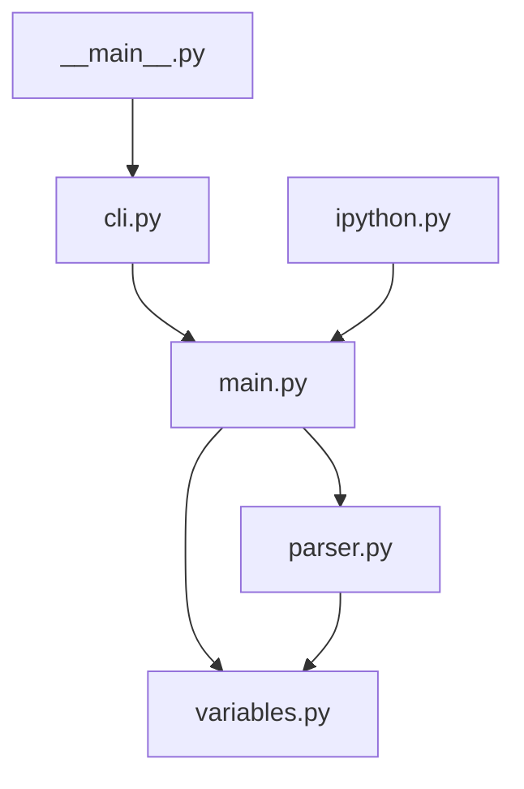

# Eagle Eye Module Map

## Module Overview

```
┌─────────────────────────────────────────────────────────────────┐
│                        python-dotenv                             │
├─────────────────────────────────────────────────────────────────┤
│                                                                  │
│  ┌──────────────┐    ┌──────────────┐    ┌──────────────┐      │
│  │    cli.py    │    │  ipython.py  │    │  __main__.py │      │
│  │  (Commands)  │    │ (Magic %dotenv)│   │  (Entry PT) │      │
│  └──────┬───────┘    └──────────────┘    └──────────────┘      │
│         │                                                      │
│  ┌──────▼───────────────────────────────────────────────┐      │
│  │                     main.py                            │      │
│  │  ┌─────────────┐ ┌─────────────┐ ┌────────────────┐  │      │
│  │  │  DotEnv     │ │ find_dotenv │ │ load_dotenv    │  │      │
│  │  │  (Core)     │ │ (Search)    │ │ (Environment)  │  │      │
│  │  └──────┬──────┘ └─────────────┘ └────────────────┘  │      │
│  │         │                                               │      │
│  │  ┌──────▼──────┐    ┌─────────────┐                    │      │
│  │  │  parser.py  │◄───│variables.py│                    │      │
│  │  │ (Regex/Token)│    │(Expansion) │                    │      │
│  │  └─────────────┘    └─────────────┘                    │      │
│  └─────────────────────────────────────────────────────────┘      │
│                                                                  │
└─────────────────────────────────────────────────────────────────┘
```

## Module Descriptions

### 1. main.py (Core Engine)
**Purpose:** Core loading, parsing, and environment management  
**Key Functions:**
- `DotEnv` class - parses and manages .env bindings
- `load_dotenv()` - loads vars into os.environ
- `dotenv_values()` - returns dict without modifying env
- `find_dotenv()` - searches for .env file
- `set_key()`, `get_key()`, `unset_key()` - CRUD operations

### 2. parser.py (Tokenizer)
**Purpose:** Regex-based parsing of .env file syntax  
**Key Classes:**
- `Reader` - character-by-character stream reader
- `Binding` - NamedTuple for parsed key-value
- `parse_stream()` - main parsing function

### 3. variables.py (Expansion Engine)
**Purpose:** POSIX variable expansion `${VAR}`, `$VAR`, defaults `${VAR:-default}`  
**Key Classes:**
- `Atom` (abstract) - base for Literal/Variable
- `Literal` - constant text
- `Variable` - expandable variable reference

### 4. cli.py (Command Interface)
**Purpose:** CLI commands via Click  
**Commands:** `set`, `get`, `unset`, `list`, `run`

### 5. ipython.py (Integration)
**Purpose:** IPython magic `%dotenv`

## Data Flow

```
.env file (or stream)
       │
       ▼
┌──────────────────┐
│   find_dotenv() │ ← Locates .env file
└────────┬─────────┘
         │
         ▼
┌──────────────────┐
│   DotEnv.parse() │ ← Reads & tokenizes
└────────┬─────────┘
         │
    ┌────▼────┐
    │ parser  │ ← Regex matching
    └────┬────┘
         │
         ▼
┌──────────────────┐
│ variables.py     │ ← Expand ${VAR}
└────────┬─────────┘
         │
    ┌────▼──────────┐
    │   Binding    │ ← Key-value with metadata
    └───────────────┘
         │
         ▼
┌─────────────────────┐
│ load_dotenv()       │ → os.environ
│ dotenv_values()     │ → Dict
└─────────────────────┘
```

## Dependency Graph


