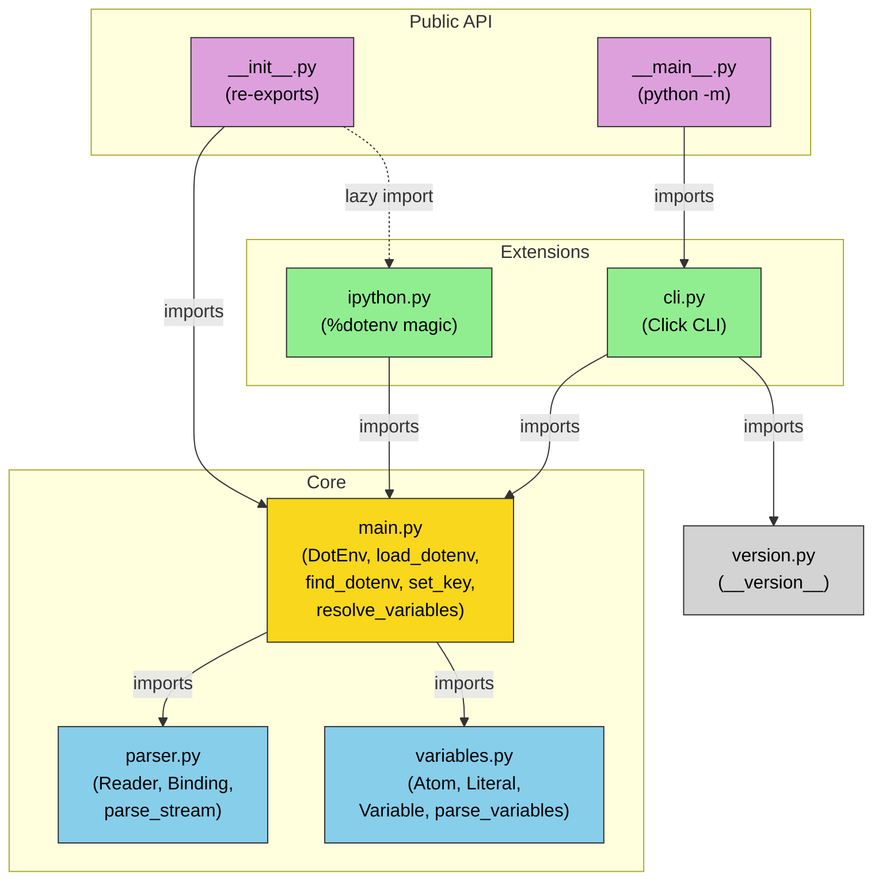

# Eagle Eye Module Map: python-dotenv

## Module Overview

| Module | File | Lines | Responsibility |
|--------|------|-------|----------------|
| **Entry Points** | `__init__.py`, `__main__.py` | 57 | Public API surface, re-exports, IPython extension hook |
| **Core Engine** | `main.py` | 482 | DotEnv class, load/get/set/unset/find functions, variable resolution, file rewriting |
| **Parser** | `parser.py` | 182 | Lexing and parsing `.env` content into Binding tuples |
| **Variable Resolution** | `variables.py` | 86 | POSIX variable expansion (`${VAR:-default}`) |
| **CLI** | `cli.py` | 247 | Click-based command-line interface |
| **IPython Integration** | `ipython.py` | 50 | `%dotenv` magic for IPython/Jupyter |
| **Version** | `version.py` | 1 | Version string constant |

## Module Descriptions

### 1. Entry Points (`__init__.py`, `__main__.py`)
- `__init__.py` re-exports all public functions from `main.py` via `__all__`: `load_dotenv`, `dotenv_values`, `get_key`, `set_key`, `unset_key`, `find_dotenv`
- Provides `get_cli_string()` utility and `load_ipython_extension()` hook
- `__main__.py` enables `python -m dotenv` by importing CLI

### 2. Core Engine (`main.py`)
The heart of the library. Contains:
- **`DotEnv` class** (line 42): Orchestrates stream handling, parsing, interpolation, and env-var setting
- **`load_dotenv()`** (line 383): Primary API -- parses and loads into `os.environ`
- **`dotenv_values()`** (line 433): Returns parsed dict without side effects
- **`find_dotenv()`** (line 332): File discovery via directory-tree walk with interactive/debugger detection
- **`set_key()` / `unset_key()`** (lines 193, 248): Atomic file modification
- **`rewrite()`** (line 138): Context manager for safe temp-file-based file rewriting
- **`resolve_variables()`** (line 289): Coordinates variable interpolation with override semantics

### 3. Parser (`parser.py`)
A hand-written recursive-descent parser:
- **`Reader`** (line 69): Wraps stream into position-tracked string with `peek`, `read`, `read_regex`
- **`Binding`** (line 40): NamedTuple output: `(key, value, original, error)`
- **`parse_stream()`** (line 179): Top-level iterator that yields Bindings
- **`parse_binding()`** (line 142): Parses one key=value line
- Handles: single/double/unquoted values, escape sequences, comments, `export` prefix, multiline values
- 13 pre-compiled regex patterns (lines 18-32) for tokenization

### 4. Variable Resolution (`variables.py`)
- **`_posix_variable`** regex (line 5): Matches `${name}` and `${name:-default}` patterns
- **`Atom`** abstract base (line 18): Interface with `resolve(env)` method
- **`Literal`** (line 29): Plain text segments
- **`Variable`** (line 48): References to other variables with optional defaults
- **`parse_variables()`** (line 70): Tokenizes a value string into Atom sequence

### 5. CLI (`cli.py`)
- **`cli()`** (line 62): Click group with `--file`, `--quote`, `--export` options
- **`list_values()`** (line 93): Display stored values (simple/json/shell/export formats)
- **`set_value()`** (line 116): Store a key/value pair
- **`get()`** (line 137): Retrieve a single value
- **`unset()`** (line 154): Remove a key
- **`run()`** (line 184): Execute command with loaded env vars
- **`run_command()`** (line 204): Process execution (`execvpe` on Unix, `Popen` on Windows)

### 6. IPython Integration (`ipython.py`)
- **`IPythonDotEnv`** (line 17): Magics class with `@line_magic` decorator
- **`%dotenv`** magic: Accepts path, `-o` (override), `-v` (verbose)
- **`load_ipython_extension()`** (line 46): Registration function

## Module Dependency Diagram



## Key Data Flow

```
User calls load_dotenv()
  --> find_dotenv() walks directory tree
  --> DotEnv.__init__() stores config
  --> DotEnv._get_stream() opens file/stream
  --> parse_stream() [parser.py] yields Binding tuples
  --> with_warn_for_invalid_lines() filters errors
  --> DotEnv.parse() yields (key, value) pairs
  --> resolve_variables() [main.py] calls parse_variables() [variables.py]
      --> Atom.resolve() expands ${VAR:-default} references
  --> DotEnv.set_as_environment_variables() writes to os.environ
```

## Cross-Cutting Concerns

- **Encoding**: Propagated through all layers; default `utf-8`
- **Error handling**: Parser returns `error=True` bindings instead of raising; main.py logs warnings
- **Symlink safety**: `set_key`/`unset_key` default to `follow_symlinks=False`
- **Platform differences**: CLI `run_command` branches on `sys.platform == "win32"`
- **Disable mechanism**: `PYTHON_DOTENV_DISABLED` env var checked at `load_dotenv` entry
