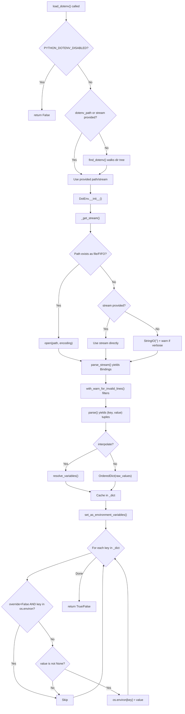

## Overview

The complete flow from a user calling `load_dotenv()` to environment variables being set in `os.environ`.

## Steps

### Step 1: Entry & Guard Check
`load_dotenv()` checks if loading is disabled via `PYTHON_DOTENV_DISABLED` env var. If disabled, returns `False` immediately.
- **Evidence:** `src/dotenv/main.py:L389-L393`

### Step 2: File Discovery
If no `dotenv_path` or `stream` is provided, `find_dotenv()` walks the directory tree upward from the caller's frame to locate a `.env` file.
- **Evidence:** `src/dotenv/main.py:L395-L396`, `src/dotenv/main.py:L332-L380`

### Step 3: DotEnv Construction
A `DotEnv` instance is created with all configuration flags (`path`, `stream`, `verbose`, `interpolate`, `override`, `encoding`).
- **Evidence:** `src/dotenv/main.py:L398-L406`

### Step 4: Stream Acquisition
`_get_stream()` opens the file (or FIFO), or falls back to the provided stream, or yields an empty `StringIO` if nothing is found.
- **Evidence:** `src/dotenv/main.py:L60-L73`

### Step 5: Parse + Interpolate
`dict()` calls `parse()` which delegates to `parser.parse_stream()`. Results flow through `with_warn_for_invalid_lines()`. If `interpolate=True`, values pass through `resolve_variables()`.
- **Evidence:** `src/dotenv/main.py:L75-L89`, `src/dotenv/main.py:L91-L95`

### Step 6: Environment Injection
`set_as_environment_variables()` iterates the cached dict. For each key: if `override=False` and key exists in `os.environ`, skip. Otherwise, set `os.environ[k] = v` (only if `v is not None`).
- **Evidence:** `src/dotenv/main.py:L97-L110`

## Flowchart

## Failure Modes

1. **File not found, verbose=False:** `_get_stream()` silently yields `StringIO("")`, resulting in no env vars set and `set_as_environment_variables()` returning `False`. No error is raised.
   - **Evidence:** `src/dotenv/main.py:L66-L73`

2. **Malformed lines:** Parser catches `Error` exceptions per-binding and returns `Binding(error=True)`. `with_warn_for_invalid_lines()` logs a warning but yields the binding (which is then filtered out by `parse()` since `key` is `None`). Processing continues for remaining lines.
   - **Evidence:** `src/dotenv/parser.py:L168-L175`, `src/dotenv/main.py:L32-L39`

3. **Circular variable references:** No detection. If `A=${B}` and `B=${A}`, both resolve to empty string because at the time of resolution, the referenced variable hasn't been assigned yet (sequential processing).
   - **Evidence:** `src/dotenv/main.py:L289-L311` (sequential accumulation in `new_values`)

4. **Encoding errors:** If the file encoding doesn't match `encoding` parameter, Python's `open()` will raise `UnicodeDecodeError`. This is not caught by DotEnv.
   - **Evidence:** `src/dotenv/main.py:L63`
