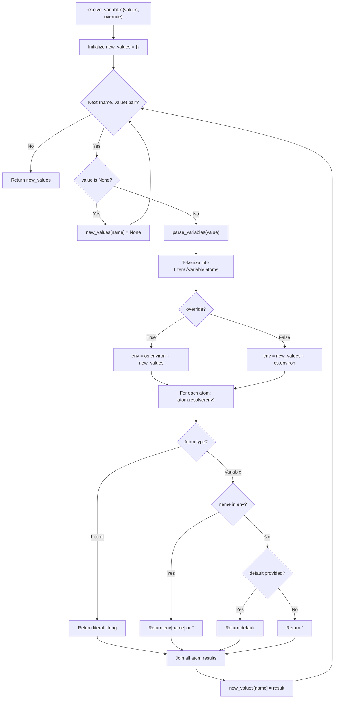

## Overview

How `resolve_variables()` in `main.py` and `parse_variables()` in `variables.py` cooperate to expand POSIX-style variable references in `.env` values, respecting override semantics.

## Steps

### Step 1: Value Iteration
`resolve_variables()` iterates over `(name, value)` pairs sequentially. A `new_values` dict accumulates resolved results.
- **Evidence:** `src/dotenv/main.py:L293-L295`

### Step 2: None Check
If `value is None` (key-only binding like `FOO` without `=`), result is `None`. Skip to next.
- **Evidence:** `src/dotenv/main.py:L296-L297`

### Step 3: Tokenization
`parse_variables(value)` scans the value string using the `_posix_variable` regex. It yields an alternating sequence of `Literal` and `Variable` atoms. Text between `${...}` references becomes `Literal`; each `${...}` becomes a `Variable`.
- **Evidence:** `src/dotenv/variables.py:L70-L86`

### Step 4: Environment Construction
Build the `env` lookup dict based on `override` flag:
- `override=True`: start with `os.environ`, overlay `new_values` (`.env` wins)
- `override=False`: start with `new_values`, overlay `os.environ` (OS wins)
- **Evidence:** `src/dotenv/main.py:L300-L306`

### Step 5: Atom Resolution
Each `Atom.resolve(env)` is called:
- `Literal.resolve()`: returns its value unchanged
- `Variable.resolve()`: looks up `env.get(self.name, default)`, falls back to `""` if result is `None`
- **Evidence:** `src/dotenv/variables.py:L44-L45`, `src/dotenv/variables.py:L63-L67`

### Step 6: Concatenation & Accumulation
All atom results are joined (`"".join(...)`) into the resolved value. Stored in `new_values[name]` for use by subsequent entries.
- **Evidence:** `src/dotenv/main.py:L307-L309`

## Flowchart

## Failure Modes

1. **Undefined variable without default:** `${MISSING_VAR}` resolves to empty string `""`, not an error. This is silent and may produce unexpected configuration values. No warning is logged.
   - **Evidence:** `src/dotenv/variables.py:L65` (`default = self.default if self.default is not None else ""`)

2. **Self-referencing variable:** `FOO=${FOO}` -- depends on processing order. If `FOO` is not in `os.environ` and hasn't been defined earlier in the file, it resolves to `""`. If it was defined earlier, the earlier value is used. No infinite loop risk (no recursion).
   - **Evidence:** `src/dotenv/main.py:L300-L306` (env is built fresh per variable)

3. **Unrecognized POSIX operators:** `${VAR:=value}`, `${VAR:+value}`, `${VAR:?error}` are NOT matched by the `_posix_variable` regex. They become literal text (not expanded). No error is raised.
   - **Evidence:** `src/dotenv/variables.py:L5-L13` (regex only matches `:-`)

4. **Dollar sign without braces:** `$VAR` (without `{}`) is treated as literal text, not a variable reference. Only `${VAR}` syntax triggers expansion.
   - **Evidence:** `src/dotenv/variables.py:L5` (regex requires `\$\{`)
