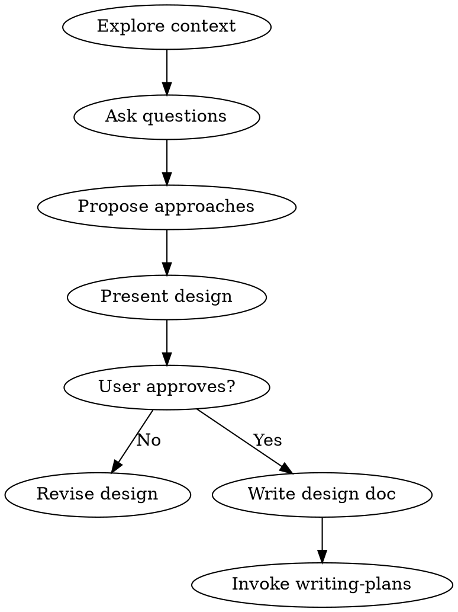

## Overview
The Design Flow transforms raw ideas into fully validated design documents through structured collaborative dialogue.

## Steps

| Step | Action | File:Line |
|------|--------|-----------|
| 1 | Explore project context (files, docs, recent commits) | skills/brainstorming/SKILL.md:L62-65 |
| 2 | Ask clarifying questions (one at a time) | skills/brainstorming/SKILL.md:L67-72 |
| 3 | Propose 2-3 approaches with trade-offs | skills/brainstorming/SKILL.md:L74-78 |
| 4 | Present design in sections, get approval after each | skills/brainstorming/SKILL.md:L80-88 |
| 5 | Write design doc to docs/plans/YYYY-MM-DD-<topic>-design.md | skills/brainstorming/SKILL.md:L90-94 |
| 6 | Invoke writing-plans skill | skills/brainstorming/SKILL.md:L96-98 |

## Flowchart

## Failure Modes

| Failure | Cause | Recovery |
|---------|-------|----------|
| Skipping design for "simple" tasks | Rationalization | Always follow flow, document can be 2 sentences |
| Multiple questions in one message | Violating one-at-a-time rule | Restart from last answered question |
| Proceeding without user approval | Impatience | Return to design presentation |
| Writing code before design approved | HARD-GATE violation | Delete code, restart from design |
