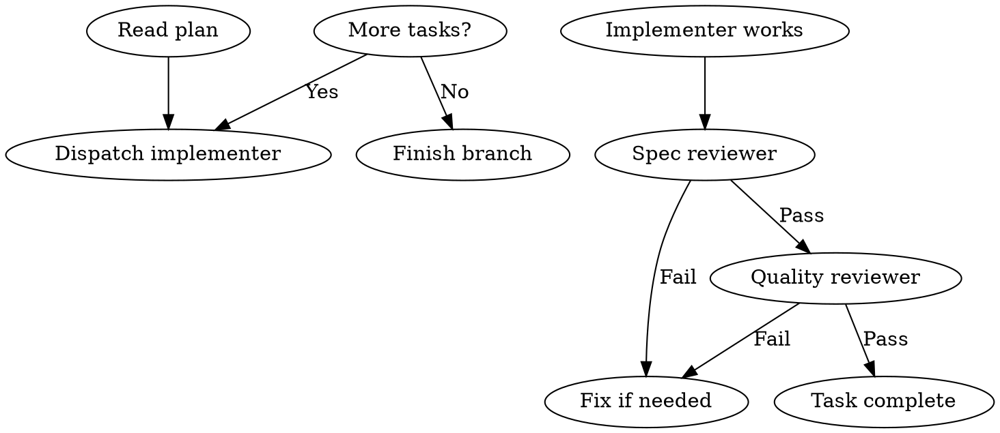

## Overview
Execute implementation plans by dispatching fresh subagents for each task with two-stage review (spec compliance first, then code quality).

## Steps

| Step | Action | File:Line |
|------|--------|-----------|
| 1 | Read plan, extract tasks, create TodoWrite | skills/subagent-driven-development/SKILL.md:L82-85 |
| 2 | Dispatch implementer subagent with implementer-prompt.md | skills/subagent-driven-development/SKILL.md:L87-90 |
| 3 | Implementer asks questions? Answer with context | skills/subagent-driven-development/SKILL.md:L92-96 |
| 4 | Implementer implements, tests, commits, self-reviews | skills/subagent-driven-development/SKILL.md:L98-102 |
| 5 | Dispatch spec reviewer subagent | skills/subagent-driven-development/SKILL.md:L104-108 |
| 6 | Spec reviewer confirms code matches spec? | skills/subagent-driven-development/SKILL.md:L110-114 |
| 7 | Fix spec gaps if any | skills/subagent-driven-development/SKILL.md:L116-118 |
| 8 | Dispatch code quality reviewer | skills/subagent-driven-development/SKILL.md:L120-124 |
| 9 | Code quality reviewer approves? | skills/subagent-driven-development/SKILL.md:L126-130 |
| 10 | Fix quality issues if any | skills/subagent-driven-development/SKILL.md:L132-134 |
| 11 | Mark task complete in TodoWrite | skills/subagent-driven-development/SKILL.md:L136-138 |
| 12 | More tasks? Repeat from step 2 | skills/subagent-driven-development/SKILL.md:L140-142 |

## Flowchart

## Failure Modes

| Failure | Cause | Recovery |
|---------|-------|----------|
| Context pollution | Reusing same agent for multiple tasks | Always dispatch fresh subagent |
| Wrong order | Reviewing quality before spec | Follow two-stage: spec first |
| Skipping reviews | Time pressure | Hard gate: no task complete without both reviews |
| Tightly coupled tasks | Wrong workflow choice | Use executing-plans instead |
