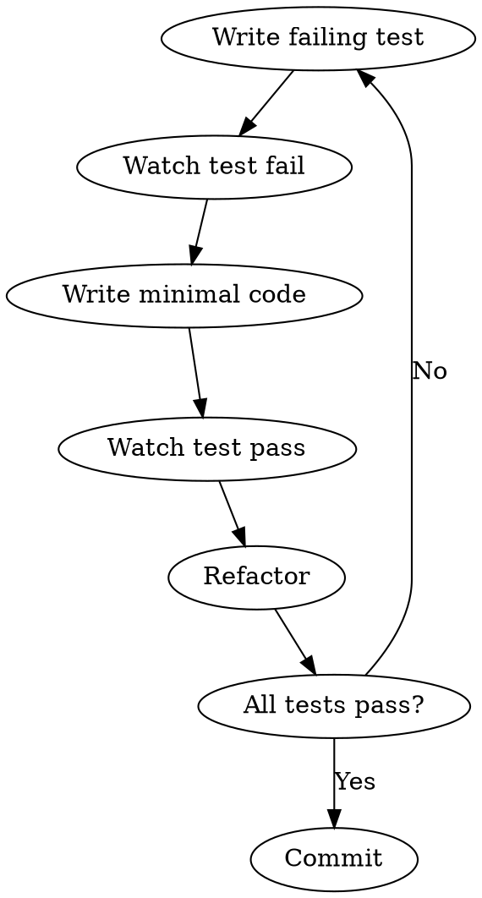

## Overview
Test-Driven Development enforces writing failing tests first, then minimal code to pass, then refactoring.

## Steps

| Step | Action | File:Line |
|------|--------|-----------|
| 1 | Write failing test (RED) | skills/test-driven-development/SKILL.md:L32-38 |
| 2 | Watch test fail | skills/test-driven-development/SKILL.md:L40-44 |
| 3 | Write minimal code to pass (GREEN) | skills/test-driven-development/SKILL.md:L46-52 |
| 4 | Watch test pass | skills/test-driven-development/SKILL.md:L54-58 |
| 5 | Refactor if needed (REFACTOR) | skills/test-driven-development/SKILL.md:L60-66 |
| 6 | Commit | skills/test-driven-development/SKILL.md:L68-72 |

## Flowchart



## Iron Law

```
NO PRODUCTION CODE WITHOUT A FAILING TEST FIRST
```

**If you wrote code before the test, DELETE IT. Start over.**

## Failure Modes

| Failure | Cause | Recovery |
|---------|-------|----------|
| Writing code before test | "I'll just write it quickly" | Delete code, restart from test |
| Keeping "reference" code | Sentimental attachment | Delete, implement fresh |
| Skipping RED phase | Time pressure | Not allowed, go back |
| Writing too much code | Over-implementation | Minimal only, YAGNI |
| Skipping refactor | Fear of breaking | Refactor carefully, tests protect you |
