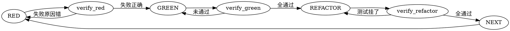

## Steps

1. **识别任务**: 确定要实现的功能或修复的 bug
2. **RED**: 写一个最小测试，展示预期行为
3. **验证 RED**: 运行测试，确认测试失败且失败原因正确
4. **GREEN**: 写最小代码让测试通过（不追求完美）
5. **验证 GREEN**: 运行所有测试，确认全部通过
6. **REFACTOR**: 重构代码保持测试绿色
7. **验证 REFACTOR**: 再次运行测试，确认仍然全部通过
8. **NEXT**: 回到步骤 2，继续下一个测试

## Flow Diagram

## Failure Modes

| Phase | Failure | Recovery |
|-------|---------|----------|
| RED | 不知道测什么 | 先写一个最明显的用例 |
| GREEN | 写太多代码 | 删除，重写最小实现 |
| GREEN | 测试全绿但不满足需求 | 删除代码，重新理解需求 |
| REFACTOR | 重构后测试挂了 | 回滚重构，继续 GREEN |
| ANY | 在测试前写了生产代码 | **必须删除，从头开始** |
