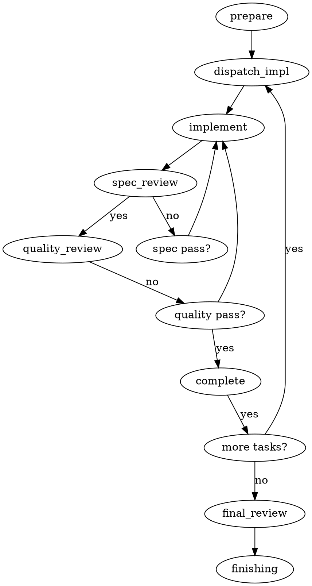

## Steps

1. **准备**: 读取 plan，提取所有任务完整文本，创建 TodoWrite
2. **Dispatch Implementer**: 分发 fresh subagent（implementer-prompt.md）
3. **执行**: subagent 实现 + 测试 + 提交 + 自审
4. **Spec Review**: 分发 spec-reviewer subagent 确认代码符合 spec
5. **修复 Spec Gap**: 如有不符，implementer 修复后重新审查
6. **Code Quality Review**: 分发 code-quality-reviewer subagent 检查代码质量
7. **修复 Quality Issue**: 如有问题，implementer 修复后重新审查
8. **标记完成**: TodoWrite 标记任务完成
9. **循环**: 重复步骤 2-8 直到所有任务完成
10. **最终审查**: 整个实现完成后，dispatch 最终 code reviewer
11. **收尾**: 调用 finishing-a-development-branch

## Flow Diagram

## Failure Modes

| Stage | Failure | Recovery |
|-------|---------|----------|
| implement | subagent 提问 | 回答问题，提供上下文 |
| implement | 实现错误 | spec review 会发现 |
| spec review | 代码不符合 spec | 修复后 re-review |
| quality review | 代码质量问题 | 修复后 re-review |
| any | subagent 失控 | kill subagent，手动介入 |
