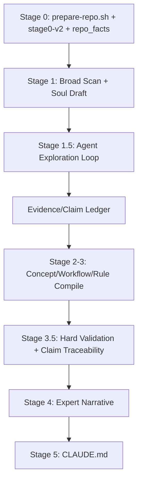

# Agentic 提取 MVP 设计 — Codex 工程架构研究报告

> 视角：系统设计 + 算法 + 落地可行性  
> 日期：2026-03-15  
> 模型：Codex

---

## 0. 执行摘要

我的核心判断很明确：

> **Agentic 提取的 MVP 不应该替代 Soul Extractor 的顺序流水线，而应该在 Stage 1 后插入一个“受约束的定向探索环”。**

也就是：

- **保留** Stage 0 的确定性采样与事实提取
- **保留** Stage 1-4 的知识编译骨架
- **新增** `Stage 1.5: Agent Exploration Loop`

推荐架构：**方案 C（混合架构）**

原因：

1. **Stage 0 仍然提供广度视图**，避免 agent 在大项目里瞎逛
2. **Agent 只做定向深挖**，把 token 花在 WHY / UNSAID / 工作流追踪上
3. **能和现有 `repo_facts.json + validate_extraction.py` 无缝衔接**
4. **弱模型也能跑**，因为它不是“完全自主”，而是“受约束执行”
5. **失败可降级**：Stage 1.5 挂了，仍可回退到当前单遍提取

我不推荐：

- 纯单 agent 全自主：理论优雅，工程不稳
- 纯多 agent 分工：MVP 过早复杂化

MVP 的最小范围我建议是：

1. 新增 `Stage 1.5`
2. 新增 4-5 个最小工具
3. 新增 4 个中间文件
4. 扩展 Stage 3.5 验证 claim traceability

**不做** AST 工具、执行代码、复杂多 agent 协调、自动 PR/issue 深挖。

---

## 1. 先讲本质：Agentic 提取不是“让模型看更多”，而是“让模型决定接下来该看什么”

当前单遍架构的问题不是 Stage 1-4 的 prompt 不够聪明，而是：

1. **Stage 0 的采样不可交互**
2. **模型不能基于新发现回头查证**
3. **WHY / UNSAID 需要跨文件因果链，而不是单文件摘要**

所以 Agentic 化的真正收益来自：

- 形成假说
- 精确找证据
- 基于证据修正假说

这不是把“读代码”从一次变十次这么简单，而是把提取过程从：

`静态摘要`

变成：

`假说 → 搜索 → 阅读 → 记录证据 → 修正理解 → 编译知识`

因此 MVP 的重点不该是“多聪明”，而该是：

> **怎么让探索过程可控、可审计、可预算、可回退。**

---

## 2. 三种核心架构方案对比

## 2.1 方案 A：单 agent 多轮迭代

### 设计

一个 agent 拥有最小工具集，循环：

1. 读当前摘要 / 假说
2. 决定下一步看什么
3. 调工具
4. 记录发现
5. 直到预算耗尽或认为饱和

### 优点

- 最贴近“专家翻代码”的认知模型
- 所有推理在一个上下文里，线索不断裂
- WHY 类跨文件追踪最自然

### 缺点

- **最容易迷路**
- 对上下文管理要求高
- 弱模型很容易在长对话里退化
- 大项目时，agent 会把时间花在“重新理解自己刚才做了什么”

### 工程复杂度

- 中等
- 难点不在工具，而在 **状态管理和停止条件**

### 适用

- 中小项目
- 强模型
- 研究实验

### 我的判断

**不适合 MVP 默认模式。**  
因为它把最难的问题——规划、记忆、压缩、避坑——一次性全揽了。

---

## 2.2 方案 B：多 agent 协作

### 设计

按任务拆 agent，例如：

- Structure Agent：模块地图
- Workflow Agent：调用链
- Why Agent：设计哲学
- Unsaid Agent：暗坑与变通

最后由一个 Compiler Agent 合并。

### 优点

- 可并行
- 每个 agent 的 prompt 可高度专用
- 单 agent 上下文负担更小

### 缺点

- **协调成本高于探索成本**
- agent 之间共享线索很难
- 最后合并冲突会变成新问题
- 对 Telegram / 4-5 分钟当前体验不友好

### 工程复杂度

- 高
- 需要 orchestration、结果合并、冲突去重

### 适用

- 后期高质量模式
- 特定大仓库 / 多子系统仓库

### 我的判断

**不适合 MVP。**  
现阶段 Doramagic 最大瓶颈是“看不对地方”，不是“没有足够多 agent”。

---

## 2.3 方案 C：混合架构（推荐）

### 设计



其中：

- Stage 0 负责“给地图”
- Stage 1 负责“给初步理解 + 假说清单”
- Stage 1.5 负责“按假说定向深挖”

### 优点

- 与现有管线兼容性最高
- 成本受控
- 可以显式 budget control
- 弱模型可执行
- 失败时可回退到旧路径

### 缺点

- 需要设计新的中间产物
- 假说生成质量会成为新瓶颈

### 工程复杂度

- 中等偏低
- 改造集中在 Stage 1.5 与 Stage 3.5

### 我的判断

**这是唯一既有工程确定性、又有质量跃升空间的方案。**

---

## 3. 推荐的 MVP 架构：受约束的 Stage 1.5

我建议不要把 Agentic 看成“取代 Stage 0”，而是看成：

> **Stage 0 的广度不足，由 Stage 1.5 的深度补齐。**

### 3.1 新增产物

Stage 1 输出后，新增以下文件：

```text
output/
├── artifacts/
│   ├── repo_facts.json
│   ├── community_signals.md
│   ├── stage0_manifest.json
│   └── packed_compressed.xml
└── soul/
    ├── 00-soul.md
    ├── hypotheses.jsonl
    ├── exploration_log.jsonl
    ├── evidence_index.json
    ├── claim_ledger.jsonl
    └── context_digest.md
```

### 3.2 各文件作用

| 文件 | 作用 |
|---|---|
| `hypotheses.jsonl` | Stage 1 产出的待验证假说 |
| `exploration_log.jsonl` | 每次工具调用的事实记录 |
| `evidence_index.json` | 证据到文件/行号/假说的索引 |
| `claim_ledger.jsonl` | 已确认/已反驳/待定的知识 claim |
| `context_digest.md` | 压缩后的当前理解，给下一轮 fresh context 用 |

关键点：

- **Agent 不靠长对话记忆**
- **Agent 靠文件记忆**

这和 Manus 的 filesystem-as-memory 经验一致，也最适合大仓库。

---

## 4. Agent 工具集设计：必须比你直觉中更少

我建议 MVP 只暴露 **5 个工具**。

### 4.1 `read_artifact`

读取 Stage 0/Stage C 的结构化产物。

```json
{
  "name": "read_artifact",
  "input": {
    "artifact": "repo_facts|community_signals|stage0_manifest|context_digest|hypotheses|claim_ledger",
    "limit": 200
  },
  "output": {
    "artifact": "repo_facts",
    "content": "...",
    "truncated": false
  }
}
```

**为什么需要它**：  
不要让 agent 自己去找 `artifacts/repo_facts.json` 路径。减少路径噪音。

### 4.2 `list_tree`

列目录树，但带过滤。

```json
{
  "name": "list_tree",
  "input": {
    "path": ".",
    "depth": 3,
    "include_glob": ["src/**", "docs/**", "tests/**"],
    "exclude_glob": ["**/node_modules/**", "**/vendor/**", "**/.git/**"]
  },
  "output": {
    "entries": [
      {"path": "src/dotenv/main.py", "type": "file"},
      {"path": "src/dotenv/parser.py", "type": "file"}
    ]
  }
}
```

### 4.3 `search_repo`

全仓搜索。

```json
{
  "name": "search_repo",
  "input": {
    "query": "override",
    "path": ".",
    "glob": ["src/**/*.py", "docs/**/*.md", "tests/**/*.py"],
    "limit": 20,
    "context_lines": 2
  },
  "output": {
    "matches": [
      {
        "path": "src/dotenv/main.py",
        "line": 78,
        "snippet": "if not override and key in os.environ:"
      }
    ]
  }
}
```

### 4.4 `read_file`

读取文件片段，不允许整仓大读。

```json
{
  "name": "read_file",
  "input": {
    "path": "src/dotenv/main.py",
    "start_line": 60,
    "end_line": 120,
    "max_lines": 120
  },
  "output": {
    "path": "src/dotenv/main.py",
    "start_line": 60,
    "end_line": 120,
    "content": "..."
  }
}
```

### 4.5 `append_finding`

这是唯一“写”工具，但必须是结构化写入，不给自由写文件。

```json
{
  "name": "append_finding",
  "input": {
    "kind": "evidence|claim_update|hypothesis_update|digest_note",
    "payload": {
      "hypothesis_id": "H-003",
      "status": "CONFIRMED",
      "evidence": [
        {"path": "src/dotenv/main.py", "line_start": 78, "line_end": 85}
      ],
      "note": "override=False is implemented as non-destructive env injection"
    }
  },
  "output": {
    "written_to": "claim_ledger.jsonl",
    "entry_id": "CLM-014"
  }
}
```

## 4.6 为什么不加更多工具

MVP 不需要：

- AST parse tool
- dependency graph tool
- git log tool
- code execution tool
- write_file arbitrary tool

原因：

1. AST / dependency / git 摘要可在 Stage 0 预提取
2. 执行代码会引入环境不确定性
3. 任意写文件会让 agent“靠写文章制造进展”

**结论：MVP 的 agent 不是程序员 agent，而是受约束的代码考古 agent。**

---

## 5. Tool budget 设计：要限制调用次数，也要限制“无效探索”

我建议做四层 budget：

### 5.1 硬预算

| 维度 | 小项目 | 大项目 |
|---|---:|---:|
| 总轮数 | 5 | 10 |
| `search_repo` 次数 | 10 | 24 |
| `read_file` 次数 | 12 | 30 |
| 单次 `read_file` 最大行数 | 120 | 160 |
| 总 wall clock | 2 min | 5 min |
| 额外 token 预算 | 20k | 60k |

### 5.2 软预算

若连续 3 次工具调用没有新增高置信 evidence，则触发降速：

- 禁止继续扫 tests
- 禁止再开新假说
- 只能处理未闭合的 P0/P1 假说

### 5.3 信息增益预算

对每个假说维护：

```text
expected_gain = priority_weight × uncertainty × locus_score / estimated_cost
```

只有 gain 足够高，才值得再读文件。

### 5.4 Budget-aware 策略切换

剩余预算少于 25% 时：

- 停止广泛搜索
- 只做 claim 收敛与证据补全

这很重要。  
很多 agent 不是死在“不会探索”，而是死在“预算快没了还在找新线索”。

---

## 6. 探索策略：怎么决定“接下来看什么”

## 6.1 初始入口点

按优先顺序：

1. README / docs overview
2. package manifest / entrypoint
3. Stage 0 抽出的 high-soul-locus files
4. repo_facts 中的 commands / skills / config keys
5. community_signals 中的 deprecation / known issues

### 建议新增 `stage0_manifest.json`

由 Stage 0 额外产出：

```json
{
  "entrypoints": ["src/dotenv/main.py"],
  "hot_files": ["src/dotenv/parser.py", "src/dotenv/variables.py"],
  "config_files": [".env.example", "pyproject.toml"],
  "validation_files": ["src/dotenv/main.py"],
  "doc_files": ["README.md"],
  "test_files": ["tests/test_parser.py"]
}
```

这样 agent 一开始就不用从 0 找方向。

## 6.2 文件优先级打分

```text
file_priority =
  0.30 * stage0_locus_score
  + 0.25 * hypothesis_match_score
  + 0.15 * entrypoint_bonus
  + 0.15 * centrality_score
  + 0.10 * recent_change_bonus
  + 0.05 * community_signal_bonus
```

这不是必须用复杂模型。  
简单线性打分就够。

## 6.3 探索终止条件

满足任一即停：

1. P0/P1 假说全部关闭
2. 达到硬预算
3. 连续 3 轮 marginal gain < 阈值
4. 新 evidence 只是在重复已确认结论

## 6.4 防止迷路的机制

默认不探索：

- `vendor/`
- `node_modules/`
- 纯 fixture / snapshot
- 大量生成文件
- test helpers

除非某个假说明确指向这些区域。

另一个关键机制：

> **tests 默认不是起点，只是验证点。**

Agent 只有在：

- 代码里出现难理解行为
- 或 claim 缺少反例验证

时，才去看 tests。

---

## 7. 与现有 Stage 的集成方式

## 7.1 哪些替代，哪些保留

| Stage | 处理方式 |
|---|---|
| Stage 0 | 保留，并补充 `stage0_manifest.json` |
| Stage 1 | 保留，但新增 `hypotheses.jsonl` 输出 |
| Stage 1.5 | 新增 agent loop |
| Stage 2-3 | 保留，输入改为 `Stage1 + claim_ledger` |
| Stage 3.5 | 扩展验证 claim traceability |
| Stage 4 | 保留 |

我的结论：

> **Agentic 阶段不是 Stage 0 的替代品，也不是 Stage 2-3 的替代品；它是 Stage 1 和 Stage 2 之间的“深度证据层”。**

## 7.2 `repo_facts.json` 的角色

在 Agentic 架构里，它不只是 whitelist，而是：

1. 初始知识
2. 探索锚点
3. 验证基线

例如：

- `commands` 可触发 workflow 假说
- `skills` 可触发模块关系假说
- `config_keys` 可触发 IF / rule 假说

## 7.3 Stage 3.5 如何适配

新增三类校验：

1. `claim.evidence[]` 引用的文件/行号必须真实存在
2. 每条 `CONFIRMED` claim 必须至少引用一个 `exploration_log` 条目
3. `WHY/UNSAID` claim 若只有 inference、无 evidence，则只能标 `INCONCLUSIVE`

建议扩展 `validate_extraction.py`：

```text
check_claim_ledger_exists()
check_claim_evidence_traceability()
check_claim_status_consistency()
check_exploration_log_references()
```

这比修改 Stage 2/3 prompt 更重要。

---

## 8. 上下文管理：不要长对话，要短回合 + 文件记忆

我推荐：

> **每轮 fresh context + 累积发现文件**

而不是长对话。

### 8.1 原因

长对话会带来：

- token 线性膨胀
- 弱模型 drift
- “我好像记得之前看过”但其实没记准

### 8.2 每轮上下文组成

每轮只给 agent：

1. 当前 repo 摘要（短）
2. Top N 未解决假说
3. 最近 M 条关键 evidence
4. 剩余 budget
5. 当前禁止区域

### 8.3 Context compaction 触发条件

任一满足即压缩：

1. 已读文件 > 8 个
2. 已消费工具返回 > 12k tokens
3. claim_ledger 新增 > 5 条

压缩后只保留：

- 已确认 claims
- 未闭合假说
- 高价值证据索引
- 尚未读取但优先级高的文件名单

## 8.4 对话历史增长曲线

若不用 compaction：

```text
tokens ≈ O(rounds × avg_tool_output)
```

若使用 fresh context + digest：

```text
tokens ≈ O(digest_size + current_tool_output)
```

这正是大项目可跑的关键。

---

## 9. 各知识类型的具体探索算法

## 9.1 WHAT（概念）

### 目标

识别项目核心对象、模块、角色。

### 策略

- 广度优先
- 主要依赖 README + package manifest + 顶层模块

### 算法

1. 从 README 抽对象名
2. 在 `repo_facts` 和目录树里找对应模块
3. 若对象和模块一一对应，则收敛

### 结论

WHAT 不需要太 agentic。  
MVP 中主要收益不在这里。

## 9.2 HOW（工作流）

### 目标

找到“从入口到结果”的主路径。

### 策略

- 从 entrypoint 出发
- 搜索调用与关键状态变换

### 算法

1. 识别入口函数 / CLI
2. 搜索被调用的核心函数
3. 读 2-4 个关键文件片段
4. 写入 workflow claim

## 9.3 IF（规则）

### 目标

找到条件、约束、保护性分支。

### 策略

搜索：

- `if`
- `validate`
- `error`
- `warn`
- `override`
- `deprecated`
- config keys

### 算法

1. 从 config / validators / error handling 文件入手
2. 抓条件判断与默认值
3. 用 tests 验证边界条件

## 9.4 WHY（设计哲学）

### 目标

解释“为什么它要这样设计”。

### 策略

假说驱动。

例如：

- “为什么默认不覆盖已有环境变量？”
- “为什么自定义 parser 而不是复用现有库？”

### 算法

1. 从“奇怪默认值 / 手工实现 / 明显 trade-off”生成假说
2. 搜索注释、README 解释、tests 命名、community_signals
3. 若出现一致证据链，则升级为 WHY claim

WHY 的关键词不是 `why`，而是：

- `because`
- `to avoid`
- `must`
- `should not`
- 特殊默认值
- 重复测试覆盖的边界行为

## 9.5 UNSAID（暗坑）

### 目标

找到项目没有大声说，但代码其实在防的坑。

### 策略

搜反模式：

- workaround
- fallback
- compatibility
- legacy
- deprecated
- special case
- exception branches

### 算法

1. 搜错误处理与兼容逻辑
2. 看 tests 中异常分支
3. 看 community signals 中 issue / changelog 提到的问题
4. 汇总成 gotcha / unstated constraint

**UNSAID 的核心不是“读更多”，而是“主动找防守动作”。**

---

## 10. 成本与性能估算

## 10.1 单遍 vs Agentic

### python-dotenv（小项目）

建议配置：

- 轮数：3-5
- 文件读取：6-10 次
- 搜索：4-8 次

预期收益：

- WHAT 提升有限
- WHY 会更稳
- 可更清楚解释 `override=False`、shell 语义兼容、变量插值

成本判断：

- 可以接受
- 但不应过度探索

### wger（大项目）

建议配置：

- 轮数：8-10
- 文件读取：20-30 次
- 搜索：15-24 次

预期收益：

- 从“结构性摘要”提升到“子系统级理解”
- 能显著减少静态采样丢失
- 更容易抓到 WHY / 子系统边界 / 例外规则

成本判断：

- 这是 Agentic 模式真正值钱的场景

## 10.2 5 / 10 / 20 轮质量-成本曲线

| 轮数 | 质量收益 | 成本 | 建议 |
|---|---|---|---|
| 5 | 高 | 低中 | 小项目默认 |
| 10 | 高峰 | 中 | 大项目默认 |
| 20 | 边际递减明显 | 高 | 仅研究模式 |

我的建议：

> **MVP 不提供 20 轮。**  
> 产品默认只做 5 或 10 轮两档。

## 10.3 Budget-aware 探索

剩余预算 > 50%：

- 允许开新假说
- 允许扫描 docs + core code + tests

剩余预算 25%-50%：

- 只允许 P0/P1 假说
- test 文件只做佐证

剩余预算 < 25%：

- 禁止新搜索
- 只补证据与收敛 claim

## 10.4 弱模型（MiniMax）可行性

能跑，但必须降级。

### 弱模型模式

1. 更强的 Stage 0 seed
2. 更少工具
3. 更少轮数
4. 更强格式约束
5. WHY / UNSAID 只允许产出 `CANDIDATE` 或 `INCONCLUSIVE`

也就是说：

> 弱模型可以做“受约束证据收集”，不要要求它做“高自由度研究员”。 

---

## 11. `agentic_extract(repo_path, config) -> ExtractionResult` 伪代码

```pseudo
function agentic_extract(repo_path, config):
    # -----------------------------------
    # Stage 0: deterministic prep
    # -----------------------------------
    artifacts = run_prepare_repo(repo_path, config.output_dir)
    stage0_manifest = build_stage0_manifest(repo_path, artifacts)

    # -----------------------------------
    # Stage 1: broad scan
    # -----------------------------------
    soul_draft = run_stage1_broad_scan(
        packed_xml=artifacts.packed_compressed,
        repo_facts=artifacts.repo_facts,
        community_signals=artifacts.community_signals,
        stage0_manifest=stage0_manifest
    )

    hypotheses = generate_hypotheses(
        soul_draft,
        repo_facts=artifacts.repo_facts,
        stage0_manifest=stage0_manifest,
        max_hypotheses=config.max_hypotheses
    )
    write_jsonl("soul/hypotheses.jsonl", hypotheses)

    # -----------------------------------
    # Stage 1.5: agent exploration loop
    # -----------------------------------
    state = {
        "budget": init_budget(config, repo_size=stage0_manifest.repo_size),
        "open_hypotheses": prioritize_hypotheses(hypotheses),
        "claim_ledger": [],
        "evidence_index": {},
        "recent_evidence": [],
        "digest": initial_digest(soul_draft, hypotheses)
    }

    while true:
        if stop_condition_met(state):
            break

        round_input = build_round_context(
            digest=state.digest,
            top_hypotheses=top_k_open(state.open_hypotheses, k=5),
            recent_evidence=state.recent_evidence,
            remaining_budget=state.budget,
            forbidden_paths=config.forbidden_paths
        )

        plan = agent_plan_next_action(round_input)
        if not plan_is_valid(plan, state.budget):
            plan = fallback_close_claims_plan(state)

        tool_result = execute_tool(plan.tool, plan.args)
        log_entry = record_exploration_log(plan, tool_result)

        observations = extract_observations(
            tool_result,
            target_hypothesis=plan.hypothesis_id
        )

        for obs in observations:
            update_evidence_index(state.evidence_index, obs, log_entry)
            claim_delta = evaluate_observation_against_hypothesis(obs, state.open_hypotheses)
            apply_claim_delta(state.claim_ledger, claim_delta)

        state.open_hypotheses = refresh_hypotheses(
            open_hypotheses=state.open_hypotheses,
            claim_ledger=state.claim_ledger,
            evidence_index=state.evidence_index
        )

        state.budget = consume_budget(state.budget, plan, tool_result)
        state.recent_evidence = refresh_recent_evidence(state.evidence_index)

        if need_compaction(state):
            state.digest = compact_context(
                soul_draft=soul_draft,
                claim_ledger=state.claim_ledger,
                open_hypotheses=state.open_hypotheses,
                evidence_index=state.evidence_index
            )
            write_file("soul/context_digest.md", state.digest)

    write_jsonl("soul/claim_ledger.jsonl", state.claim_ledger)
    write_json("soul/evidence_index.json", state.evidence_index)

    # -----------------------------------
    # Stage 2-3: compile cards
    # -----------------------------------
    compiled_cards = compile_cards(
        soul_draft=soul_draft,
        claim_ledger=state.claim_ledger,
        repo_facts=artifacts.repo_facts,
        community_signals=artifacts.community_signals
    )

    # -----------------------------------
    # Stage 3.5: validate
    # -----------------------------------
    validation = validate_extraction(
        output_dir=config.output_dir,
        check_claim_traceability=true,
        check_claim_status=true
    )

    if validation.hard_fail:
        compiled_cards = retry_repair(compiled_cards, validation.feedback)

    # -----------------------------------
    # Stage 4-5: narrative + assembly
    # -----------------------------------
    narrative = run_stage4(
        soul_draft=soul_draft,
        claim_ledger=state.claim_ledger,
        compiled_cards=compiled_cards
    )

    final_output = assemble_output(
        narrative=narrative,
        cards=compiled_cards,
        metadata={
            "agentic_enabled": true,
            "budget_used": state.budget.used,
            "hypotheses_total": len(hypotheses),
            "claims_confirmed": count_confirmed(state.claim_ledger)
        }
    )

    return ExtractionResult(
        soul_draft=soul_draft,
        claims=state.claim_ledger,
        cards=compiled_cards,
        validation=validation,
        output=final_output
    )
```

---

## 12. 测试与验证设计

## 12.1 Gold set 项目

### 小项目：python-dotenv

为什么合适：

- 已有 baseline
- 工作流清晰
- WHY 比较明确
- 便于判断 agent 是否过度探索

### 大项目：wger

为什么合适：

- 文件多
- 子系统多
- 静态采样损失明显
- 能检验 agent 是否真的提高“大项目信息保留度”

## 12.2 A/B 对照

### A 组

当前单遍：

`Stage 0 -> 1 -> 2 -> 3 -> 3.5 -> 4 -> 5`

### B 组

Agentic：

`Stage 0 -> 1 -> 1.5 -> 2 -> 3 -> 3.5 -> 4 -> 5`

### 同一评分 Rubric

建议测 6 个指标：

1. traceability rate
2. confirmed WHY count
3. confirmed UNSAID count
4. workflow completeness
5. hallucination rate
6. extraction time

## 12.3 “大项目信息保留度”如何衡量

不能只看主观评分。

我建议定义：

```text
retention_score =
  recalled_core_modules / expected_core_modules
  + captured_critical_rules / expected_critical_rules
  + captured_non_obvious_whys / gold_whys
```

其中 gold set 可以先人工标 10-20 个关键点。

## 12.4 具体测试用例

### python-dotenv

至少覆盖：

- `override=False` 的设计理由
- `find_dotenv()` 的搜索策略
- parser / variable interpolation 行为
- shell 语义一致性

### wger

至少覆盖：

- 核心入口与主要子系统识别
- 至少 2 条跨模块 workflow
- 至少 3 条非显而易见规则或 gotcha

---

## 13. 工程风险与恢复机制

## 13.1 Agent 死循环 / 走偏

### 检测

- 连续读取低优先级文件
- 连续重复搜索相似关键词
- 连续 3 次无新增 evidence

### 恢复

- 强制回到 top open hypotheses
- 重新生成小型 digest
- 禁止访问最近已访问路径

## 13.2 假说质量差

这是 MVP 最大风险，不是工具风险。

解决：

- Stage 1 只生成 5-8 个高价值假说
- 按 WHY / UNSAID / Workflow 分层
- 不允许生成泛泛的“看看这个模块在做什么”

## 13.3 弱模型不稳定

解决：

- 降级模式
- 更少轮次
- 更强 schema
- 更严格 Stage 3.5

## 13.4 测试文件黑洞

很多 agent 会在 tests 里找到一切，看起来很聪明，实际上只是复述测试。

解决：

- tests 默认只能佐证
- 核心 claim 必须至少有一个非 test 证据

## 13.5 进度假象

如果给 agent 任意写文件能力，它会“写很多总结”制造进度。

解决：

- 只允许 `append_finding`
- 由 harness 决定写入位置

---

## 14. 最终 MVP 定义

## 范围

必须包含：

1. `stage0_manifest.json`
2. Stage 1 输出 `hypotheses.jsonl`
3. Stage 1.5 单 agent exploration loop
4. 5 个最小工具
5. `exploration_log.jsonl + claim_ledger.jsonl + context_digest.md`
6. Stage 3.5 claim traceability 校验

明确不做：

1. 多 agent 协作
2. 执行代码
3. AST 工具暴露给 agent
4. 自动 git/PR 深挖
5. 跨项目图谱辅助假说

## 工时估算

| 模块 | 工时 |
|---|---:|
| `stage0_manifest.json` 输出 | 0.5-1 天 |
| Stage 1 假说输出 | 0.5-1 天 |
| Agent harness + 5 工具 | 1.5-2 天 |
| 文件记忆与 compaction | 1 天 |
| Stage 3.5 扩展校验 | 0.5-1 天 |
| A/B 测试脚本与评估 | 1 天 |
| **合计** | **5-7 天** |

## 验证方式

最小通过标准：

1. python-dotenv：WHY 质量不低于当前基线，traceability 不下降
2. wger：retention_score 明显高于当前单遍
3. 总耗时可控制在 Telegram 可接受范围内
4. MiniMax 降级模式不产生更高幻觉率

---

## 15. 我的最终建议

如果只给一句建议，那就是：

> **先把 Agentic 做成“受约束的证据采集器”，而不是“自由探索的代码研究员”。**

因为 Soul Extractor 的护城河不在于“像人一样乱翻代码”，  
而在于：

1. 有稳定骨架
2. 有硬验证
3. 有高价值 WHY / UNSAID 输出

所以最正确的 MVP 是：

- **确定性骨架不动**
- **Agent 只补最值钱的深度**
- **验证门变得更硬**

这条路最稳，也最符合 Doramagic 的产品哲学：

> **代码说事实，AI 说故事。**

