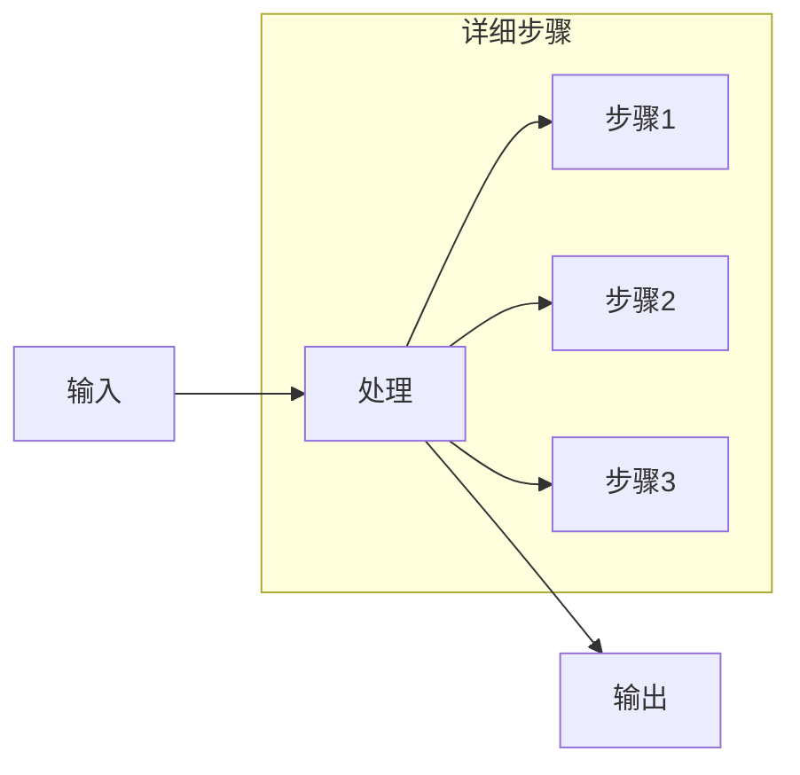

# Soul Extractor 技术分析报告

> 日期：2026-03-11
> 版本：v1.0

---

## 1. 概述

Soul Extractor 是 OpenClaw 已有的「灵魂提取」Skill，能够从 GitHub 仓库中提取设计哲学、心智模型、踩坑故事，生成专家级 AI 知识注入文件。

**触发词**：`extract soul`, `extract knowledge`, `提取知识`, `提取灵魂`

**版本**：0.8.0

---

## 2. 工作流程

### 2.1 整体架构

```
┌─────────────────────────────────────────────────────────────┐
│                     Soul Extractor                           │
├─────────────────────────────────────────────────────────────┤
│                                                             │
│  Stage 0: 准备                                             │
│    └─ 下载代码并打包                                        │
│           ↓                                                │
│  Stage 1: 灵魂发现                                          │
│    └─ 提取设计哲学和心智模型（核心阶段）                     │
│           ↓                                                │
│  Stage 2: 概念卡 + 工作流卡                                  │
│    └─ 产出中间素材                                          │
│           ↓                                                │
│  Stage 3: 规则卡                                           │
│    └─ 产出规则卡和社区陷阱卡                                │
│           ↓                                                │
│  Stage 3.5: 验证与审查                                      │
│    └─ 质量检查                                              │
│           ↓                                                │
│  Stage 4: 专家叙事合成                                      │
│    └─ 核心产出阶段                                          │
│           ↓                                                │
│  Stage 5: 组装产出                                          │
│    └─ 生成最终文件                                          │
│                                                             │
└─────────────────────────────────────────────────────────────┘
```

### 2.2 各阶段详解

| 阶段 | 名称 | 产出 |
|------|------|------|
| Stage 0 | 准备 | 代码下载打包 |
| Stage 1 | 灵魂发现 | 设计哲学、心智模型 |
| Stage 2 | 概念卡 + 工作流卡 | 中间素材卡片 |
| Stage 3 | 规则卡 | 规则卡、社区陷阱卡 |
| Stage 3.5 | 验证与审查 | 质量检查报告 |
| Stage 4 | 专家叙事合成 | 专家级知识传递 |
| Stage 5 | 组装产出 | .cursorrules, CLAUDE.md, soul/cards/ |

---

## 3. 提取方法

### 3.1 设计哲学提取（5 问法）

```
┌─────────────────────────────────────────────────────────────┐
│                    5 问法模板                                │
├─────────────────────────────────────────────────────────────┤
│                                                             │
│  Q1: 这个项目解决什么问题？                                   │
│      → 核心问题                                             │
│                                                             │
│  Q2: 在此之前人们是怎么做的？                                 │
│      → 替代方案                                             │
│                                                             │
│  Q3: 这个项目承诺带来什么不同？                               │
│      → 核心承诺                                             │
│                                                             │
│  Q4: 它是如何兑现承诺的？                                     │
│      → 实现方式                                             │
│                                                             │
│  Q5: 用一句话总结这个项目的本质？                             │
│      → 一句话总结                                           │
│                                                             │
└─────────────────────────────────────────────────────────────┘
```

### 3.2 心智模型提取

#### 概念卡（Is/IsNot 表）

```
┌─────────────────────────────────────────────────────────────┐
│                    概念卡模板                                │
├─────────────────────────────────────────────────────────────┤
│                                                             │
│  # 概念名称                                                  │
│                                                             │
│  ## IS（是）                                                │
│  - [特点1]                                                  │
│  - [特点2]                                                  │
│                                                             │
│  ## IS NOT（不是）                                          │
│  - [不是1]                                                  │
│  - [不是2]                                                  │
│                                                             │
│  ## 边界                                                    │
│  - [适用场景]                                               │
│  - [不适用场景]                                             │
│                                                             │
└─────────────────────────────────────────────────────────────┘
```

#### 工作流卡（Mermaid 流程图）



### 3.3 踩坑故事提取

#### 来源

| 来源 | 内容类型 |
|------|----------|
| Issues | 用户报告的 Bug、踩坑记录 |
| CHANGELOG | 版本更新中的已知问题 |
| 安全公告 | 安全漏洞和修复 |
| Discussions | 社区解决方案 |

#### 社区陷阱卡模板

```
┌─────────────────────────────────────────────────────────────┐
│                    社区陷阱卡                                │
├─────────────────────────────────────────────────────────────┤
│                                                             │
│  # 陷阱名称                                                  │
│                                                             │
│  ## 症状                                                    │
│  - [错误现象]                                               │
│                                                             │
│  ## 原因                                                    │
│  - [根本原因]                                               │
│                                                             │
│  ## 解决方案                                                │
│  - [workaround]                                             │
│  - [修复方法]                                               │
│                                                             │
│  ## 来源                                                    │
│  - GitHub Issue #XXX                                        │
│                                                             │
└─────────────────────────────────────────────────────────────┘
```

---

## 4. 可复用模块

### 4.1 社区信号采集

**脚本**：`collect-community-signals.py`

**功能**：
- GitHub Issues 排序打分
- 多源分层采集
- 社区反馈提取

**Doramagic 可直接调用**：独立采集 GitHub Issues 中的踩坑经验

### 4.2 卡片验证器

**脚本**：`validate_extraction.py`

**功能**：
- 字段检查
- 来源追溯
- 数量门槛验证

**Doramagic 可直接调用**：用于产出质量检查

### 4.3 阶段模板

| 模板 | 位置 | 用途 |
|------|------|------|
| 概念卡模板 | stages/STAGE-2-concepts.md | 概念定义 |
| 工作流卡模板 | stages/STAGE-2-concepts.md | 流程图 |
| 规则卡模板 | stages/STAGE-3-rules.md | 规则定义 |
| 社区陷阱卡模板 | stages/STAGE-3-rules.md | 踩坑记录 |

---

## 5. 输出格式

### 5.1 产出文件结构

```
output/
├── soul/
│   └── project_soul.md          # 核心产出
├── .cursorsules                   # Cursor 加载
├── CLAUDE.md                      # Claude Code 加载
└── soul/
    └── cards/                     # 中间素材
        ├── concepts/              # 概念卡
        ├── workflows/             # 工作流卡
        ├── rules/                # 规则卡
        └── pitfalls/             # 陷阱卡
```

### 5.2 project_soul.md 结构

```markdown
# 项目灵魂

## 设计哲学
[5 问法提取的内容]

## 核心概念
[概念卡汇总]

## 工作流
[Mermaid 流程图]

## 关键规则
[规则卡汇总]

## 踩坑记录
[社区陷阱卡汇总]
```

---

## 6. Doramagic 集成建议

### 6.1 调用方式

Doramagic 可以通过以下方式调用 soul-extractor：

| 方式 | 说明 |
|------|------|
| **子代理调用** | spawn 子代理执行 soul-extractor |
| **脚本复用** | 直接调用社区信号采集脚本 |
| **模板复用** | 使用 5 问法等模板 |

### 6.2 整合策略

```
用户需求 → Doramagic 规划
                ↓
        需要提取灵魂？ → 调用 soul-extractor
                ↓
        需要踩坑经验？ → 调用采集脚本
                ↓
        需要质量检查？ → 调用验证器
                ↓
        组合成最终 Skill
```

### 6.3 差异化定位

| Skill | 定位 |
|-------|------|
| soul-extractor | 深度提取（时间长、质量高） |
| Doramagic | 快速规划（时间短、智能组合） |

**Doramagic 不重复造轮子，而是智能调用现有资源。**

---

## 7. 技术参考

### 7.1 目录结构

```
~/.agents/skills/soul-extractor/
├── SKILL.md
├── scripts/
│   ├── prepare-repo.sh
│   ├── collect-community-signals.py
│   ├── validate_extraction.py
│   └── assemble-output.sh
└── stages/
    ├── STAGE-1-essence.md
    ├── STAGE-2-concepts.md
    ├── STAGE-3-rules.md
    ├── STAGE-3.5-review.md
    └── STAGE-4-synthesis.md
```

### 7.2 依赖

| 依赖 | 用途 |
|------|------|
| node, npx, git | 环境要求 |
| LLM | 内容分析生成 |

---

*本报告基于 soul-extractor v0.8.0 分析*
