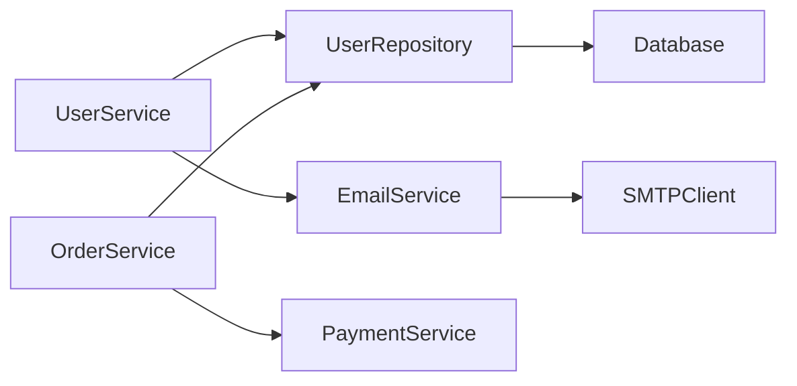

# 模块识别方法研究报告

研究日期: 2026-03-10 | 模型: GLM-5

---

## 一、问题定义

### 1.1 什么是模块？

**模块（Module）** 是软件系统中具有以下特征的逻辑单元：

1. **高内聚**：模块内部的元素紧密相关，共同完成一个明确定义的功能
2. **低耦合**：模块之间的依赖关系尽可能少且松散
3. **独立边界**：具有清晰的接口和职责边界
4. **可替换性**：可以在不影响其他模块的情况下被替换或修改

模块的粒度可以是：
- 文件级别（单文件模块）
- 包/命名空间级别（package, namespace）
- 目录级别（folder, directory）
- 子系统级别（subsystem, layer）

### 1.2 为什么需要识别模块边界？

**核心价值**：

| 维度 | 价值 |
|------|------|
| **理解成本** | 降低认知负荷，快速把握系统架构 |
| **维护效率** | 精确定位修改范围，减少 "散弹式修改" |
| **重构决策** | 识别 "上帝模块" 和循环依赖，指导重构优先级 |
| **团队协作** | 明确责任边界，减少代码冲突 |
| **架构治理** | 检测架构腐化，保持系统健康 |
| **AI 注入** | 为 "灵魂提取" 提供结构化单元，实现知识模块化注入 |

**灵魂拆解的关键需求**：
- 将大型项目的 "灵魂"（设计哲学、心智模型、经验教训）按模块拆分
- 每个模块的 "灵魂" 可独立注入到新项目
- 需要自动识别模块边界，避免人工标注的高成本

---

## 二、识别方法

### 2.1 代码结构分析

**原理**：利用项目现有的物理组织结构作为模块边界的初步线索。

#### 2.1.1 目录结构分析

```
project/
├── api/          # API 层 - 清晰边界
├── core/         # 核心逻辑 - 清晰边界
├── infra/        # 基础设施 - 清晰边界
├── utils/        # 工具函数 - 跨模块依赖
└── tests/        # 测试代码 - 非生产模块
```

**识别规则**：

| 规则 | 描述 | 权重 |
|------|------|------|
| **同目录聚合** | 同一目录下的文件倾向于属于同一模块 | 高 |
| **命名前缀** | 相同前缀的文件/目录属于同一模块 | 中 |
| **配置文件边界** | `package.json`, `go.mod`, `Cargo.toml` 定义模块 | 高 |
| **构建目标边界** | Makefile target, Bazel build 定义的编译单元 | 高 |

**局限**：
- 目录结构可能过时（架构腐化）
- 跨目录的强依赖无法识别
- 某些项目目录结构混乱

#### 2.1.2 命名空间/Package 分析

**语言特性映射**：

| 语言 | 模块边界单位 | 示例 |
|------|--------------|------|
| Java | package, module (JPMS) | `com.example.service.user` |
| Go | package | `github.com/xxx/user` |
| Python | package, module | `user.services` |
| TypeScript/JS | namespace, module | `@company/user-service` |
| Rust | crate, module | `user::service` |
| C# | namespace, assembly | `Company.User.Service` |

**识别策略**：
1. 解析 import/using 语句构建命名空间依赖图
2. 同一命名空间下的类/函数为候选模块
3. 识别命名空间间的依赖关系

---

### 2.2 依赖图分析

**原理**：通过分析代码实体间的依赖关系，使用图算法识别自然形成的模块边界。

#### 2.2.1 依赖类型

| 依赖类型 | 检测方法 | 强度 |
|----------|----------|------|
| **静态导入** | import/require 语句 | 强 |
| **继承关系** | extends/implements | 强 |
| **调用关系** | function call | 中 |
| **数据依赖** | 共享变量/状态 | 中 |
| **注解/装饰器** | annotation/decorator | 弱 |

#### 2.2.2 依赖图构建

**步骤**：
1. **AST 解析**：将源代码解析为抽象语法树
2. **符号解析**：识别所有符号（类、函数、变量）的定义和引用
3. **边构建**：为每个依赖关系创建有向边
4. **图增强**：添加权重（调用频率、依赖强度）

**示例依赖图**：



#### 2.2.3 社区检测算法

**核心思想**：将依赖图视为社交网络，使用社区检测算法识别 "紧密连接" 的节点群。

**主要算法**：

| 算法 | 原理 | 时间复杂度 | 适用场景 |
|------|------|------------|----------|
| **Louvain** | 模块度最大化，层次聚类 | O(n log n) | 大规模网络，快速识别 |
| **Leiden** | Louvain 改进版，保证连通性 | O(n log n) | 需要高质量社区划分 |
| **Infomap** | 信息论方法，最小化描述长度 | O(n) | 层次化模块结构 |
| **Label Propagation** | 标签传播，迭代收敛 | O(n) | 超大规模网络 |
| **Spectral Clustering** | 图拉普拉斯矩阵特征分解 | O(n³) | 小规模，精确划分 |

**Louvain 算法详解**：

```
阶段1：局部移动
  对每个节点，尝试移动到邻居所在社区
  选择使模块度增量最大的移动

阶段2：社区聚合
  将同一社区的所有节点合并为一个超级节点
  重新计算边权重

重复阶段1-2直到模块度不再增加
```

**模块度（Modularity）定义**：

$$Q = \frac{1}{2m}\sum_{ij}\left[A_{ij} - \frac{k_i k_j}{2m}\right]\delta(c_i, c_j)$$

其中：
- $A_{ij}$：节点 i 和 j 之间的边权重
- $k_i$：节点 i 的度
- $m$：总边数
- $\delta(c_i, c_j)$：若 i 和 j 在同一社区则为 1，否则为 0

---

### 2.3 职责边界识别

**原理**：通过量化内聚度和耦合度，识别符合 SRP（单一职责原则）的模块边界。

#### 2.3.1 内聚度度量

**LCOM (Lack of Cohesion of Methods)** 家族：

| 度量 | 定义 | 计算 |
|------|------|------|
| **LCOM1** | 不共享属性的方法对数量 | $\|P\|$ 其中 P = {(m1, m2) : 不共享属性} |
| **LCOM2** | LCOM1 减去共享属性的方法对 | $\|P\| - \|Q\|$ |
| **LCOM3** | 归一化版本 | $1 - \frac{\sum_{a}|M_a|}{m \cdot |A|}$ |
| **LCOM4** | 基于图的连通性 | 连通分量数 |
| **LCOM-HS** | Henderson-Sellers 版本 | $(m - \sum_{a}\frac{|M_a|}{|A|}) / (m - 1)$ |

**其中**：
- $m$：方法数量
- $A$：属性集合
- $M_a$：访问属性 a 的方法集合

**解释**：
- LCOM = 0：完美内聚（所有方法访问所有属性）
- LCOM 高：低内聚，建议拆分

**示例**：

```java
// 低内聚类（高 LCOM）
class User {
    String name;
    String email;
    List<Order> orders;
    
    void updateName() { /* 使用 name */ }
    void sendEmail() { /* 使用 email */ }
    void calculateOrderTotal() { /* 使用 orders */ }
    // 三个方法互不共享属性 → LCOM 高 → 建议拆分
}
```

#### 2.3.2 耦合度度量

| 度量 | 定义 | 目标 |
|------|------|------|
| **Afferent Coupling (Ca)** | 被其他模块依赖的数量 | 高 = 稳定模块 |
| **Efferent Coupling (Ce)** | 依赖其他模块的数量 | 低 = 独立模块 |
| **Instability (I)** | $I = \frac{Ce}{Ca + Ce}$ | 0 = 稳定，1 = 不稳定 |
| **Abstractness (A)** | 抽象元素比例 | 与 I 形成平衡 |
| **Distance from Main Sequence** | $|A + I - 1|$ | 0 = 理想设计 |

**模块健康诊断**：

```
Instability vs Abstractness 图：

    A (抽象度)
    ↑
1.0 |   ● 理想抽象区
    |
0.5 |       ● 平衡区
    |
0.0 |               ● 具体实现区
    └────────────────────→ I (不稳定性)
    0.0              1.0

主序列 (A + I = 1)：理想设计线
离主序列越远，设计问题越大
```

#### 2.3.3 SRP 检测启发式

**检测规则**：

1. **多原因变化**：识别被多个不相关功能修改的类
2. **方法分组**：识别方法之间的访问模式
3. **名称分析**：类名包含 "And"、"Or"、"Manager" 可能违反 SRP
4. **依赖方向**：不同方法组依赖不同外部模块

---

### 2.4 混合方法

**原理**：结合多种方法，取长补短。

#### 2.4.1 多层次识别框架

```
┌─────────────────────────────────────────────────────┐
│              第一层：物理结构分析                      │
│  (目录、命名空间、构建配置)                            │
└─────────────────────┬───────────────────────────────┘
                      │ 初步边界候选
                      ▼
┌─────────────────────────────────────────────────────┐
│              第二层：依赖图分析                        │
│  (构建调用图、社区检测)                               │
└─────────────────────┬───────────────────────────────┘
                      │ 依赖边界验证
                      ▼
┌─────────────────────────────────────────────────────┐
│              第三层：职责边界识别                      │
│  (内聚/耦合度量、SRP 检测)                           │
└─────────────────────┬───────────────────────────────┘
                      │ 边界优化
                      ▼
┌─────────────────────────────────────────────────────┐
│              第四层：语义增强                         │
│  (注释、文档、命名语义)                               │
└─────────────────────────────────────────────────────┘
```

#### 2.4.2 权重融合策略

**模块边界得分**：

$$Score(M) = w_1 \cdot S_{struct} + w_2 \cdot S_{dep} + w_3 \cdot S_{cohesion} + w_4 \cdot S_{semantic}$$

推荐权重：
- $w_1 = 0.2$（物理结构）
- $w_2 = 0.4$（依赖关系，权重最高）
- $w_3 = 0.3$（内聚度）
- $w_4 = 0.1$（语义信息）

---

## 三、工具调研

### 3.1 静态分析工具

| 工具 | 语言 | 能力 | 局限 |
|------|------|------|------|
| **SonarQube** | 多语言 | 代码质量、架构规则、依赖分析 | 商业版功能完整，社区版有限 |
| **NDepend** | .NET | 依赖图可视化、度量指标丰富 | 仅限 .NET |
| **ArchUnit** | Java | 架构规则测试、依赖检查 | 需要手写规则，非自动识别 |
| **Understand** | 多语言 | 依赖分析、度量计算 | 商业软件，价格较高 |
| **Axivion Suite** | C/C++ | 架构检查、复杂度分析 | 商业软件 |

### 3.2 AST 分析工具

| 工具 | 语言 | 特点 |
|------|------|------|
| **Tree-sitter** | 多语言 | 高性能增量解析，IDE 集成友好 |
| **ast-grep** | 多语言 | 基于 AST 的代码搜索和替换 |
| **Esprima** | JavaScript | 成熟的 JS AST 解析器 |
| **Babel** | JavaScript | 现代前端标准 AST 工具 |
| **Clang AST** | C/C++/ObjC | 编译器级精确分析 |
| **Python AST** | Python | 内置模块，简单易用 |

### 3.3 LSP (Language Server Protocol)

**能力**：
- 精确的符号定义和引用查找
- 跨文件依赖解析
- 类型推断和语义分析

**实现**：
| 语言服务器 | 语言 | 特点 |
|------------|------|------|
| jdtls | Java | Eclipse JDT 后端 |
| rust-analyzer | Rust | 高性能增量分析 |
| pyright | Python | 微软出品，类型检查强 |
| gopls | Go | 官方实现 |
| typescript-language-server | TypeScript/JS | VS Code 内核 |

**在模块识别中的价值**：
- 提供 "语义级" 依赖关系（非文本级）
- 处理动态语言的隐式依赖
- 支持 "跳转到定义" 精确定位

### 3.4 依赖分析工具

| 工具 | 功能 | 适用场景 |
|------|------|----------|
| **CARGO** | AI 引导的模块划分，单体到微服务迁移 | 架构重构决策支持 |
| **Gauge** | 依赖可视化、增量模块化 | Python 项目 |
| **LobeHub Skills** | 架构依赖分析、影响评估 | 服务架构分析 |
| **Gephi** | 图可视化分析 | 大型依赖图探索 |
| **Neo4j GDS** | 图算法库（Louvain 等） | 社区检测 |

### 3.5 工具局限性总结

| 局限 | 描述 |
|------|------|
| **语言绑定** | 大多数工具只支持特定语言 |
| **手动规则** | 需要人工定义架构规则，无法自动发现 |
| **缺少语义** | 纯结构分析无法理解业务含义 |
| **粒度控制** | 难以控制模块识别的粗细粒度 |
| **动态依赖** | 运行时依赖难以静态分析 |
| **AI 集成** | 缺少与 LLM 的深度集成能力 |

---

## 四、算法设计建议

### 4.1 自动模块识别流水线

```
输入：源代码仓库
     │
     ▼
┌─────────────────────────────────────────────────────┐
│  Phase 1: 代码解析                                   │
│  ├── 多语言 AST 解析 (Tree-sitter)                   │
│  ├── 符号表构建 (LSP 辅助)                           │
│  └── 依赖关系提取                                    │
└─────────────────────┬───────────────────────────────┘
                      │
                      ▼
┌─────────────────────────────────────────────────────┐
│  Phase 2: 图构建                                     │
│  ├── 实体节点（类、函数、文件、目录）                  │
│  ├── 依赖边（导入、调用、继承、数据）                  │
│  └── 边权重（强度、频率）                             │
└─────────────────────┬───────────────────────────────┘
                      │
                      ▼
┌─────────────────────────────────────────────────────┐
│  Phase 3: 社区检测                                   │
│  ├── Louvain/Leiden 算法                            │
│  ├── 多层次模块分解                                  │
│  └── 模块度优化                                      │
└─────────────────────┬───────────────────────────────┘
                      │
                      ▼
┌─────────────────────────────────────────────────────┐
│  Phase 4: 质量评估                                   │
│  ├── 内聚度计算 (LCOM)                               │
│  ├── 耦合度计算 (Ca, Ce, I)                          │
│  └── 边界质量打分                                    │
└─────────────────────┬───────────────────────────────┘
                      │
                      ▼
┌─────────────────────────────────────────────────────┐
│  Phase 5: 边界优化                                   │
│  ├── 违反 SRP 的模块拆分                             │
│  ├── 循环依赖消除                                    │
│  └── 边界合并/拆分建议                               │
└─────────────────────┬───────────────────────────────┘
                      │
                      ▼
输出：模块边界报告 + 可视化
```

### 4.2 关键算法伪代码

**社区检测 + 质量评估组合**：

```python
def identify_modules(codebase):
    # Step 1: 构建依赖图
    graph = DependencyGraph()
    for file in codebase.files:
        ast = parse(file)
        symbols = extract_symbols(ast)
        dependencies = resolve_dependencies(symbols, lsp_client)
        graph.add_nodes(symbols)
        graph.add_edges(dependencies)
    
    # Step 2: 社区检测
    communities = louvain_algorithm(graph)
    
    # Step 3: 质量评估
    modules = []
    for community in communities:
        cohesion = calculate_lcom(community)
        coupling = calculate_coupling(community, graph)
        score = cohesion_score(cohesion) + coupling_score(coupling)
        
        if score < threshold:
            # 低质量模块，尝试拆分
            sub_communities = refine_module(community)
            modules.extend(sub_communities)
        else:
            modules.append(community)
    
    # Step 4: 边界验证
    for module in modules:
        validate_boundaries(module)
    
    return modules
```

### 4.3 多粒度控制

**策略**：提供参数控制模块识别粒度。

| 参数 | 效果 |
|------|------|
| `min_module_size` | 最小模块大小（节点数） |
| `max_module_size` | 最大模块大小（节点数） |
| `cohesion_threshold` | 内聚度阈值，低于此值拆分 |
| `coupling_threshold` | 耦合度阈值，高于此值合并 |
| `hierarchy_levels` | 层次化分解深度 |

---

## 五、示例：Kubernetes 模块识别

### 5.1 项目背景

- **规模**：~200 万行 Go 代码
- **组件**：API Server, Scheduler, Controller Manager, Kubelet, kube-proxy
- **目录结构**：`pkg/` 下按功能模块组织

### 5.2 识别过程

**第一层：目录结构分析**

```
kubernetes/
├── pkg/
│   ├── api/           # API 定义
│   ├── apis/          # API 组
│   ├── controller/    # 控制器
│   ├── kubelet/       # 节点代理
│   ├── scheduler/     # 调度器
│   └── registry/      # 资源注册
├── cmd/               # 入口程序
└── staging/           # 外部模块
```

**初步识别**：~15 个顶层模块候选

**第二层：依赖图分析**

构建 `pkg/` 下所有 package 的导入依赖图，使用 Louvain 算法识别：

```
检测到的社区：
1. {api, apis, runtime}           # API 核心
2. {controller, controller-manager} # 控制器
3. {kubelet, container, volume}    # 节点管理
4. {scheduler, framework}          # 调度
5. {registry, admission}           # 准入控制
```

**第三层：质量评估**

| 模块 | LCOM | Ca | Ce | I | 质量评分 |
|------|------|----|----|---|----------|
| API Core | 低 | 高 | 低 | 0.2 | 优 |
| Controller | 中 | 中 | 中 | 0.5 | 良 |
| Kubelet | 中 | 低 | 高 | 0.8 | 需关注 |
| Scheduler | 低 | 中 | 中 | 0.5 | 优 |

**发现**：
- Kubelet 模块不稳定（I=0.8），依赖过多外部模块
- Controller 模块可进一步拆分（LCOM 中等）

**第四层：建议优化**

```
优化建议：
1. Kubelet 模块：
   - 拆分为：kubelet-core, kubelet-volume, kubelet-container
   - 减少对外部依赖

2. Controller 模块：
   - 按控制器类型拆分：deployment-controller, replicaset-controller
   - 共享 informer 逻辑提取为独立模块
```

### 5.3 结果输出

```
Kubernetes 模块识别报告
=======================

顶层模块数：12
子模块数：47

模块边界清晰度：82%（高）
架构健康度：78%（良好）

主要问题：
- 3 个模块存在循环依赖
- 5 个模块违反 SRP
- 2 个模块耦合度过高

详细报告见：kubernetes-modules.html
```

---

## 六、优先级建议

### P0（必须实现）

| 功能 | 描述 | 工作量 |
|------|------|--------|
| **多语言 AST 解析** | 基于 Tree-sitter 的增量解析 | 2 周 |
| **依赖图构建** | 静态导入/调用关系提取 | 1 周 |
| **Louvain 社区检测** | 基础模块识别算法 | 1 周 |
| **LCOM 度量计算** | 内聚度量化 | 3 天 |

### P1（应该实现）

| 功能 | 描述 | 工作量 |
|------|------|--------|
| **LSP 集成** | 语义级依赖解析 | 2 周 |
| **循环依赖检测** | 模块间循环依赖识别 | 3 天 |
| **模块可视化** | 依赖图 + 模块边界渲染 | 1 周 |
| **边界报告生成** | Markdown/HTML 报告输出 | 3 天 |

### P2（可以实现）

| 功能 | 描述 | 工作量 |
|------|------|--------|
| **语义增强** | 注释/命名语义分析 | 2 周 |
| **历史数据分析** | Git 提交关联模块 | 2 周 |
| **AI 辅助命名** | 模块命名建议 | 1 周 |
| **增量更新** | 代码变更后增量识别 | 2 周 |

---

## 附录：参考资料

### 学术论文

1. **CARGO**: AI-Guided Dependency Analysis for Migrating Monolithic Applications to Microservices Architecture (ASE 2022)
2. **A graph-based clustering algorithm for software systems modularization** (Journal of Systems and Software, 2020)
3. **Software Architecture Mining from Source Code** (ICSOFT 2022)

### 工具文档

1. Tree-sitter: https://tree-sitter.github.io/
2. Louvain Method: https://en.wikipedia.org/wiki/Louvain_method
3. LCOM Metrics: https://www.aivosto.com/project/help/pm-oo-cohesion.html
4. ArchUnit: https://www.archunit.org/

### 相关项目

1. **ast-grep**: AST-based code structural search
2. **LSP Specification**: Language Server Protocol
3. **Neo4j GDS**: Graph Data Science library

---

*本报告为 "灵魂拆解" 研究系列第一篇，后续将深入探讨模块知识提取与注入方法。*