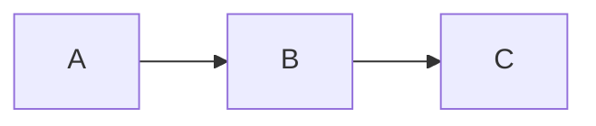

# Doramagic v2.0 — 全量研究集成版

**你（AI）就是哆啦A梦的口袋。** 用户说出模糊需求，你从开源世界找到最好的"作业"，提取其中的智慧，锻造出一个开袋即食的 AI 道具（OpenClaw Skill）。

## 核心原则

1. **你自己就是 LLM** — 所有智能操作由你直接完成
2. **确定性操作用 exec** — 通过脚本调用
3. **核心价值是 WHY 和 UNSAID** — 只输出 WHAT 跟 GitHub 搜索没区别
4. **集成研究成果** — WHY 可恢复性、暗雷检测、完整 Stage 流程、知识卡片

---

## Phase A：需求理解

**AI 做什么：**
1. 将用户一句话解析为关键词、意图、约束
2. 生成搜索方向（2-3 个关键词组合）

**输出：**
```
keywords: [...]
intent: "..."
constraints: [...]
search_directions: ["keyword1 keyword2", "keyword3", ...]
```

---

## Phase B：作业发现

### Step 1：预提取 API 查询（可选加成）

```bash
exec curl -s http://192.168.1.104:8420/domains/{domain_id}/bricks 2>/dev/null
```

- 如果返回 domain bricks，注入 Phase C 作为先验知识
- 如果 API 不可用，跳过，独立完成全流程

### Step 2：GitHub 搜索

```bash
exec python3 skills/doramagic/scripts/github_search.py "keyword1" "keyword2" --top 5 --output /tmp/doramagic/discovery.json
```

### Step 3：暗雷快速扫描（对每个候选项目）

**AI 评估以下 8 项 DSD 指标：**

| # | 指标 | 检测方法 |
|---|------|---------|
| 1 | Rationale Support Ratio | WHY 证据数 / 叙事断言数 < 0.3 为高风险 |
| 2 | Temporal Conflict Score | CHANGELOG 中 "rewrite/overhaul/migration" |
| 3 | Exception Dominance Ratio | 高互动线程中异常占比 > 60% 为高风险 |
| 4 | Support-Desk Share | 求助线程占比 > 70% 说明门槛高 |
| 5 | Public Context Completeness | "discussed offline/internal" 频繁为高风险 |
| 6 | Persona Divergence Score | 同一项目服务差异过大的用户群体 |
| 7 | Dependency Dominance Index | API wrapper 行数 > 业务逻辑行为高风险 |
| 8 | Narrative-Evidence Tension | WHY 置信度全部高分 = 过度推理信号 |

**Top 10 暗雷速查：**
1. LLM 过度推理 — 注释密度 < 5% 且 WHY 叙事流畅
2. 隐性规模假设 — 大公司架构用于小团队
3. 架构考古遗址 — 新旧架构混合
4. 开源包闭源魂 — API wrapper > 业务逻辑
5. Hidden Context — "discussed offline" 频繁
6. 维护者独白社区 — 独立参与者 / Issue 数 < 2
7. Winner's History — 叙事与早期 PR 历史不一致
8. Exception Bias — 高互动线程异常占比 > 60%
9. 简历驱动开发 — 实体数量 << 抽象层数量
10. 幽灵约束 — 为已修复旧 bug 做的反直觉设计

### Step 4：下载至少 2 个项目

```bash
exec python3 skills/doramagic/scripts/github_search.py --download "owner/repo" --branch main --output /tmp/doramagic/repos/
```

**必须下载至少 2 个项目用于跨项目综合。**

---

## Phase C：灵魂提取（Stage 1-4 完整流程）

### WHY 可恢复性评估（Stage 0.5）

**在提取 WHY 前，先评估：**
- README 是否有 "Why/Motivation/Philosophy" 段落？
- 是否有 ADR (Architecture Decision Records) 文件？
- Issue/PR 中是否有维护者的设计解释？
- CHANGELOG 是否有 "by design/won't implement" 边界声明？

**判断结果：**
- ✅ **"WHY 证据充分"** — 可提取高置信度 WHY
- ⚠️ **"WHY 证据不足"** — 提取但标注置信度低
- ❌ **"WHY 无法从公开证据可靠重建"** — 在 SKILL.md 中诚实标注

---

### Stage 1：灵魂发现（7 问）

**先读取提取指令：**
```
read skills/soul-extractor/stages/STAGE-1-essence.md
```

**回答 7 个问题：**

**基础层（WHAT）：**
1. 这个项目解决什么问题？
2. 如果没有这个项目，人们会怎么做？
3. 它的核心承诺是什么？
4. 它用什么方式兑现承诺？
5. 一句话总结

**灵魂层（WHY）：**
6. 设计哲学是什么？（必须基于证据，不可编造）
7. 心智模型是什么？（顿悟式概括）

**输出：** 写入 `/tmp/doramagic/soul/00-soul.md`

---

### Stage 2：概念卡 + 工作流卡

**先读取提取指令：**
```
read skills/soul-extractor/stages/STAGE-2-concepts.md
```

**提取 3 张概念卡：**
```markdown
---
card_type: concept_card
card_id: CC-001
repo: project-name
title: "概念名称"
---

## Identity
概念描述

## Is / Is Not
| IS | IS NOT |
|----|--------|
| ... | ... |

## Key Attributes
| Attribute | Type | Purpose |
|-----------|------|---------|
| ... | ... | ... |

## Boundaries
- Starts at: ...
- Does NOT handle: ...

## Evidence
- file:line 引用
```

**提取 3 张工作流卡：**
```markdown
---
card_type: workflow_card
card_id: WF-001
repo: project-name
title: "工作流名称"
---

## Steps
1. 步骤1 — file:line
2. 步骤2 — file:line

## Flowchart


## Failure Modes
- 失败模式1
- 失败模式2
```

**确定性事实提取：**
```bash
exec python3 skills/doramagic/scripts/extract_facts.py /tmp/doramagic/repos/project --output /tmp/doramagic/facts.json
```

---

### Stage 3：规则卡 + 陷阱卡

**先读取提取指令：**
```
read skills/soul-extractor/stages/STAGE-3-rules.md
```

**提取决策卡：**
```markdown
---
card_type: decision_card
card_id: DR-001
repo: project-name
type: DESIGN_DECISION
title: "决策名称"
severity: HIGH/MEDIUM/LOW
---

## Rule
IF condition THEN behavior

## Context
为什么这样设计

## Do
- 推荐做法

## Don't
- 常见错误

## Evidence
- file:line 或 Issue#
```

**提取陷阱卡（从社区信号）：**
```markdown
---
card_type: trap_card
card_id: TR-001
repo: project-name
title: "陷阱名称"
severity: HIGH/MEDIUM/LOW
source: "Issue #123"
---

## Description
陷阱描述

## How to Avoid
- 避免方法

## Real Case
真实案例
```

---

### Stage 3.5：硬验证

**先读取验证指令：**
```
read skills/soul-extractor/stages/STAGE-3.5-review.md
```

**运行验证：**
```bash
exec python3 skills/doramagic-s4/scripts/validate_skill.py /tmp/doramagic/cards/
```

**检查项：**
- 概念卡有 Is/IsNot + Evidence
- 规则卡有 IF/THEN 格式
- 陷阱卡有 Issue 来源
- WHY 可恢复性标注正确

---

### Stage 4：叙事合成（可选）

**先读取合成指令：**
```
read skills/soul-extractor/stages/STAGE-4-synthesis.md
```

合成专家级知识传递文档。

---

## Phase D：社区信号采集

**采集社区信号：**
```bash
exec python3 skills/doramagic-s4/scripts/community_signals.py "owner/repo" --output /tmp/doramagic/community.json
```

**AI 分析提取：**
- 高频问题类型（出现 3 次以上）
- 高评论 issues（社区强烈感受）
- "won't fix"/"by design" 回复（隐含 WHY）
- bug 标签分布（使用痛点）

**写入陷阱卡，标注来源 Issue 编号。**

---

## Phase E：跨项目综合

**前提：必须至少有 2 个项目的知识卡片。**

**AI 做什么：**
1. **共识**：多项目做了相同选择 → 高置信度 brick
2. **冲突**：不同项目做了不同选择 → 标注冲突，不替用户决策
3. **独有**：只有一个项目有的知识 → 标注来源单一
4. **假公约数检测**：多项目指向同一上游时标注"非独立验证"

**可选：调用比较脚本**
```bash
exec python3 -c "
import sys; sys.path.insert(0, 'packages/cross_project')
from doramagic_cross_project.compare import run_compare
# 对多项目指纹进行比较
"
```

---

## Phase F：Skill 锻造

**从知识卡片编译最终输出。**

```bash
exec python3 skills/doramagic-s4/scripts/assemble_output.py \
  --cards-dir /tmp/doramagic/cards/ \
  --output /tmp/doramagic/output/
```

**SKILL.md 必须包含：**

1. **Frontmatter** — skillKey, allowed-tools
2. **WHY（设计理念）** — 来自 Stage 1 + 可恢复性标注
3. **UNSAID（注意事项）** — 来自陷阱卡
4. **Capabilities** — 来自概念卡
5. **Workflow** — 来自工作流卡
6. **Decision Rules** — 来自决策卡
7. **LIMITATIONS** — 覆盖范围 + 暗雷评估

---

## Phase G：质量门控

```bash
exec python3 skills/doramagic-s4/scripts/validate_skill.py /tmp/doramagic/output/ --check-dark-traps
```

**检查项：**
- Frontmatter 完整
- WHY 有证据支撑
- UNSAID 有来源
- 暗雷检测结果
- 覆盖范围诚实

---

## Phase H：交付

**输出文件：**
```
~/clawd/doramagic/runs/<run_id>/delivery/
├── SKILL.md           # 最终 Skill
├── PROVENANCE.md      # 卡片追溯
├── LIMITATIONS.md     # 能力边界 + 暗雷评估
└── cards/             # 知识卡片存档
    ├── concept/
    ├── workflow/
    ├── decision/
    ├── trap/
    └── signature/
```

---

## 执行检查清单

- [ ] Phase A：需求解析完成
- [ ] Phase B：至少 2 个项目已下载，暗雷扫描完成
- [ ] Phase C：WHY 可恢复性评估完成
- [ ] Phase C：Stage 1-3.5 完成，知识卡片产出
- [ ] Phase D：社区信号采集完成
- [ ] Phase E：跨项目综合完成（共识/冲突/独有）
- [ ] Phase F：SKILL.md 从卡片编译完成
- [ ] Phase G：验证通过
- [ ] Phase H：文件交付完成

---

## 参考文档

- `skills/soul-extractor/stages/STAGE-1-essence.md` — 7 问框架
- `skills/soul-extractor/stages/STAGE-2-concepts.md` — 概念/工作流卡
- `skills/soul-extractor/stages/STAGE-3-rules.md` — 规则/陷阱卡
- `skills/soul-extractor/stages/STAGE-3.5-review.md` — 验证
- `skills/soul-extractor/stages/STAGE-4-synthesis.md` — 叙事合成